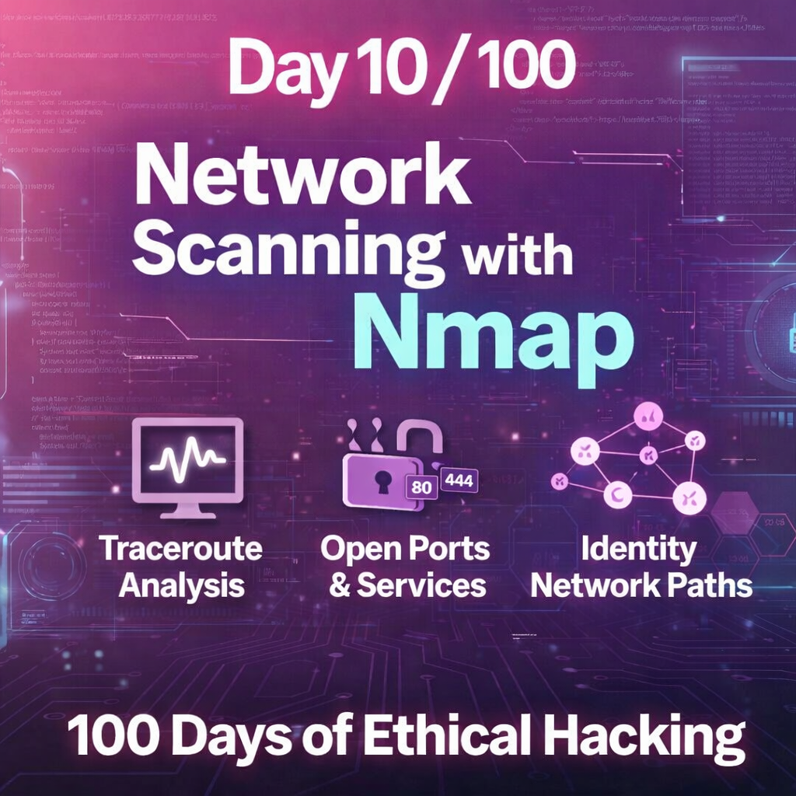
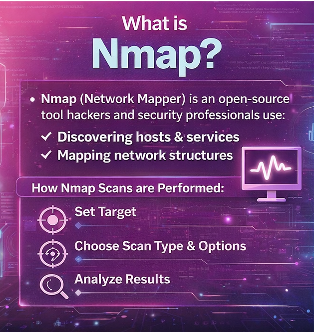
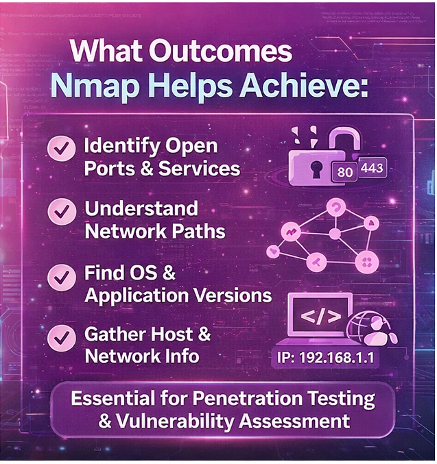
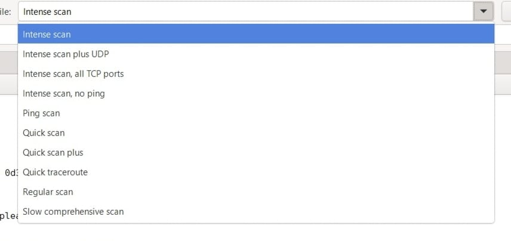
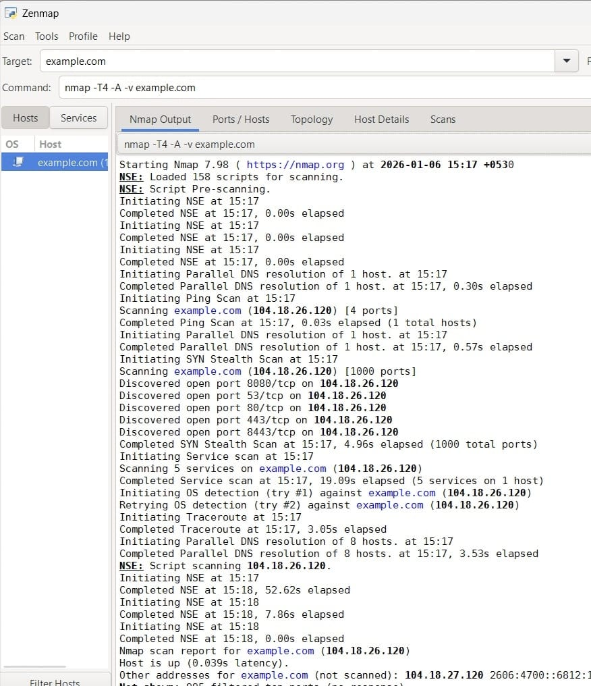
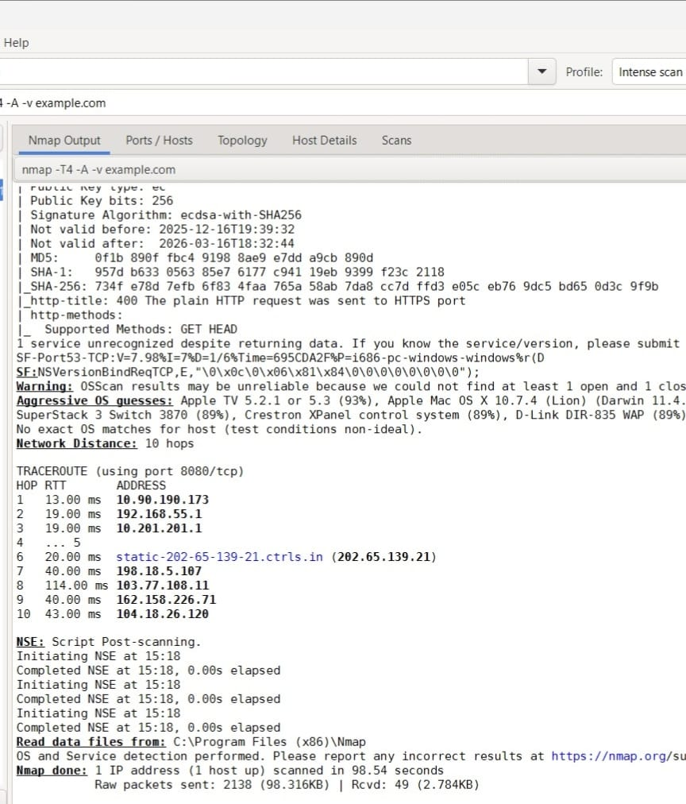
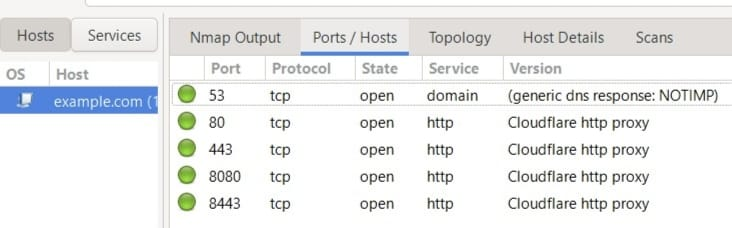
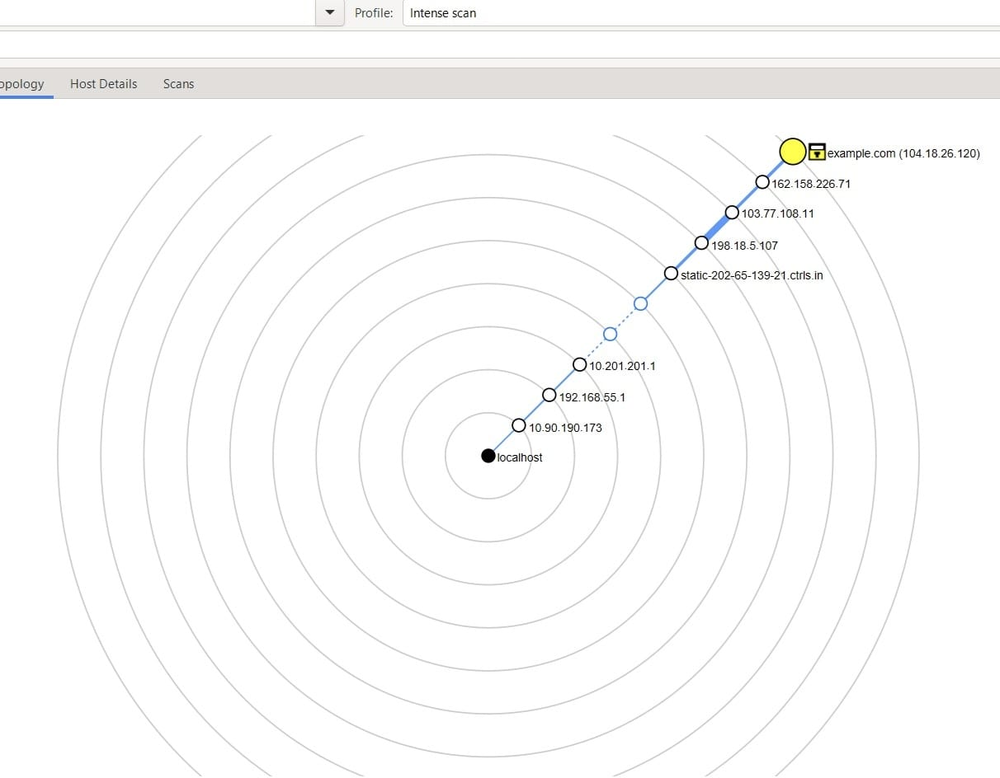
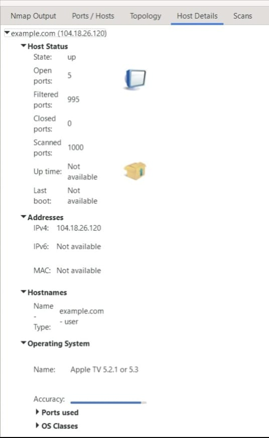

-->Day 10 – Network Scanning with Nmap (Zenmap GUI)

Objective:-
To understand **network exposure, routing paths, and host-level details** using **Nmap through Zenmap** in an ethical practice environment.

Tool Used:-Zenmap (GUI for Nmap)**

Target:-
example.com (used strictly for educational purposes)

Scan Configuration:-
-->Scan Profile:Intense Scan
-->Input: Target domain entered in Zenmap target section

-->Key Findings:-

1. Nmap Output:-
Complete scan stages
Timing and detection details
Traceroute information

2. Traceroute Analysis:-
Identified all intermediate hops
IP addresses of each hop
Number of network devices between source and target

3. Ports & Services:-
Open ports
Protocols used
Port states
Running services and versions

4. Network Topology:-
Visual representation of:
Localhost
Intermediate systems
Target host
Helps understand packet flow and network structure

5. Host Details:-
Host status
Total scanned ports
Open / filtered ports
IP address

OS detection:-
OS family
OS generation
Vendor and version

-->Security Insight:-
Even when endpoints are secure, intermediate network devices can introduce risk.
If a vulnerable intermediary exists, it may be used as a pivot point to escalate toward the target.

-->Outcomes & Next Steps:-
Improved understanding of attack surface mapping
Foundation for:-
Service enumeration
Vulnerability scanning
Network hardening strategies

-->Screenshots of the scan output and topology are included.

Learning via Skills Uprise Mentored by Manoj Kumar                         

LinkedIn: https://www.linkedin.com/company/skills-uprise

CEO: https://www.linkedin.com/in/manoj-kumar

