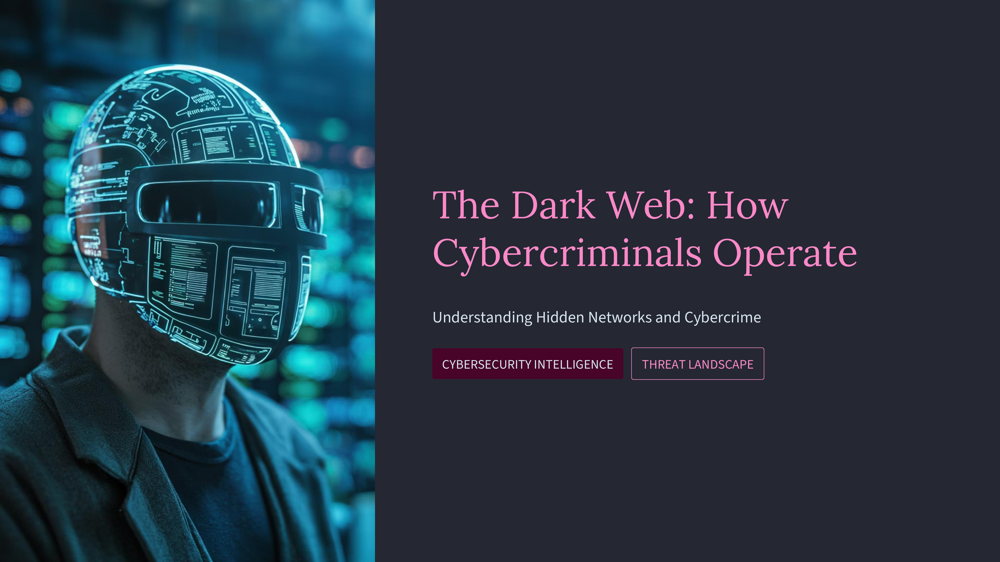
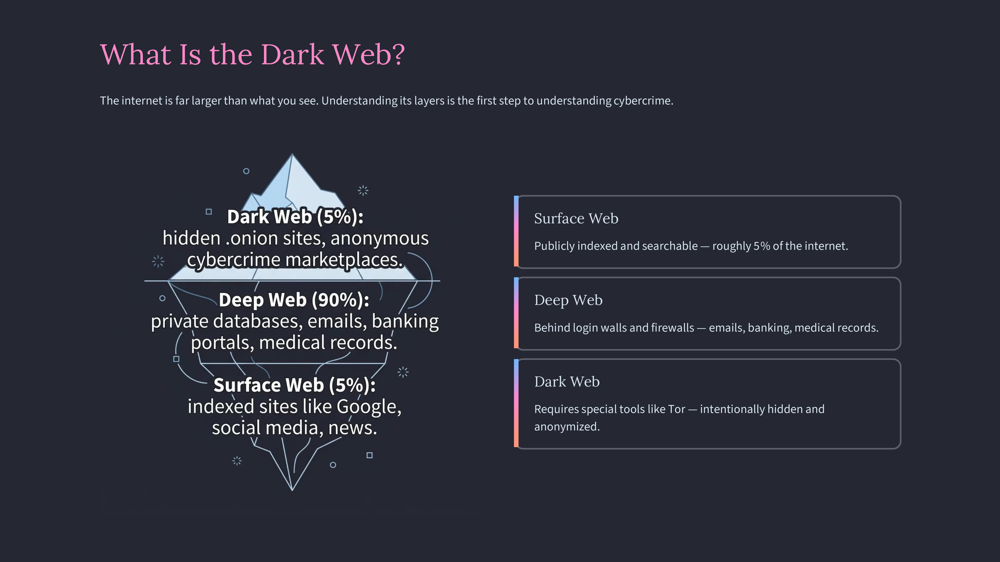
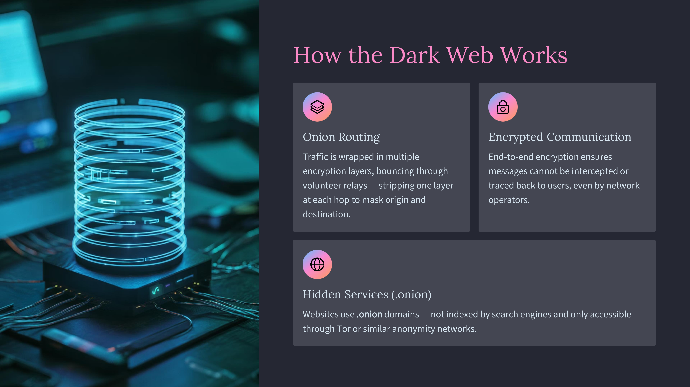
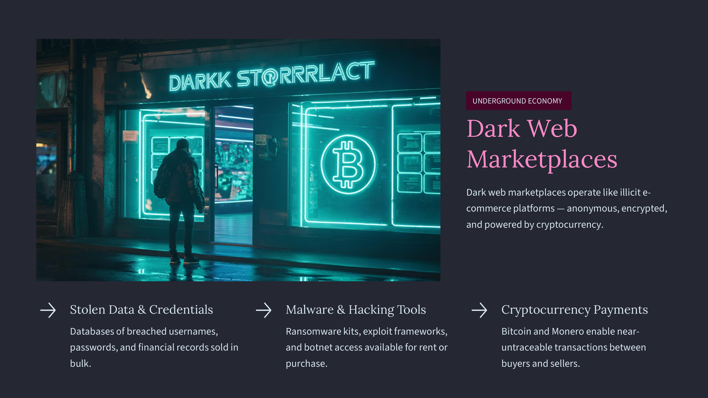
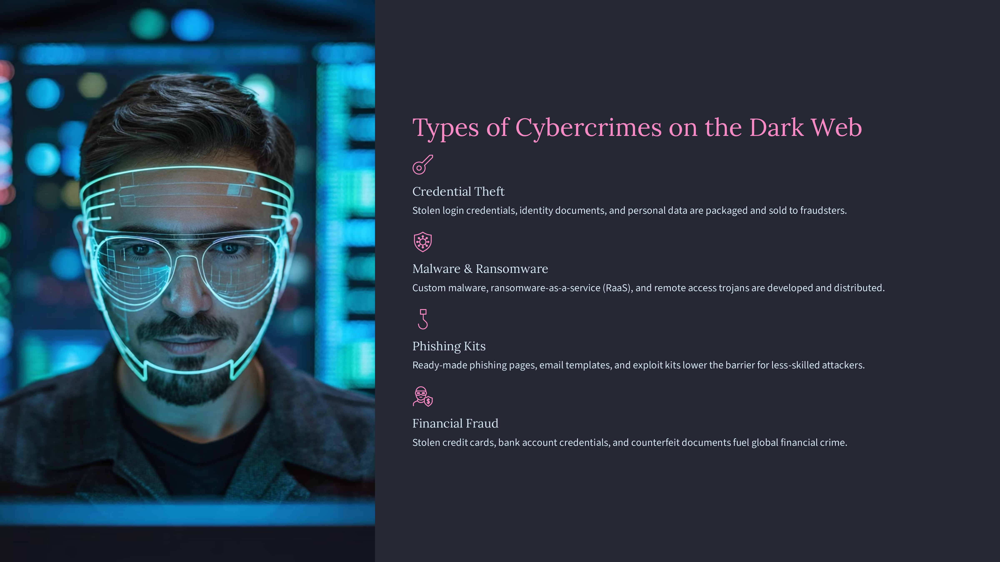
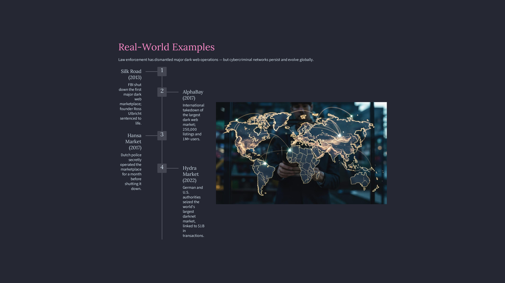
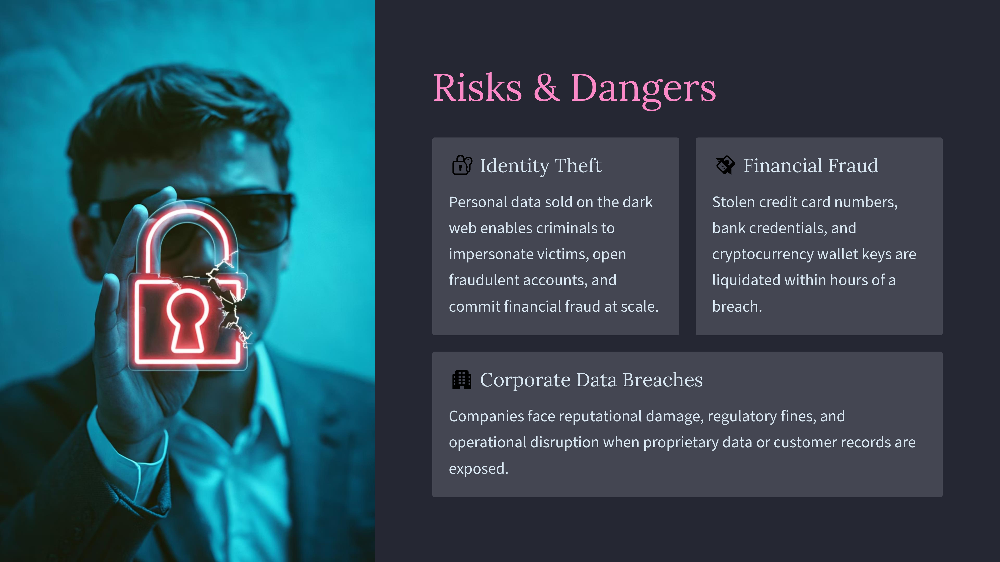
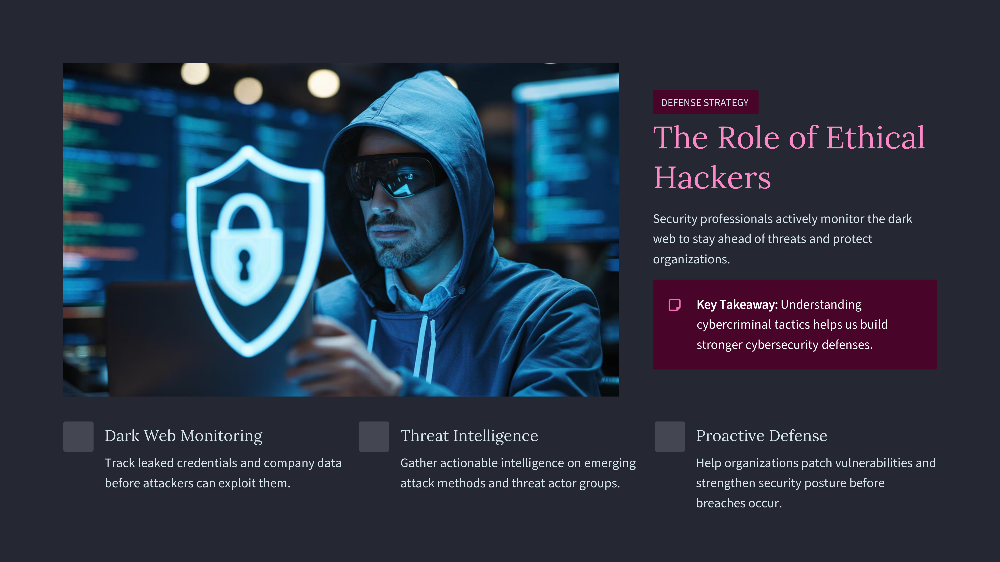

Day 100 – The Dark Web: How Cybercriminals Operate

This marks Day 100 of my 100-Days Ethical Hacking Learning Challenge.

Today’s topic focuses on The Dark Web, a hidden layer of the internet that operates through anonymity networks like Tor. These networks host underground marketplaces where cybercriminals trade stolen data, malware kits, and hacking tools. Understanding these ecosystems helps cybersecurity professionals develop better defensive strategies and threat intelligence.

But this repository is more than just technical topics.

Over the last 100 days, I committed to learning something new in cybersecurity every day. The journey wasn’t always easy — there were moments of confusion, challenges, and failures. However, those moments became the best teachers.

I’m deeply grateful to my colleagues who guided me whenever I got stuck, and special thanks to Manoj Koravangi for initiating this learning journey and motivating us to learn from every failure.

Completing this challenge doesn’t mean the journey ends here.

This is only the beginning of a much larger path in cybersecurity.

“Consistency turns curiosity into expertise.”

🚀 Day 100 Completed — Learning Continues.

Learning via Skills Uprise Mentored by Manoj Kumar                         

LinkedIn: https://www.linkedin.com/company/skills-uprise

CEO: https://www.linkedin.com/in/manoj-kumar

