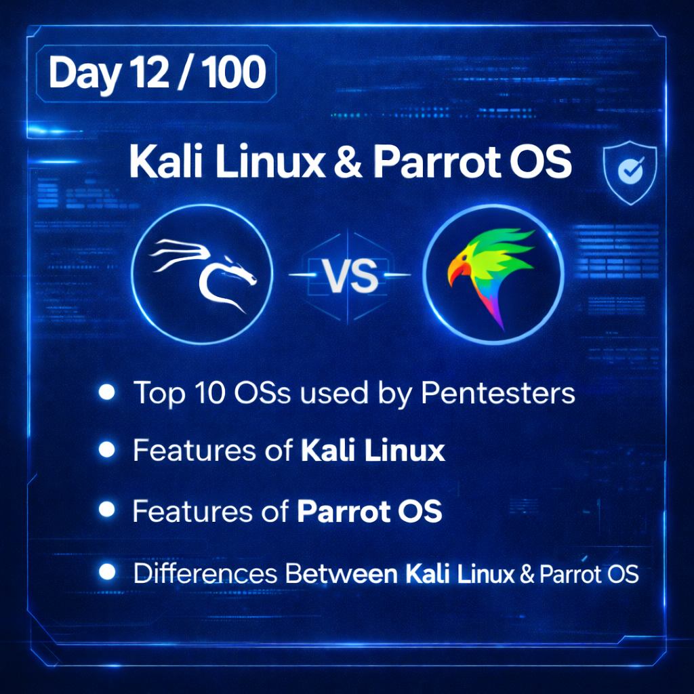
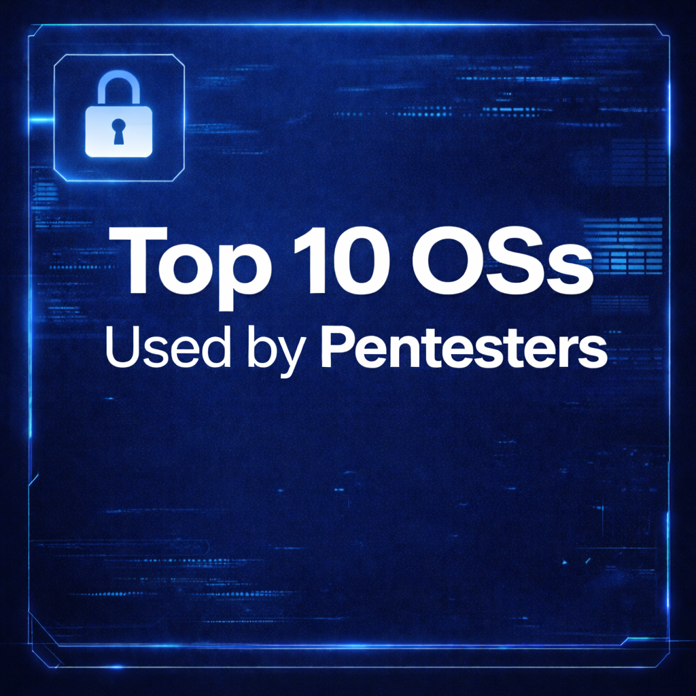
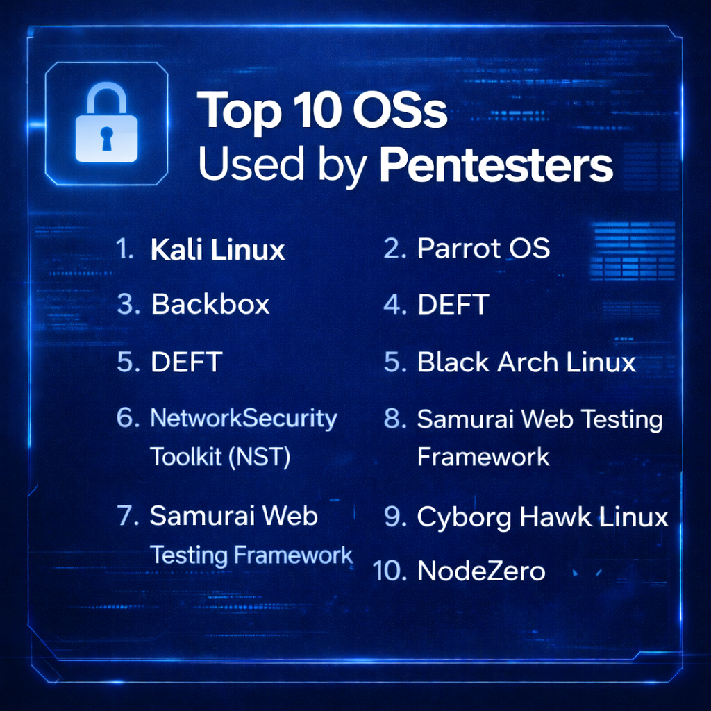
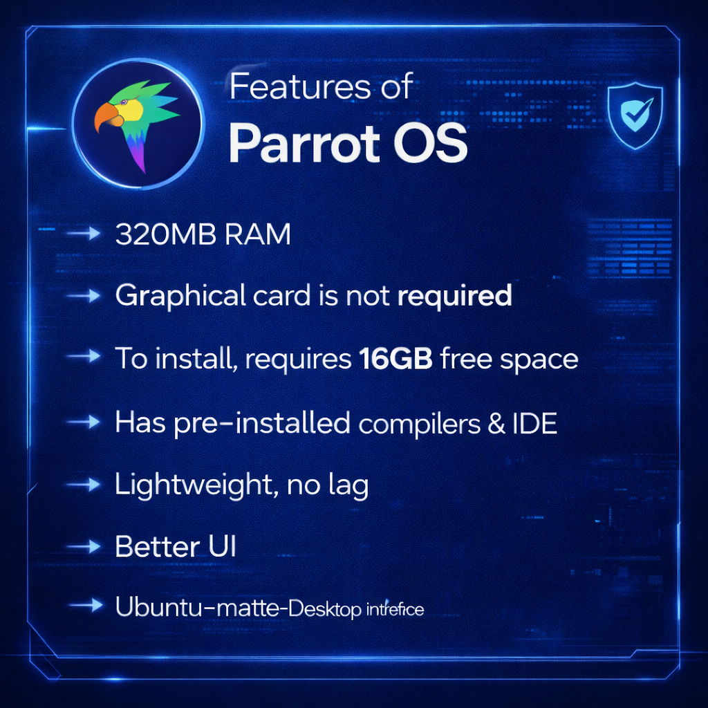
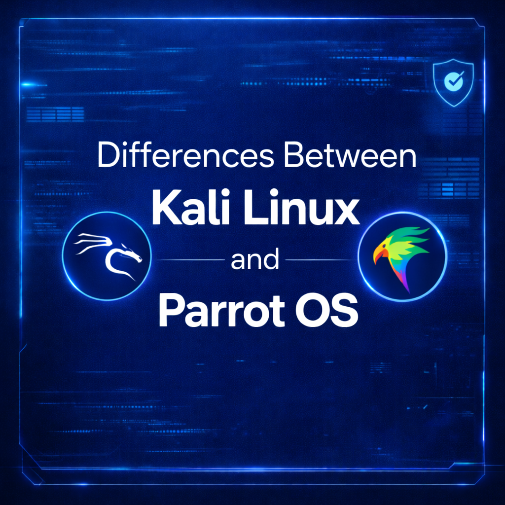
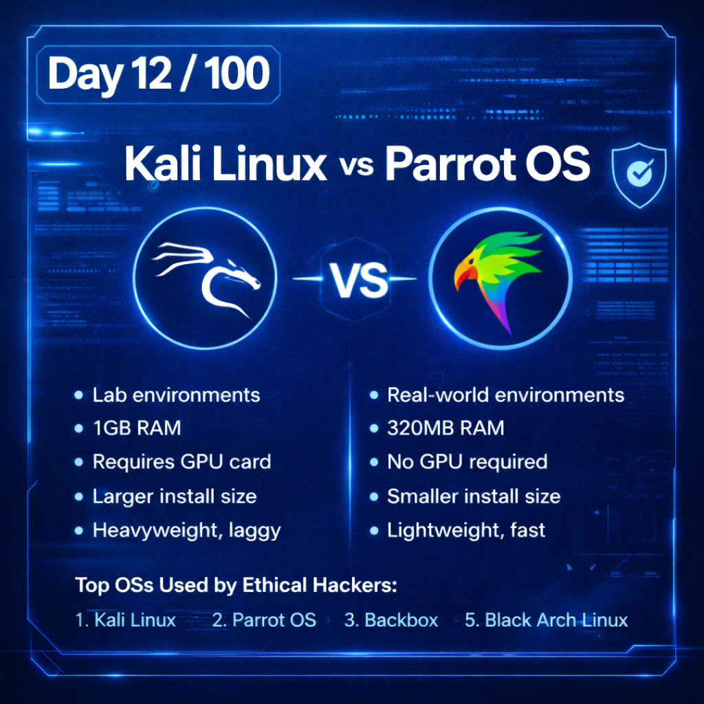

Day 12 – Ethical Hacking Learning Log

-->Topics Covered:-
Top 10 Operating Systems used by Pentesters

-->Kali Linux:-
Debian-based and open-source
Used for penetration testing & security auditing
600+ built-in security tools

-->Parrot Security OS:-
Lightweight and performance-optimized
Supports anonymous browsing and forensics
Includes pre-installed compilers and IDEs

-->Kali Linux vs Parrot OS:-
Resource usage comparison
UI and performance differences
Use-case suitability (lab vs real-world)

-->Goal:-
To understand how different security-focused operating systems support penetration testing and cybersecurity workflows.

#Part of my 100 Days of Ethical Hacking Challenge

Learning via Skills Uprise Mentored by Manoj Kumar                         

LinkedIn: https://www.linkedin.com/company/skills-uprise

CEO: https://www.linkedin.com/in/manoj-kumar

