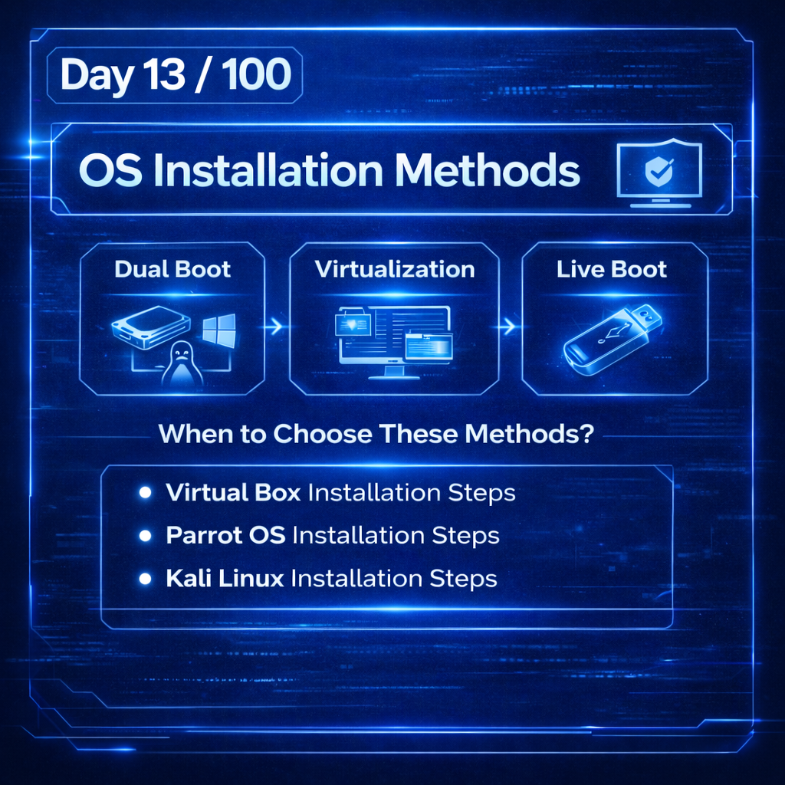
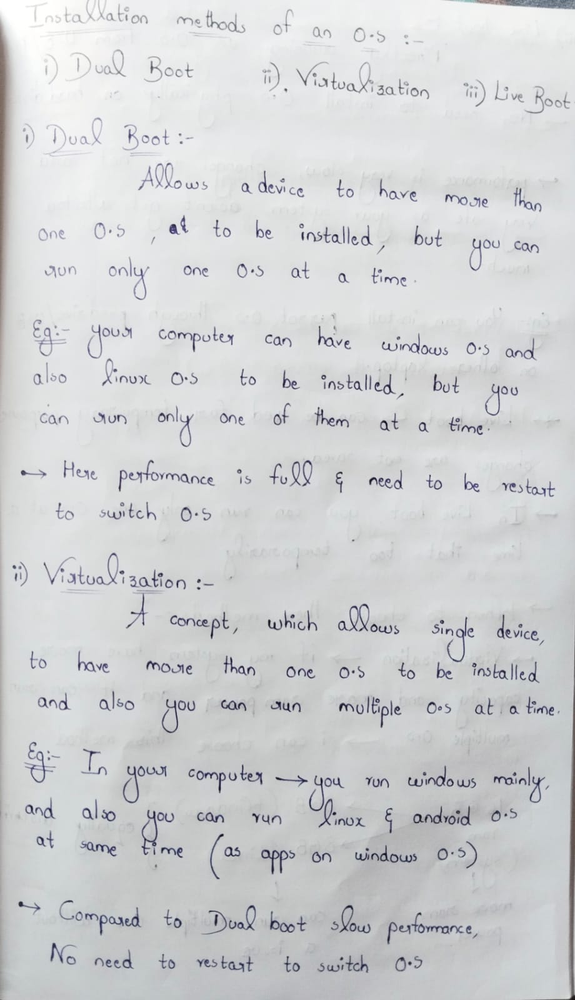
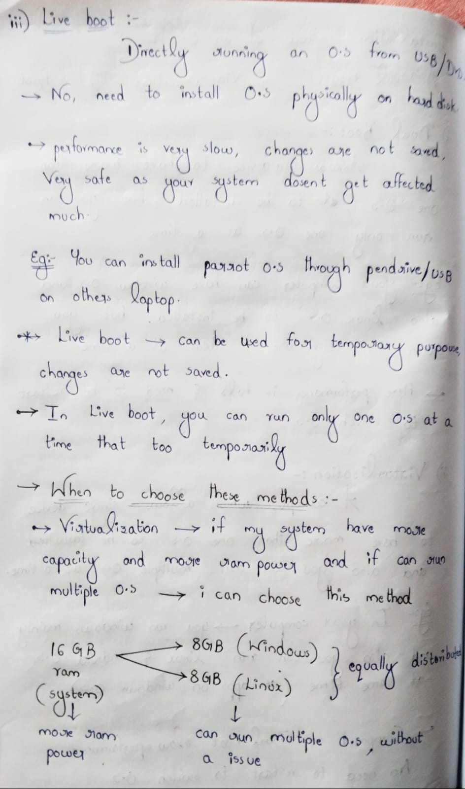
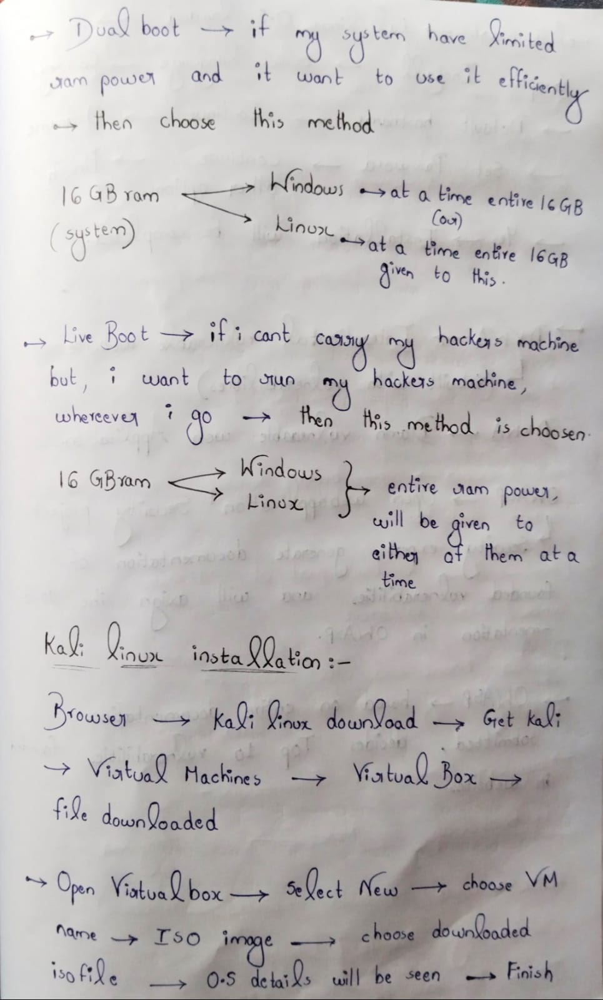
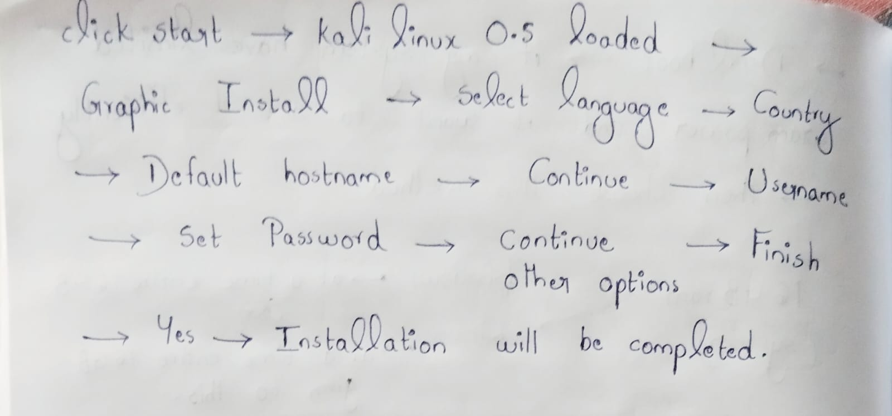
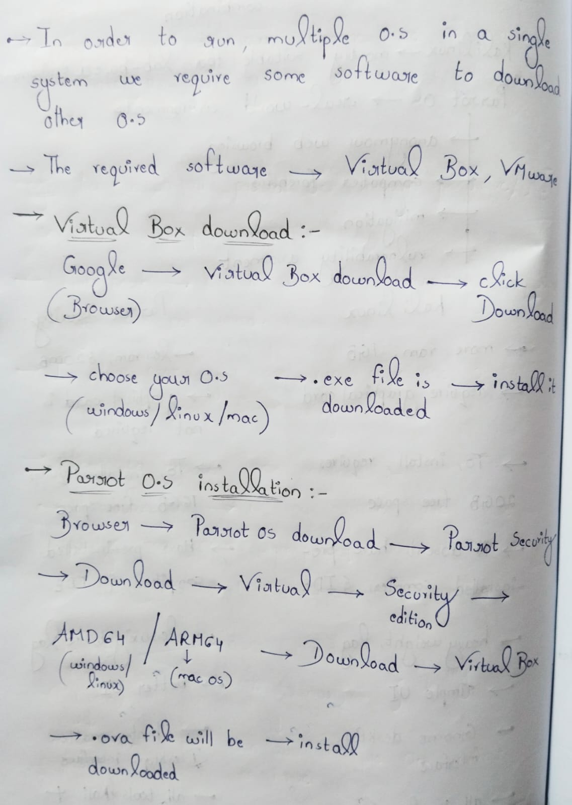
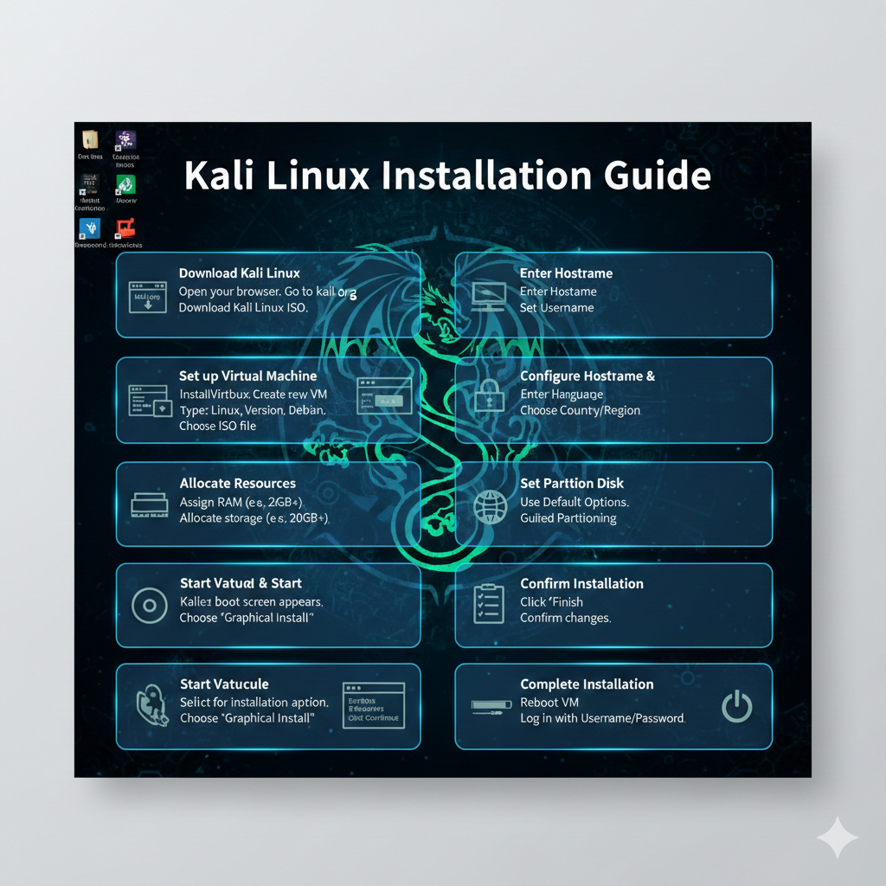

 Day 13 – Ethical Hacking Learning Challenge (100 Days)

Today, I focused on the foundation of any ethical hacking lab – the OS setup.  

-->My Journey
I explored different OS installation methods:-  
- Dual Boot:-Maximum performance, full system access  
- Virtualization:-Safe, flexible, multiple OSes in one system  
- Live Boot:-Temporary sessions for quick experiments  

Choosing the right method felt like picking the right tool for the mission.  

-->Next, I installed VirtualBox, creating isolated environments to practice safely.  

Then, step by step, I installed Parrot OS and Kali Linux, understanding their use cases and why professionals choose one over the other for tasks like penetration testing or digital forensics.  

-->Key Takeaways:-
- Installation method matters: performance, safety, and flexibility are key factors  
- Virtualization is perfect for beginners and experimentation  
- Dual Boot is powerful but requires careful system management  
- Proper OS setup is the foundation for effective penetration testing  

-->Status
Virtual Lab Ready.  
Day 13 Completed.

Learning via Skills Uprise Mentored by Manoj Kumar                         

LinkedIn: https://www.linkedin.com/company/skills-uprise

CEO: https://www.linkedin.com/in/manoj-kumar

