Day 14 – DVWA (Damn Vulnerable Web Application)

Today, I learned about DVWA (Damn Vulnerable Web Application) — a purposely vulnerable platform designed for practicing web application security in a safe and legal environment.

I explored:-
Why DVWA was introduced
Common web vulnerabilities
Security levels (Low → Impossible)
Defensive (Developer) & Offensive (Ethical Hacker) perspectives
Local DVWA setup using XAMPP

Key Learning:-
DVWA provides a legal environment to understand both attacker techniques and secure development practices, making it an essential tool for ethical hacking beginners.

Learning via Skills Uprise Mentored by Manoj Kumar                         

LinkedIn: https://www.linkedin.com/company/skills-uprise

CEO: https://www.linkedin.com/in/manoj-kumar

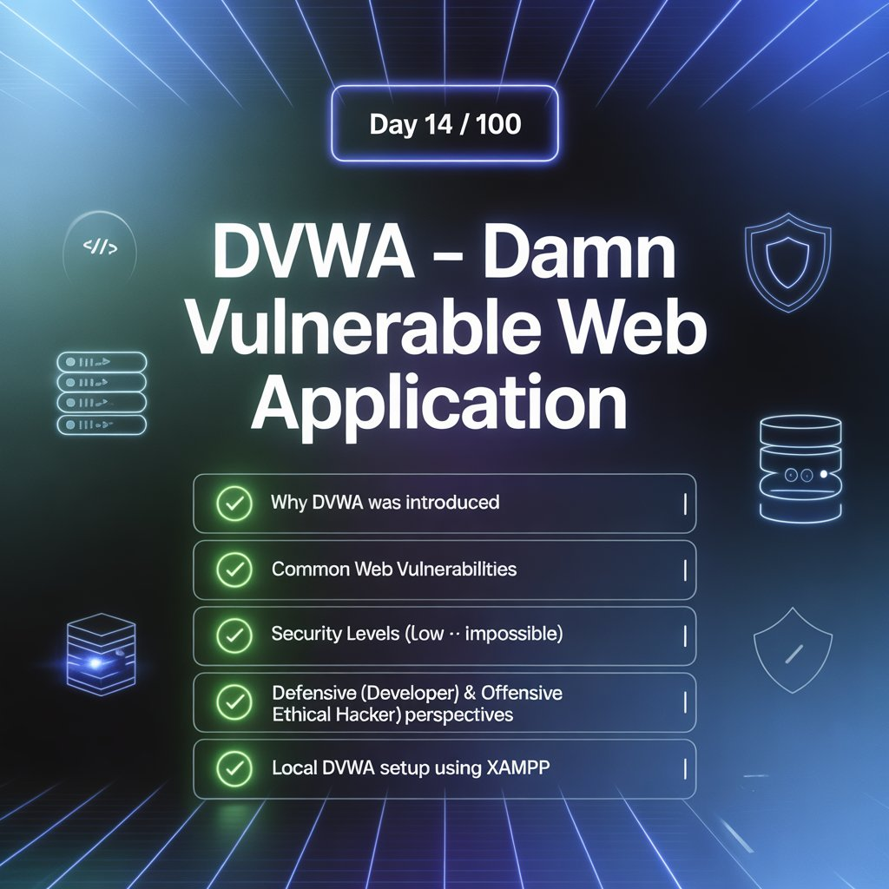
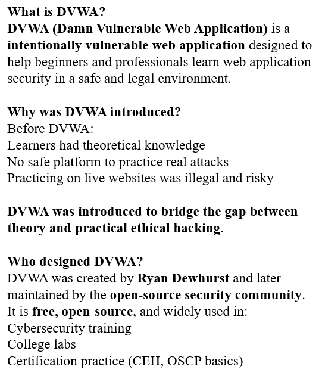
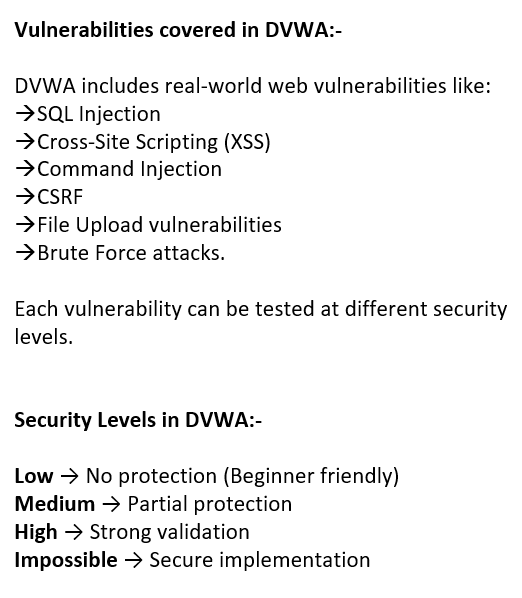
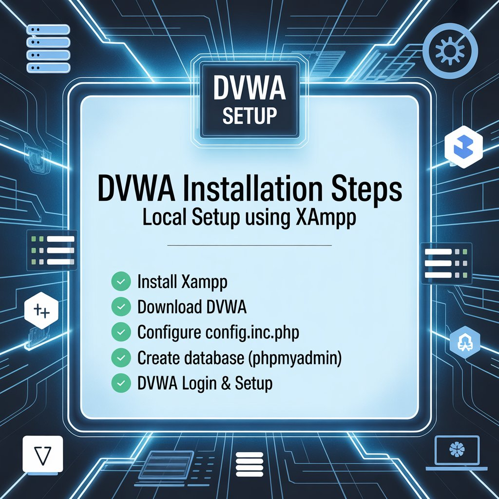
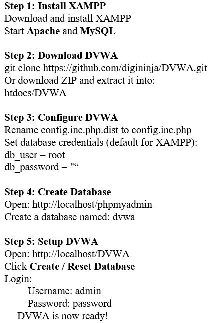
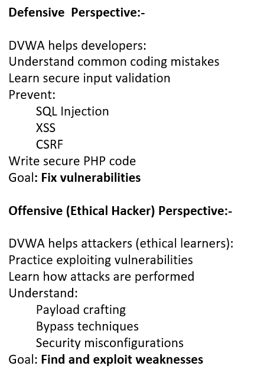

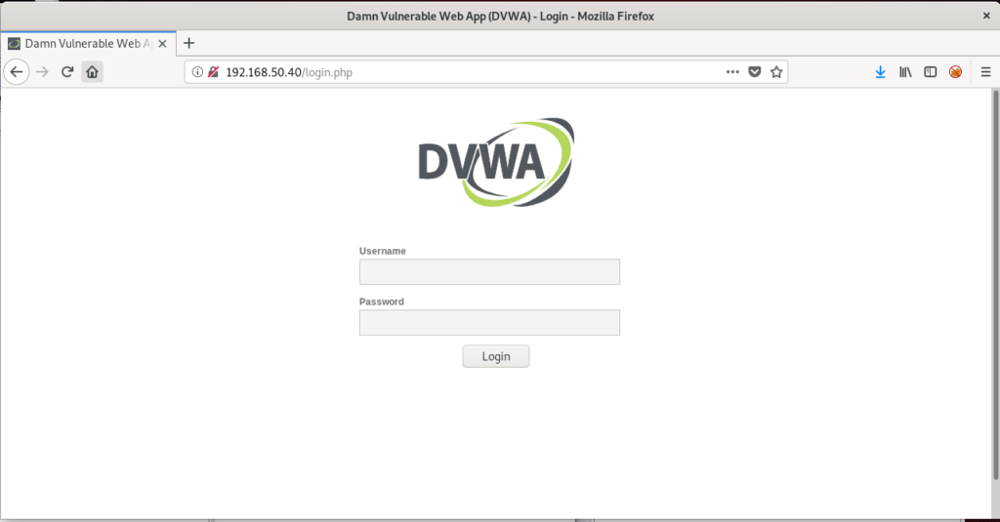
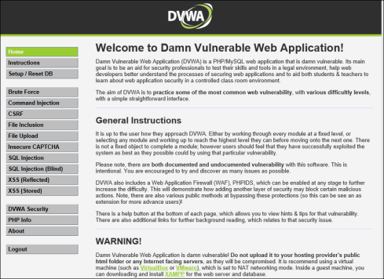
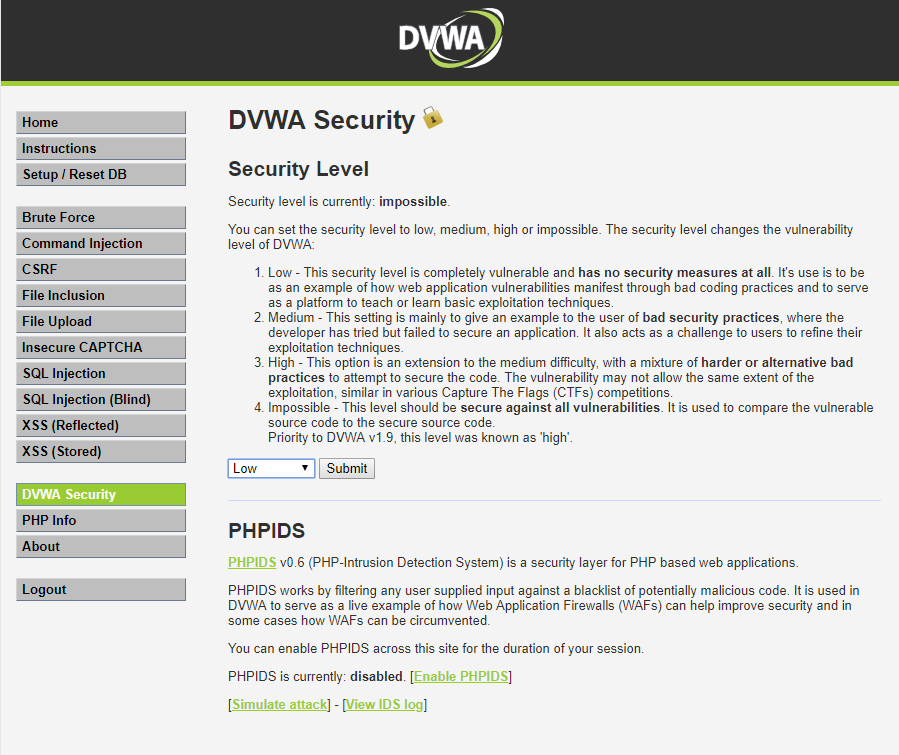
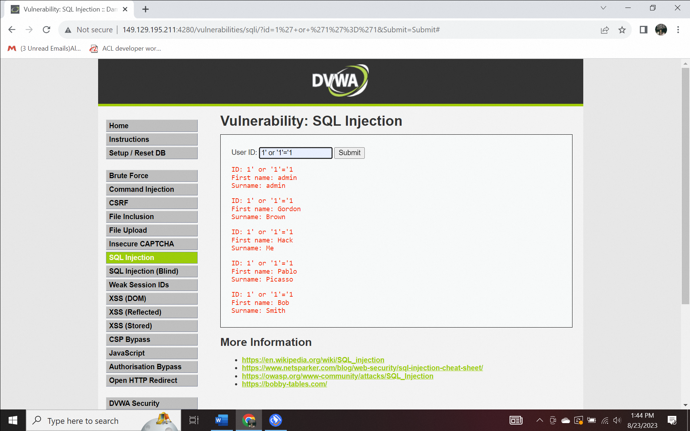
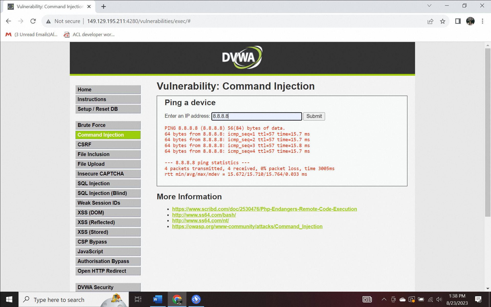
