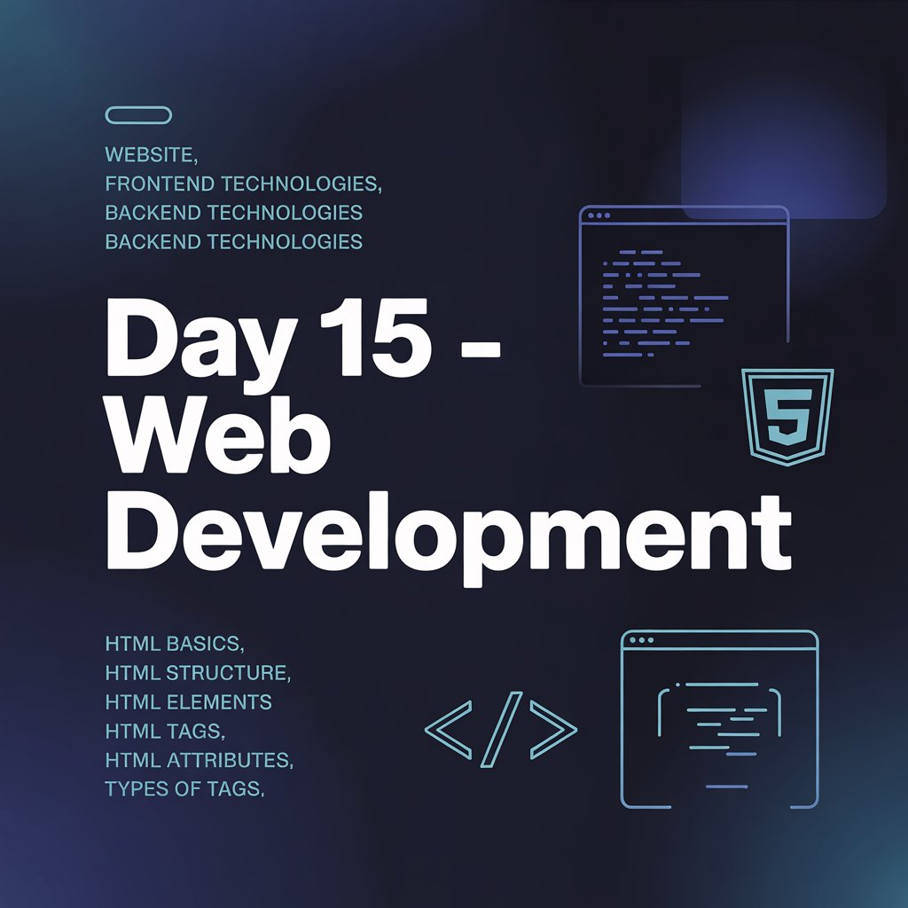
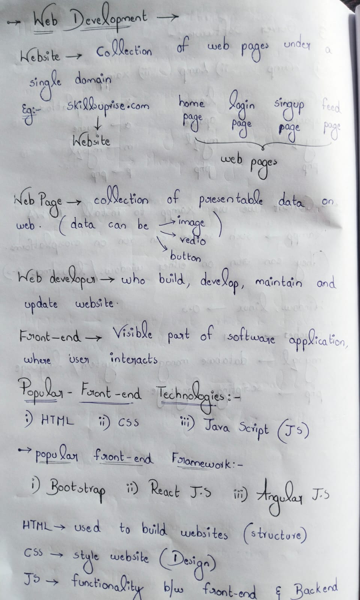
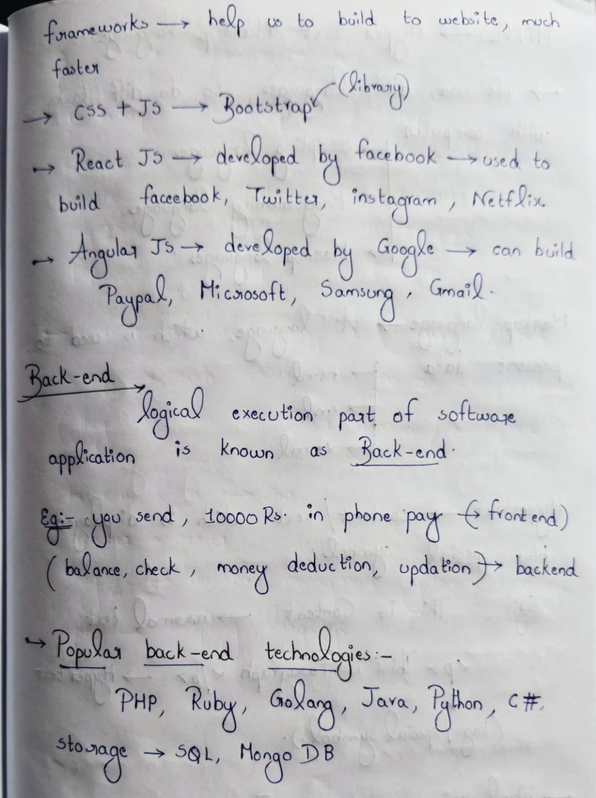
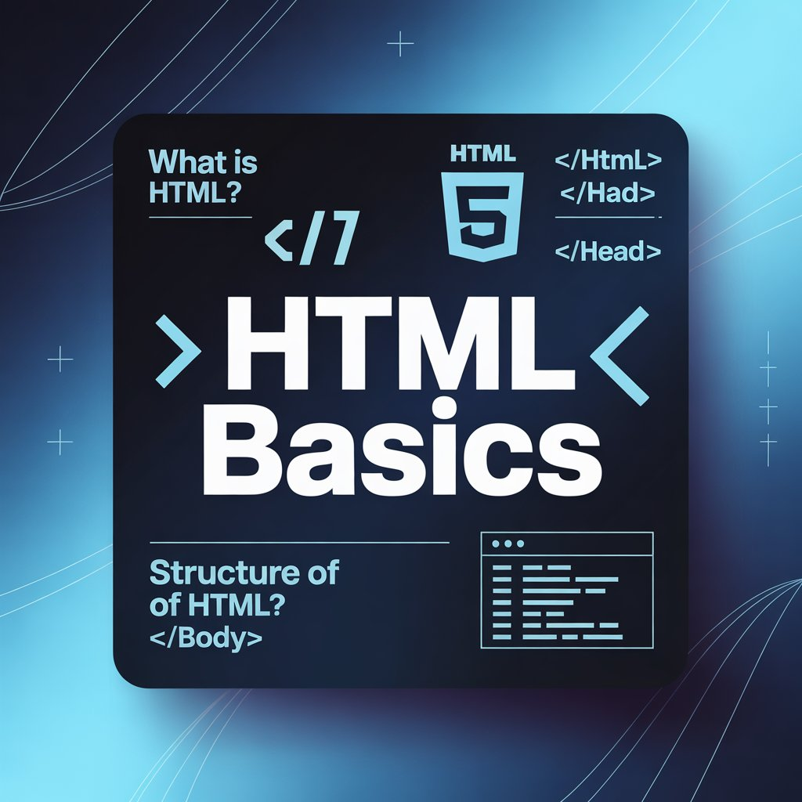
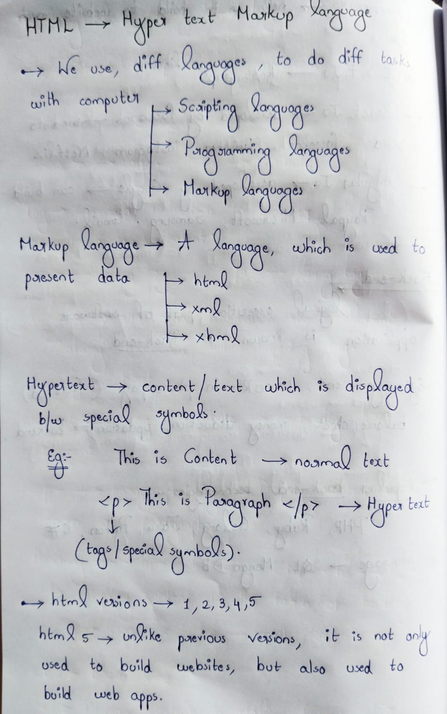
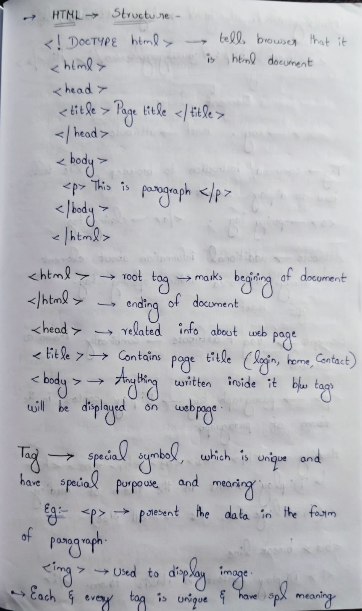
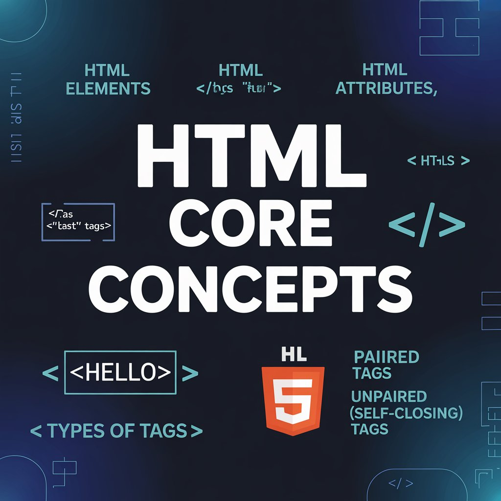
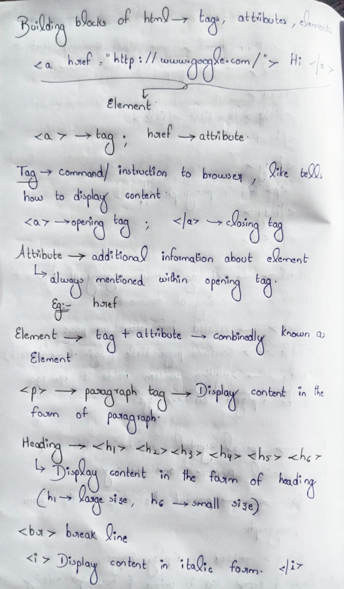
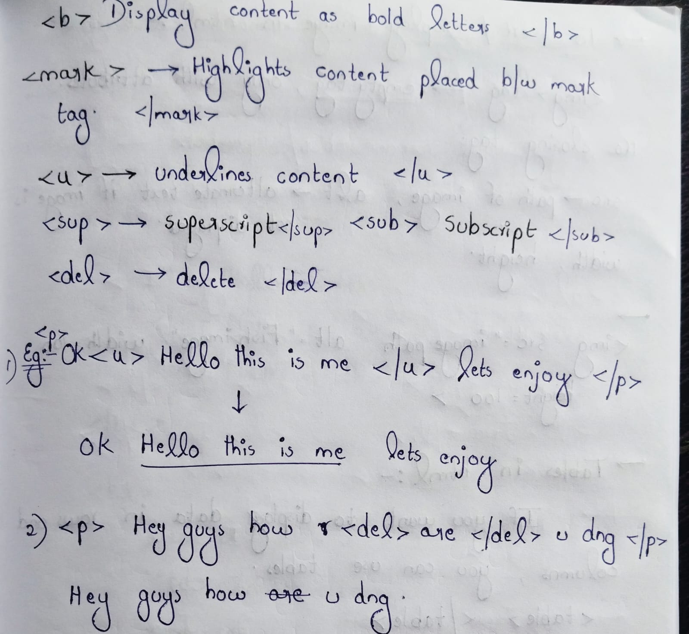

-->Day 15 – Web Fundamentals for Ethical Hacking

-->Why Web Basics?
Before exploiting web applications, it is essential to understand how they are built.
Most vulnerabilities arise due to improper implementation of web fundamentals.

-->Topics Covered:-
1. What is a Website?
A website is a collection of web pages accessed through a browser using HTTP/HTTPS protocols.

2. Frontend vs Backend
Frontend:-
- User interface
- Technologies: HTML, CSS, JavaScript
- Frameworks: React, Angular, Bootstrap

Backend:-
- Logical execution layer
- Handles authentication, validation, and database operations
- Languages: PHP, Python, Java, Node.js, Ruby, Go
- Databases: MySQL, MongoDB

3. HTML (HyperText Markup Language)
A markup language used to structure and present content on the web.

4. Basic HTML Structure
<!DOCTYPE html>
<html>
  <head>
    <title>Page Title</title>
  </head>
  <body>
    
This is a paragraph

  </body>
</html>

-->Core HTML Concepts:-
Tag: Instruction to browser (
, )
Attribute: Additional information (href, src)
Element: Combination of tag, attributes, and content

-->Types of Tags:-
Heading tags
Paragraph tags
Formatting tags
Structural tags

Learning via Skills Uprise Mentored by Manoj Kumar                         

LinkedIn: https://www.linkedin.com/company/skills-uprise

CEO: https://www.linkedin.com/in/manoj-kumar

