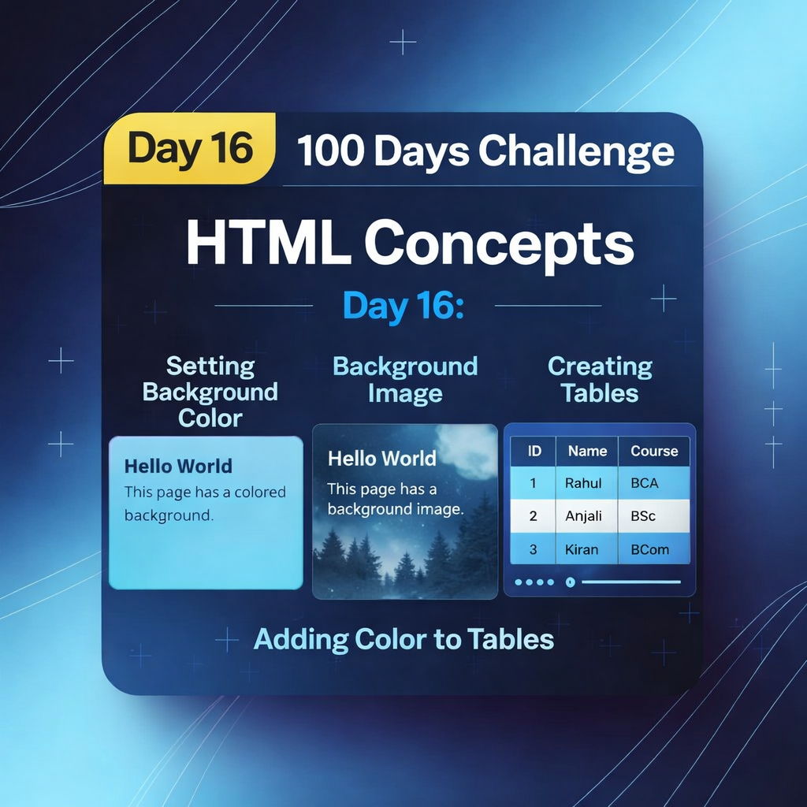
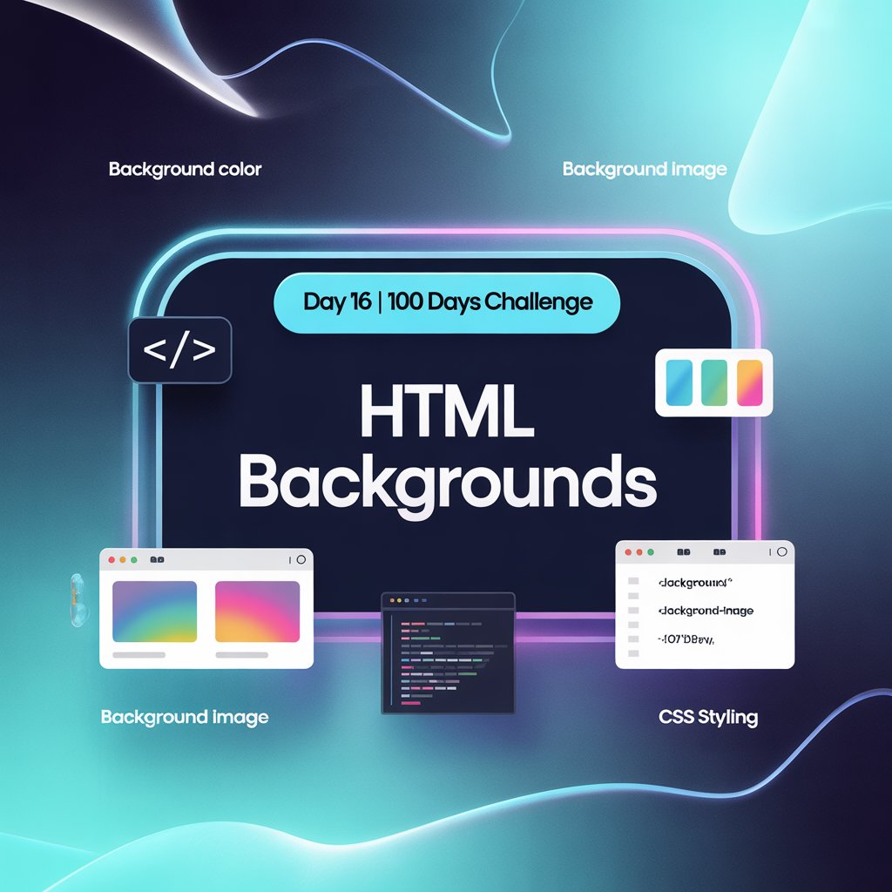
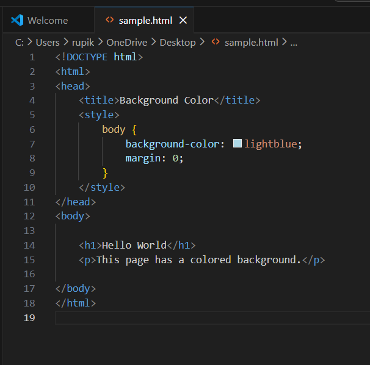
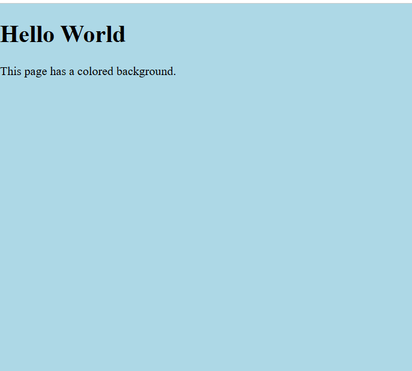
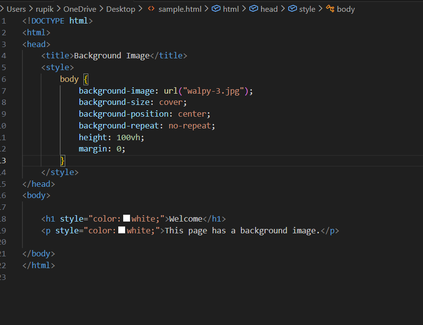
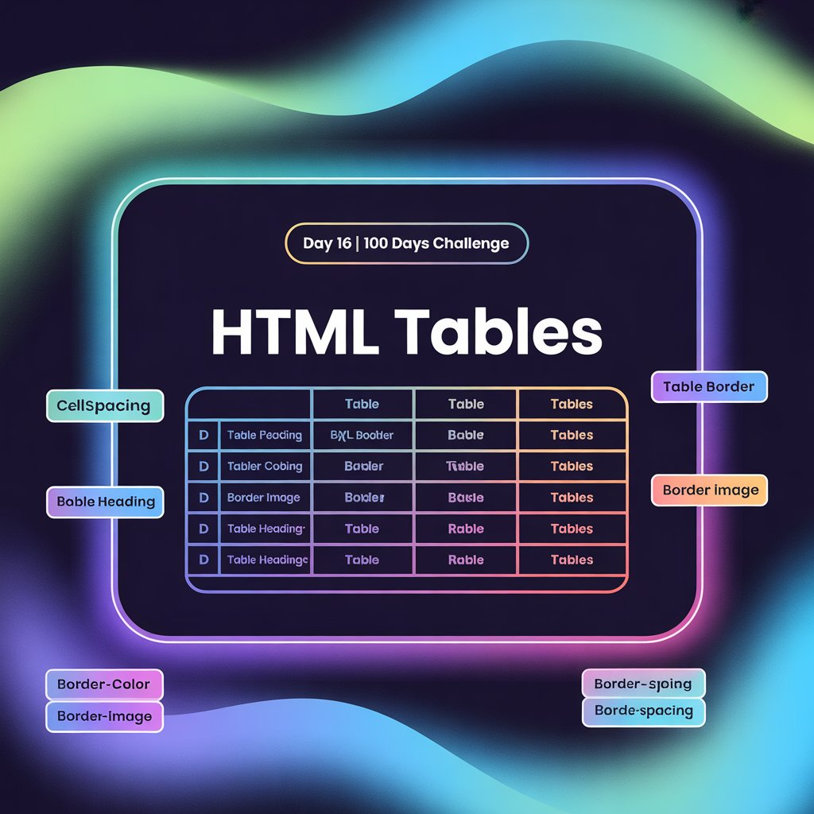
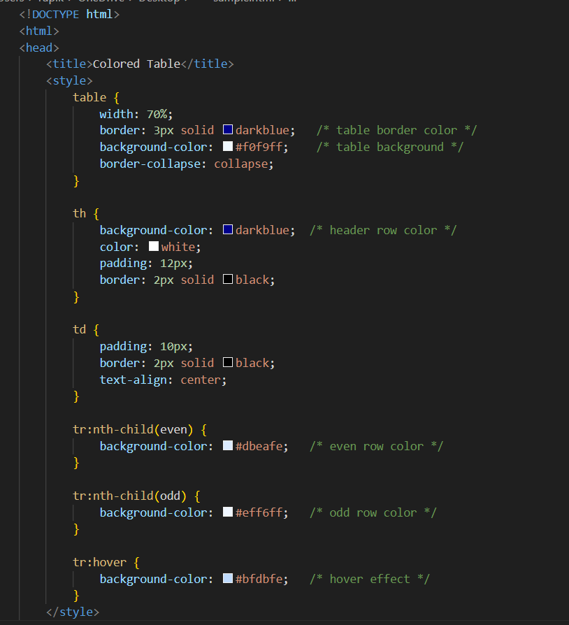
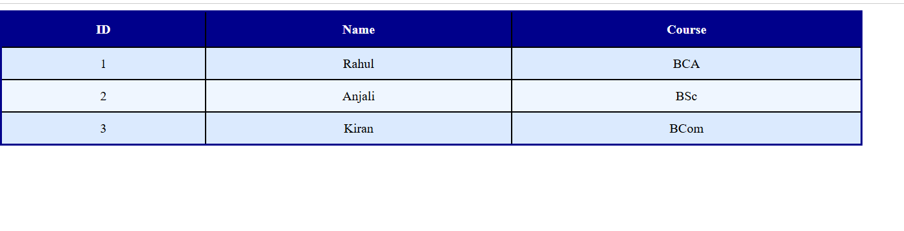

Day 16 – HTML Backgrounds & Tables

Topics Covered:-
Background color using <body style="background-color">
Background image using <body style="background-image">

Table styling:-
border, bordercolor, bgcolor
cellspacing (space between cells)
cellpadding (space inside cells)

Applying background color to a single table row
Sample Code:-
<body style="background-color: lightblue;">

<table border="4" bordercolor="blue" bgcolor="pink"
       cellspacing="5" cellpadding="10">
  <tr bgcolor="orange">
    <th>Roll No</th>
    <th>Name</th>
    <th>Marks</th>
  </tr>
  <tr>
    <td>1</td>
    <td>Anitha</td>
    <td>80</td>
  </tr>
</table>

This day helped me understand how HTML structure and basic styling work together to create readable layouts.

Learning via Skills Uprise Mentored by Manoj Kumar                         

LinkedIn: https://www.linkedin.com/company/skills-uprise

CEO: https://www.linkedin.com/in/manoj-kumar

