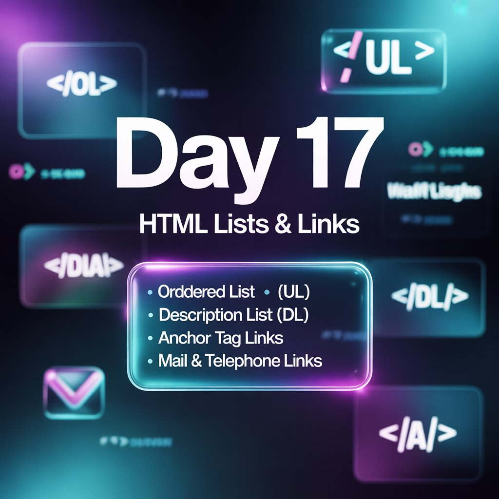
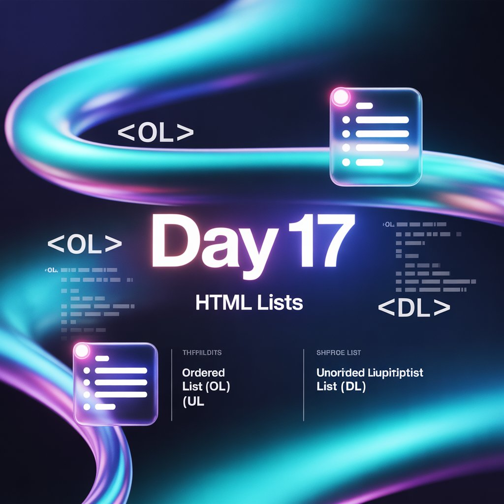
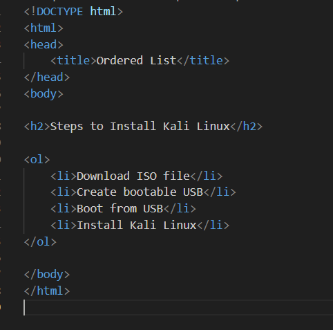
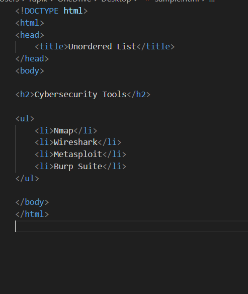
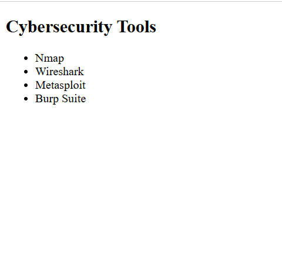
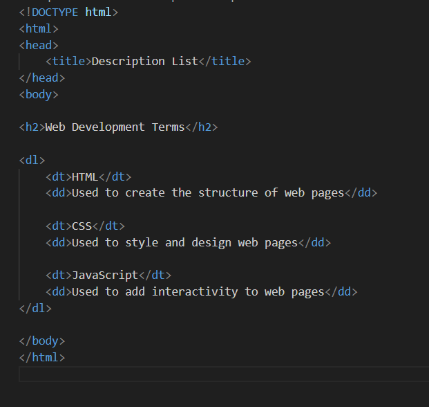
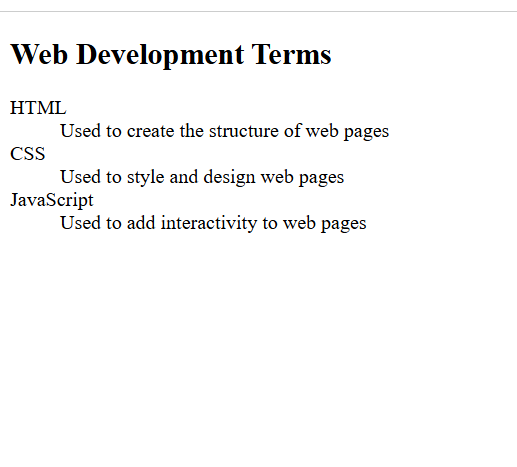
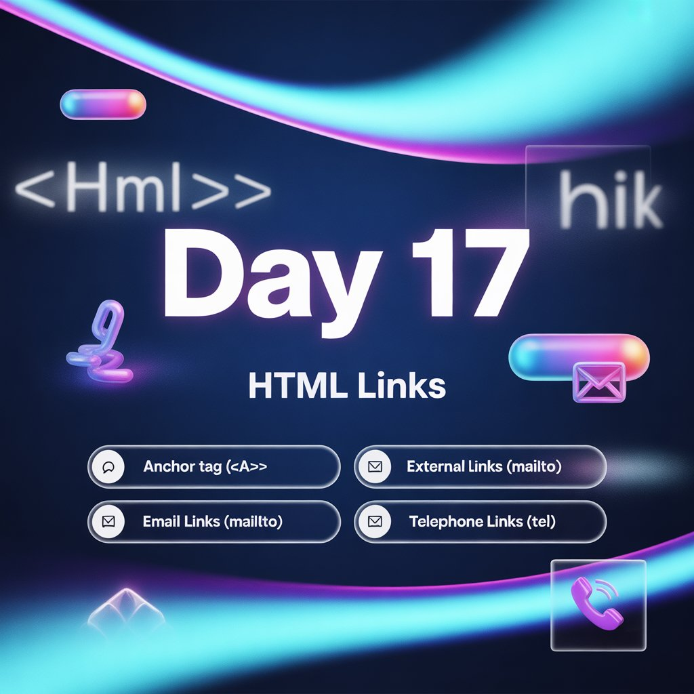
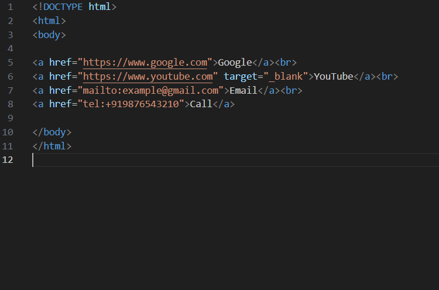
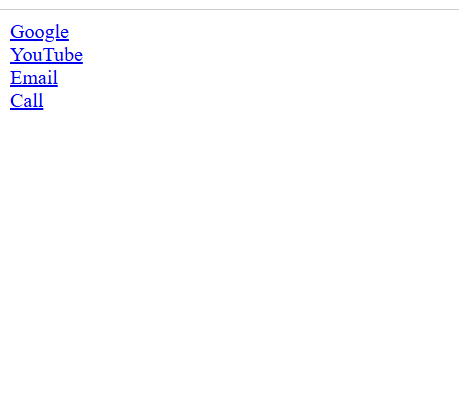

Today’s focus was on structuring content and navigation in HTML.

Topics Covered:-
-->Ordered Lists <ol>

-->Unordered Lists <ul>

-->Description Lists <dl>

-->Anchor Tags and Links <a>

Why Lists Matter:-
==>Improve content readability
==>Organize data logically
==>Enhance user experience

Purpose of Links:-
==>Enable navigation between pages
==>Connect users to external resources
==>Allow email and phone interactions

This session strengthened my understanding of how small HTML elements play a big role in building user-friendly websites.

Learning via Skills Uprise Mentored by Manoj Kumar                         

LinkedIn: https://www.linkedin.com/company/skills-uprise

CEO: https://www.linkedin.com/in/manoj-kumar

