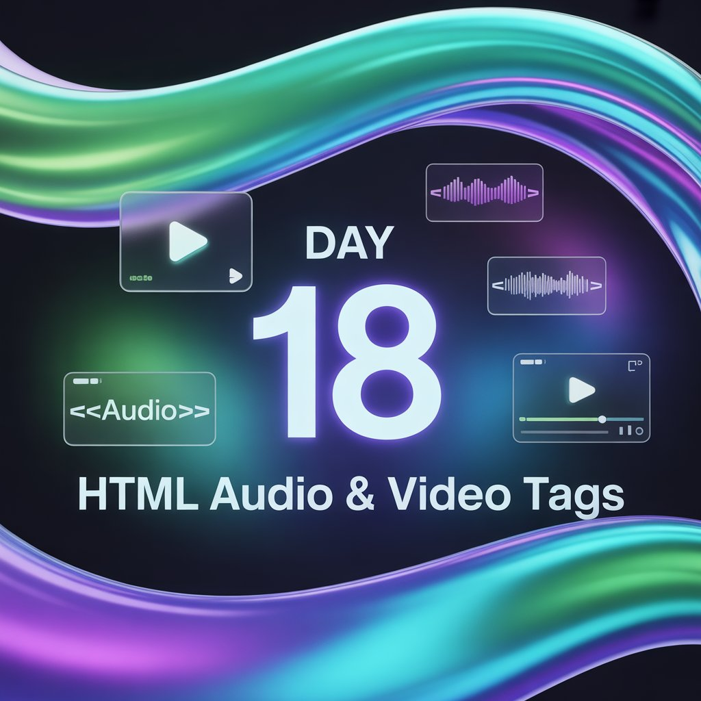
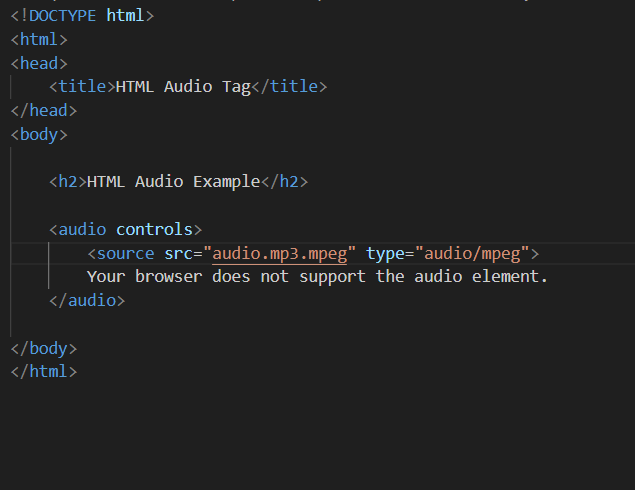
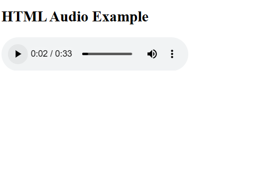
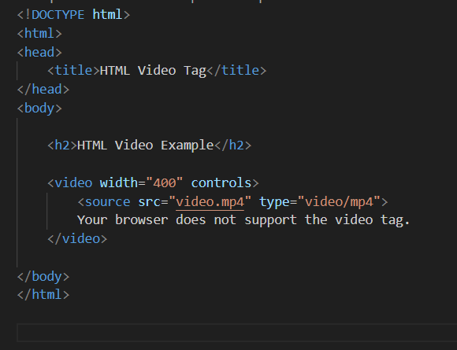
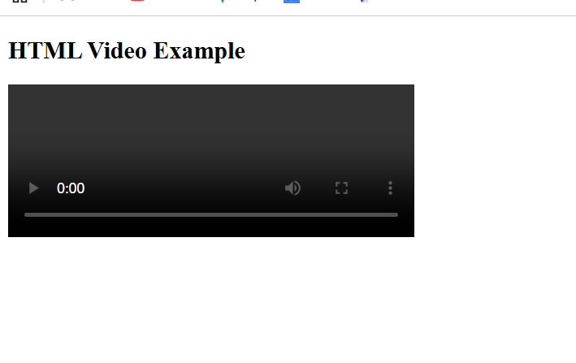

Day 18 – HTML Audio & Video Tags

Today I learned how to embed multimedia content using native HTML tags.

Why Audio & Video Tags?
-->To play media directly in browsers
-->No need for third-party plugins
-->Improves user experience and accessibility

Purpose:-
<audio>: Music, podcasts, voice content
<video>: Tutorials, demos, visual explanations

-->This helps make websites more interactive and engaging.

