Day 20 – Styling HTML (Inline vs Internal vs External)

CSS styling methods evolved to solve code maintainability and scalability problems.

Inline CSS:-
Best for quick testing and dynamic overrides
-->Violates separation of concerns
-->Makes debugging and refactoring difficult

Internal CSS:-
Centralized styles for a single page
-->Cleaner than inline
-->Not reusable across multiple pages

External CSS:-
True separation of structure and design
-->Reusable and maintainable
-->Faster load due to browser caching
-->Team-friendly

-->Real-World Insight:-
As websites grow, maintainability matters more than speed of writing code.
That’s why external CSS dominates real projects.

-->Rule of Thumb:
Inline → Rare
Internal → Small demos
External → Production websites

Learning via Skills Uprise Mentored by Manoj Kumar                         

LinkedIn: https://www.linkedin.com/company/skills-uprise

CEO: https://www.linkedin.com/in/manoj-kumar

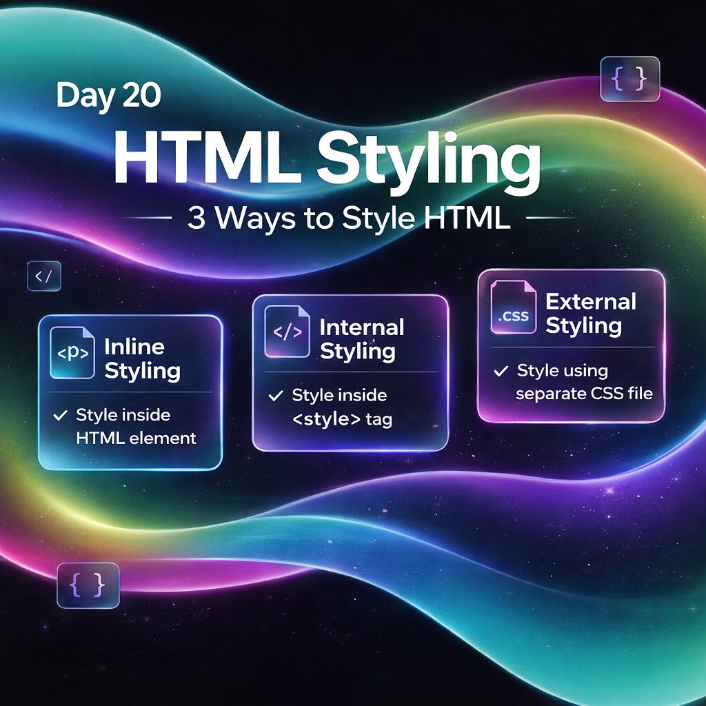
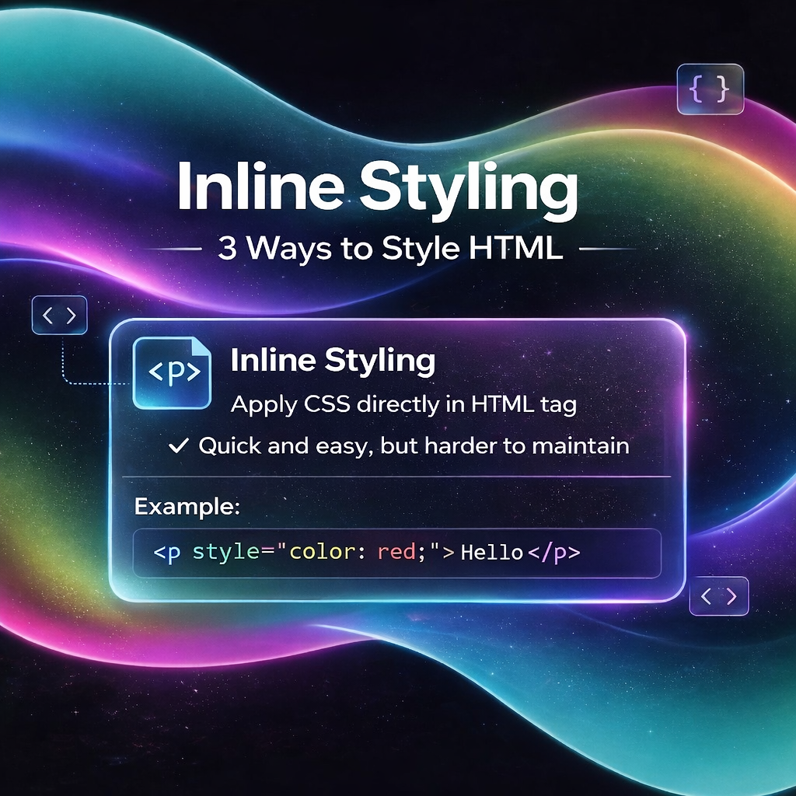
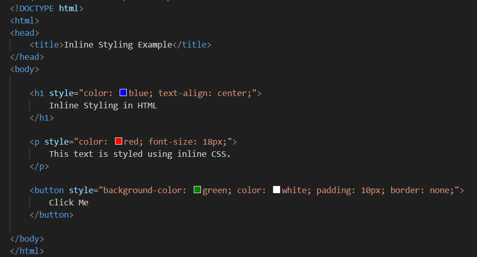
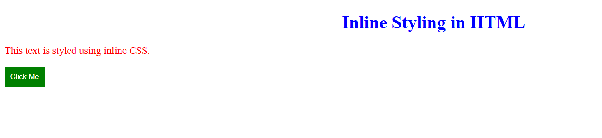
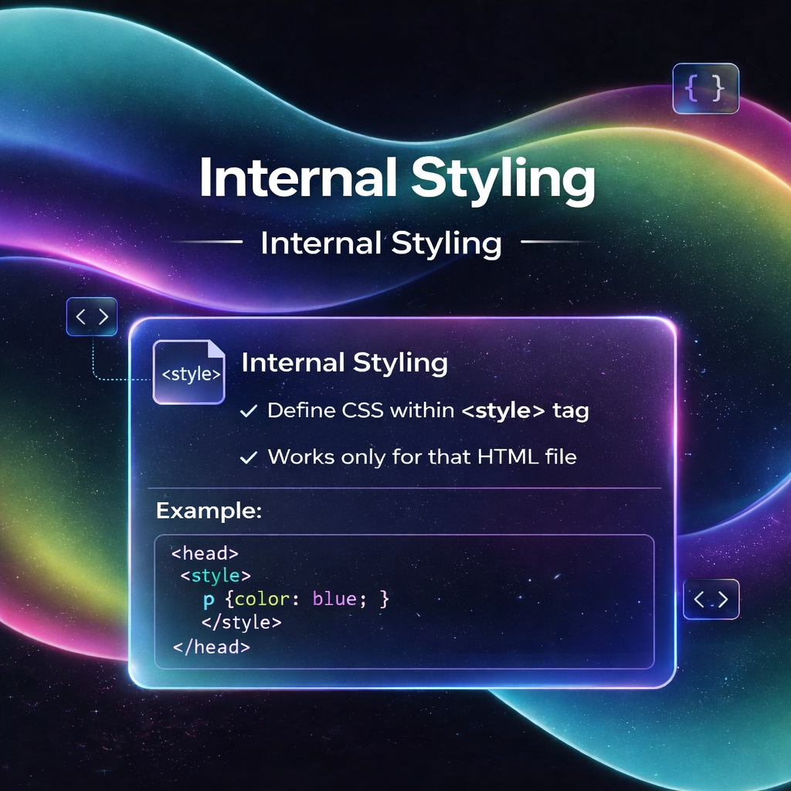
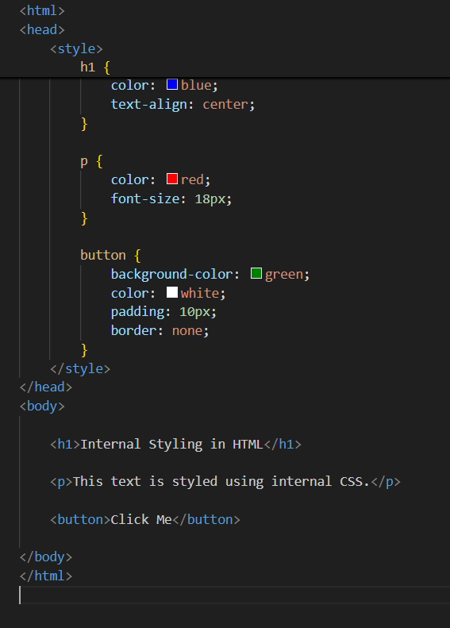
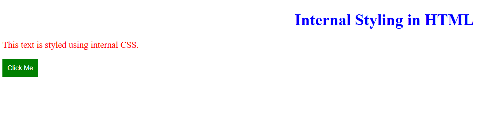
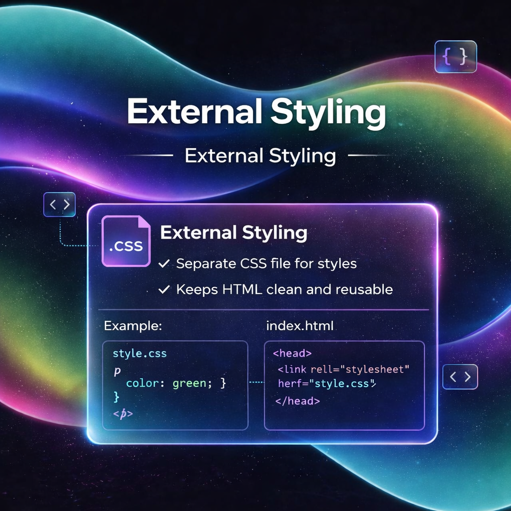
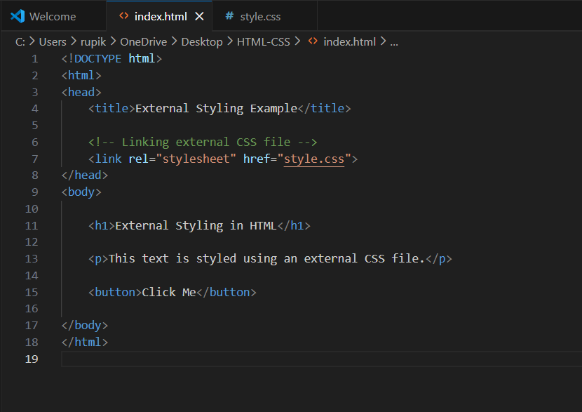
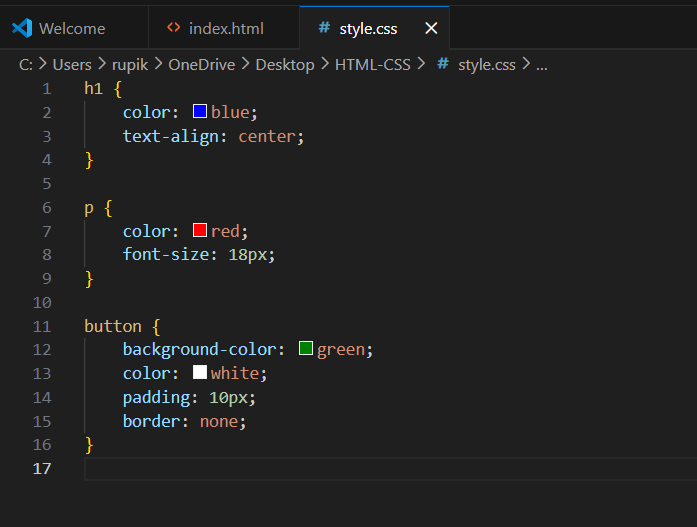
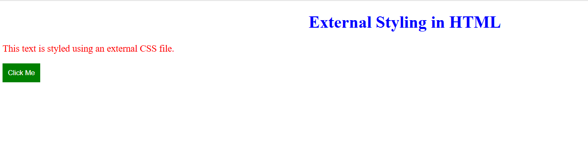
