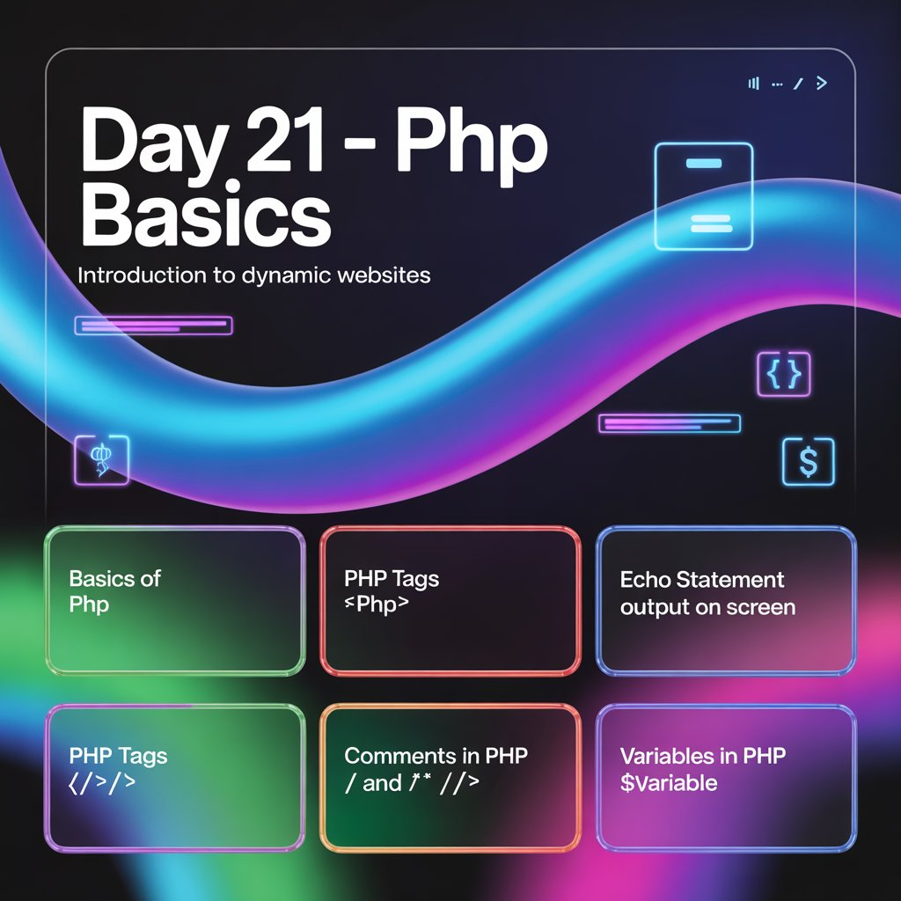
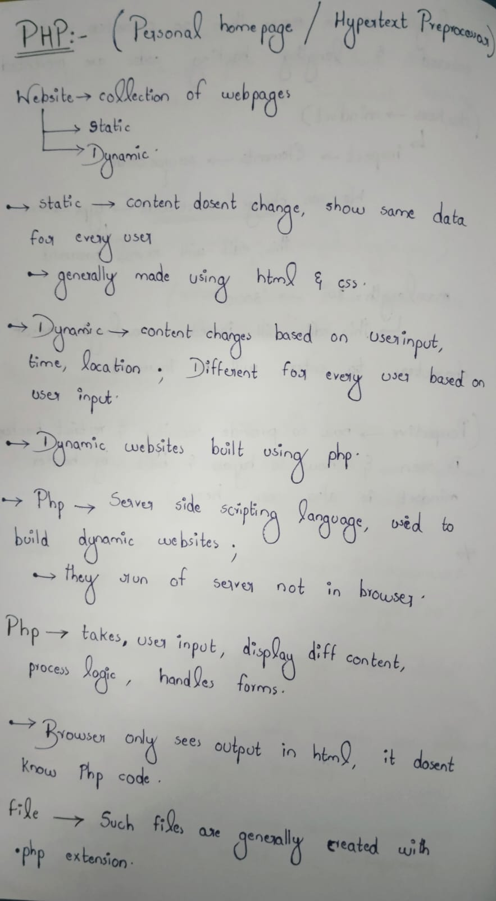
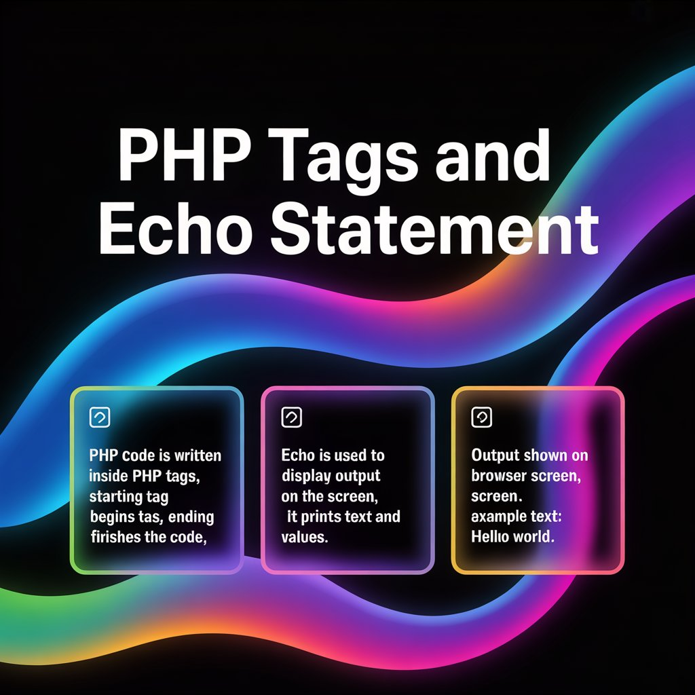
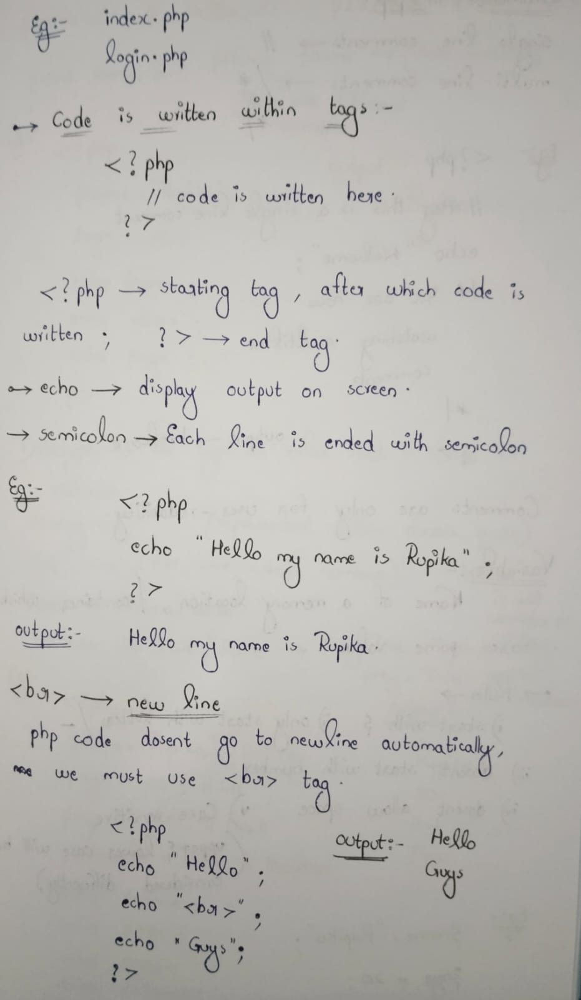
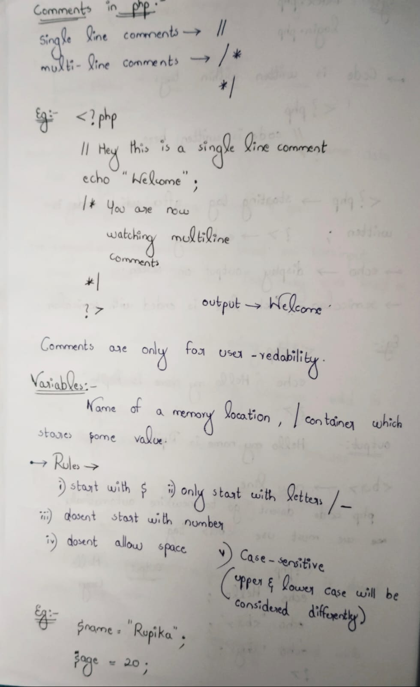
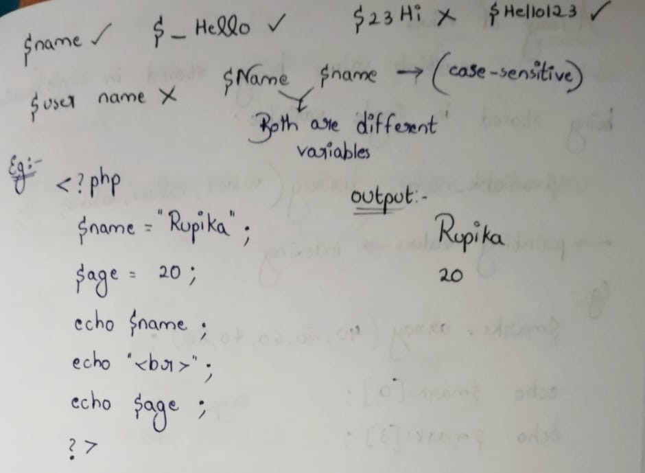

Day 21 – Introduction to PHP | Ethical Hacking Journey

-->Why PHP?
PHP is a server-side scripting language widely used to build dynamic web applications.
Understanding PHP is essential for analyzing backend logic and identifying web vulnerabilities.

-->Topics Covered
- Introduction to PHP (Server-side execution)
- PHP Tags (`<?php ?>`)
- Comments in PHP
  - Single-line (`//`)
  - Multi-line (`/* */`)
- Variables in PHP (`$variable`)

-->Security Perspective
Most web vulnerabilities such as SQL Injection, XSS, and File Inclusion originate from
improper handling of PHP variables and user inputs.

-->Progress
- Static Web: HTML, CSS 
- Dynamic Web: PHP (Started)

Day 21 marks the transition from frontend basics to backend logic analysis.

Learning via Skills Uprise Mentored by Manoj Kumar                         

LinkedIn: https://www.linkedin.com/company/skills-uprise

CEO: https://www.linkedin.com/in/manoj-kumar

