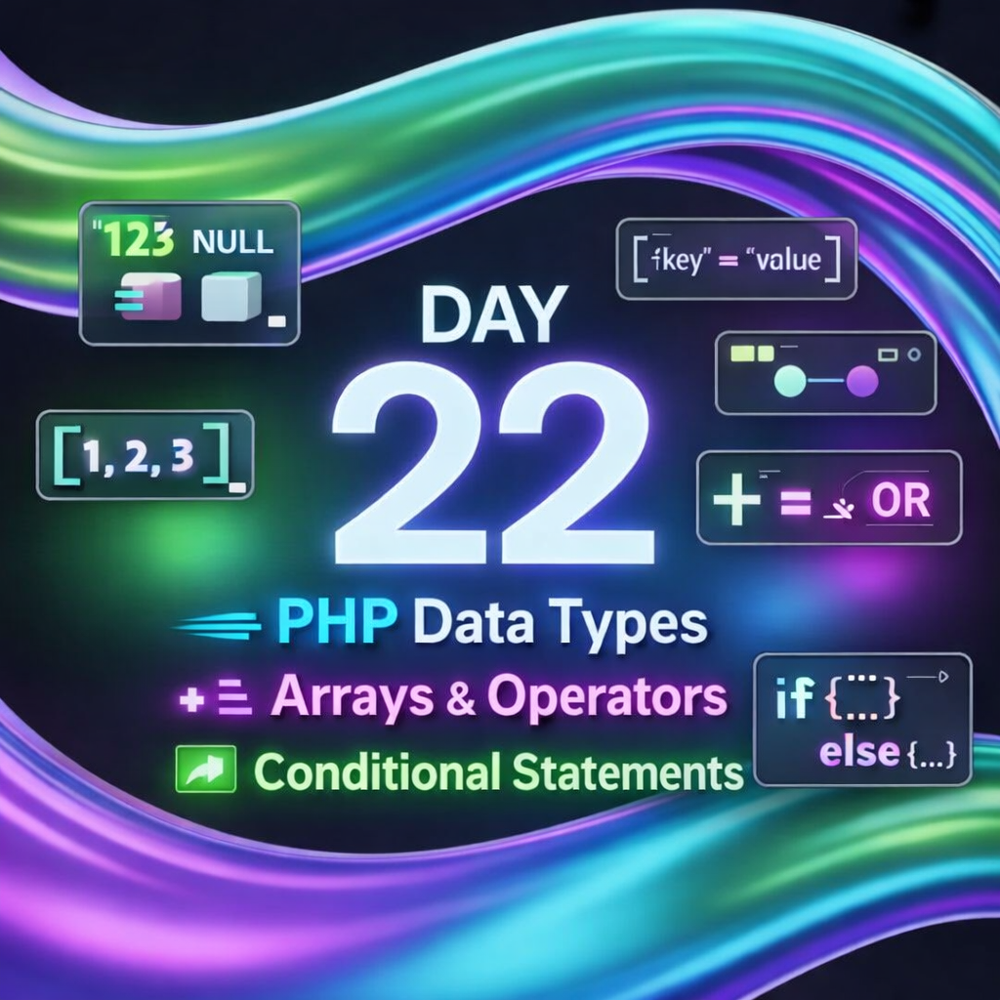
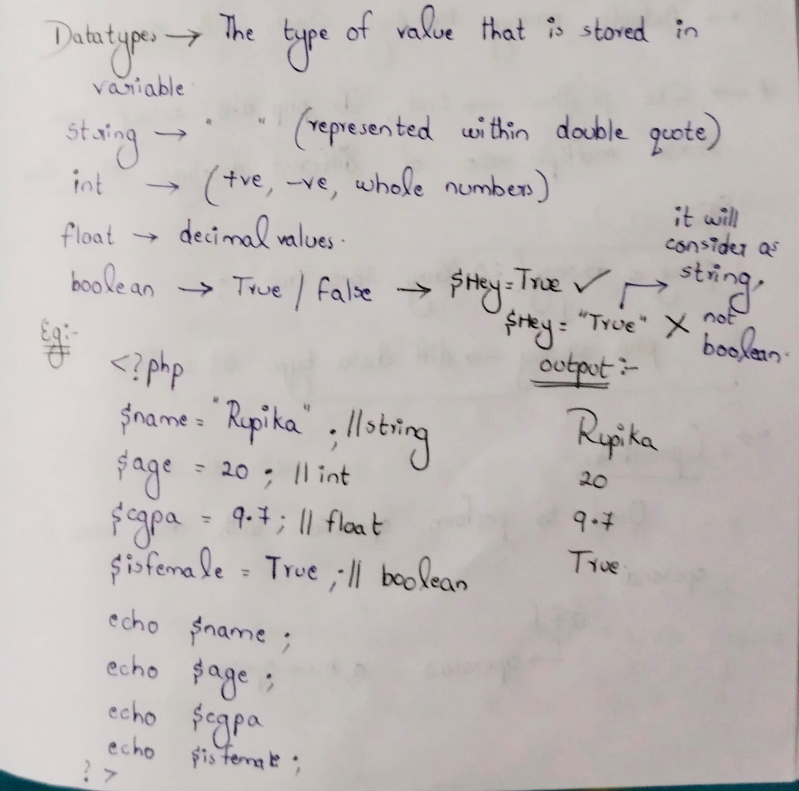
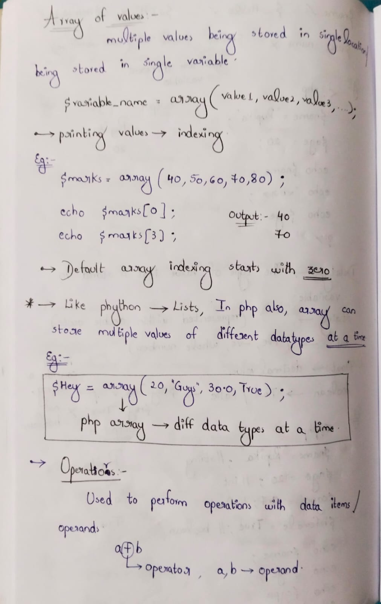
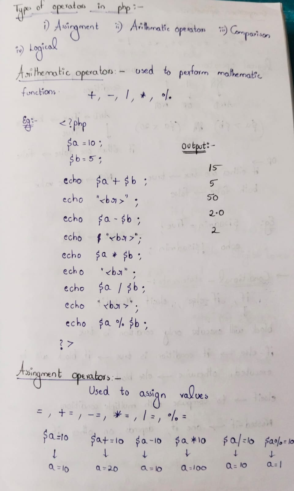
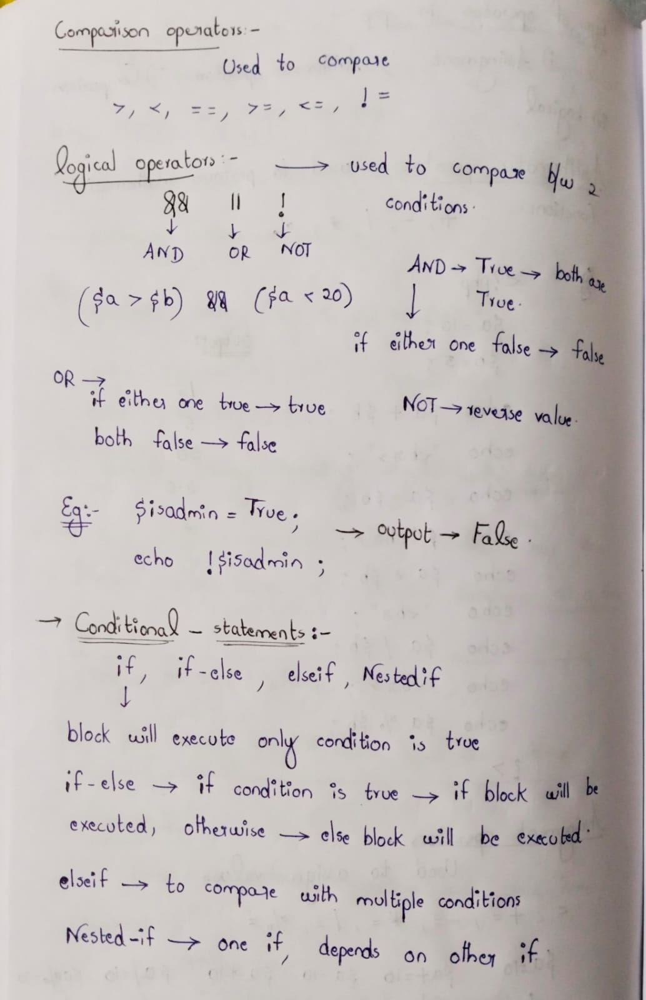
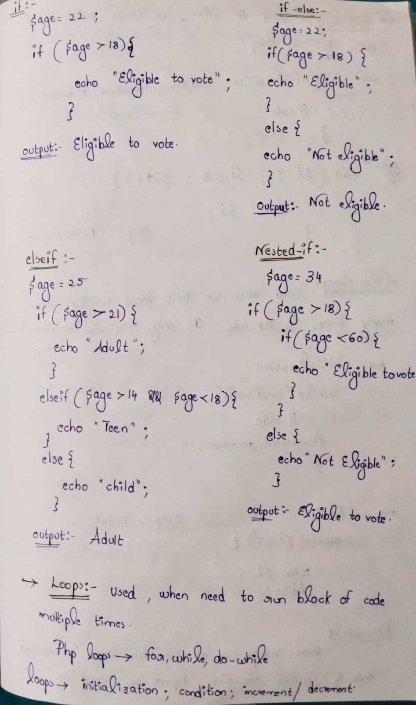

Day 22 focused on understanding how PHP handles data and controls application logic, which is essential for analyzing dynamic web applications during security testing.

Topics Covered:-
1. PHP Data Types
Learned how PHP stores and processes data using:
String
Integer / Float
Boolean
NULL

Understanding data types is important for identifying type-related issues, input handling problems, and validation flaws.

2. Arrays in PHP
Studied how arrays store multiple values:
Indexed arrays
Associative arrays

Arrays are commonly used in sessions, cookies, and database results, and weak handling can lead to data leakage or logic errors.

3. PHP Operators
Explored operators used for:
Arithmetic operations
Comparisons
Logical conditions

Operators play a key role in authentication logic and access control decisions.

4. Conditional Statements
Worked with:
if
else
elseif

Conditional statements control application flow and are critical in login systems, role validation, and security checks.

Security Perspective:-
Understanding PHP logic helps in:
Analyzing backend decision flow
Tracing how user input affects output
Identifying logic flaws and injection entry points

Summary:-
Day 22 strengthened the foundation required to understand how dynamic applications behave internally, making it easier to identify vulnerabilities in later stages of testing.

