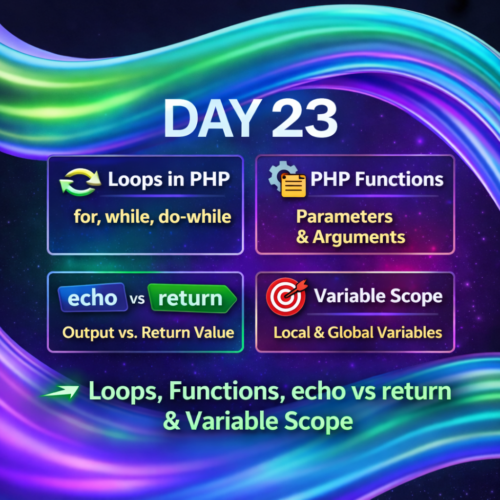
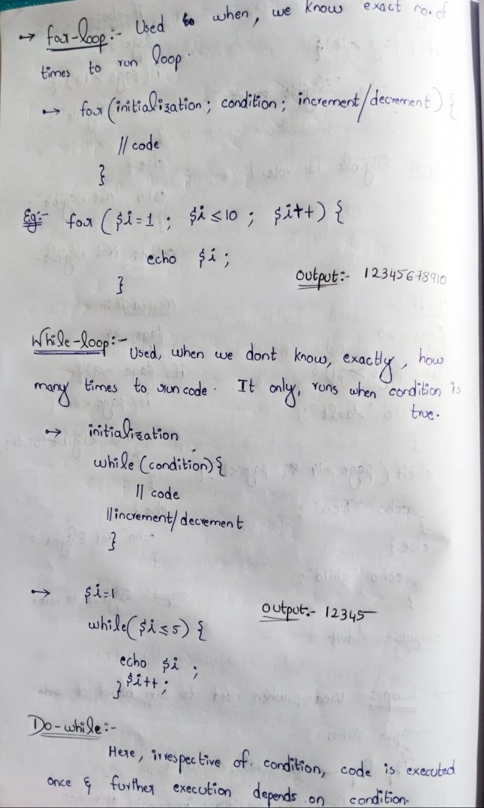
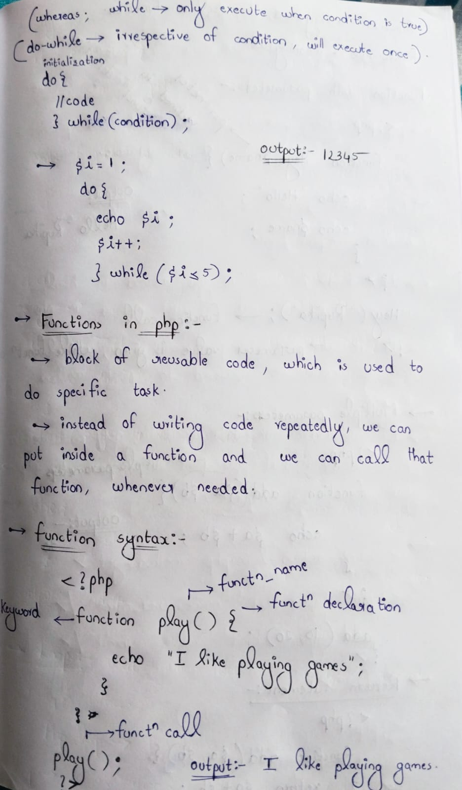
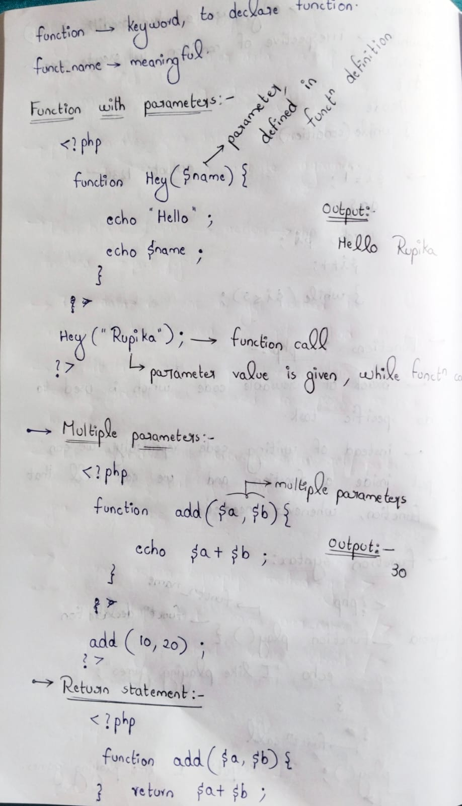
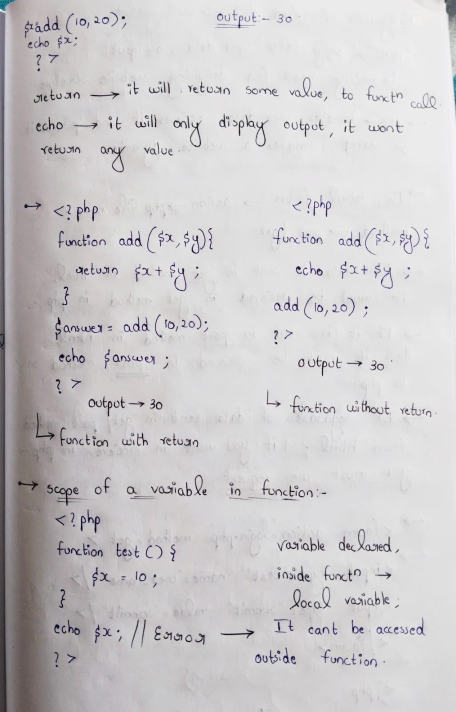

Day 23 – PHP Control Structures & Functions

As part of my 100 Days of Ethical Hacking Challenge, Day 23 focused on PHP logic and execution flow, which are essential for understanding dynamic web application behavior.

Topics Covered:-

-->Loops in PHP:-
for loop for fixed iterations
while loop for condition-based execution
do-while loop that executes at least once

-->Functions in PHP:-
Function creation and reuse
Single and multiple parameters

-->echo vs return:-
echo is used to display output
return is used to pass values from a function

-->Variable Scope:-
Local scope inside functions
Global scope across the script

Why this matters for security:-
These concepts help in analyzing repeated execution, data flow, and variable handling—common areas where vulnerabilities like logic flaws and injections occur.

Learning via Skills Uprise Mentored by Manoj Kumar                         

LinkedIn: https://www.linkedin.com/company/skills-uprise

CEO: https://www.linkedin.com/in/manoj-kumar

