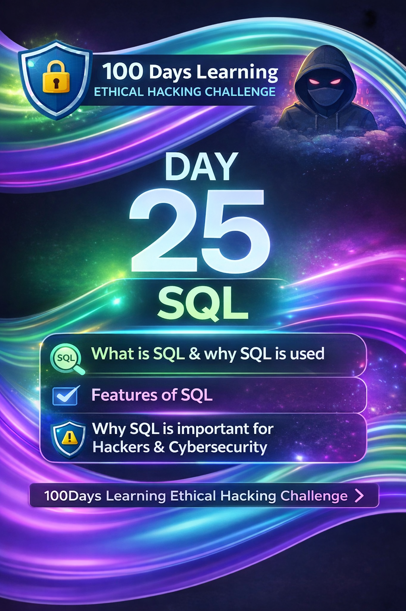
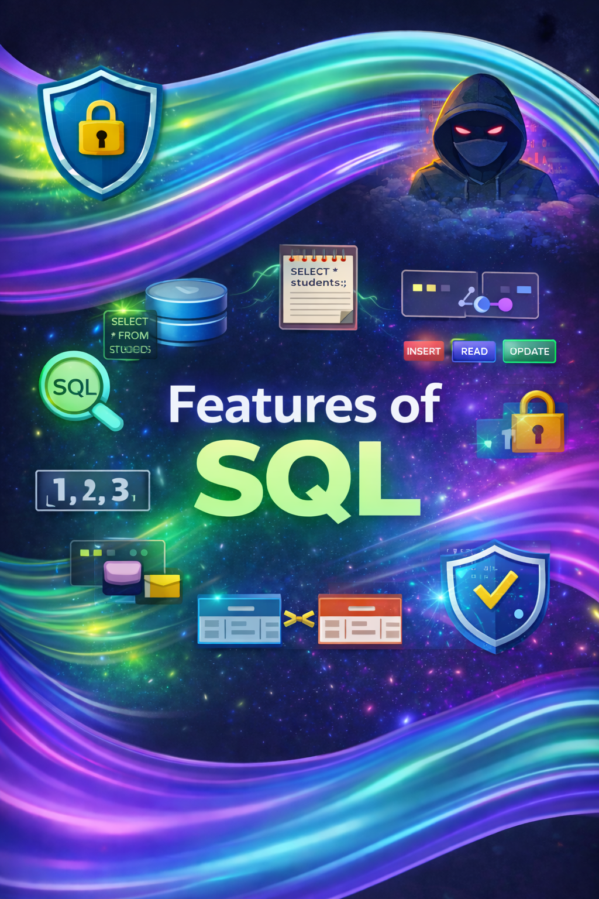
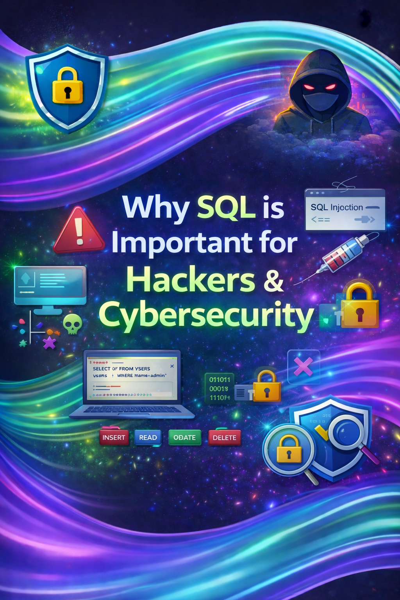

Day 25 – 100 Days Ethical Hacking Learning Challenge
-->Topic: SQL & Cybersecurity

1. What is SQL & Why SQL is Used
SQL (Structured Query Language) is used to manage and manipulate data stored in relational databases. It allows applications to store user data, retrieve records, and maintain structured information efficiently.

2. Features of SQL
- Easy to learn (English-like syntax)
- Supports CRUD operations
- Handles large datasets
- Provides data security using permissions
- Works with multiple database systems
- Supports relationships between tables

3. Why SQL is Important for Hackers & Cybersecurity
Many web applications are vulnerable due to improper SQL query handling. These weaknesses can lead to SQL Injection attacks, allowing attackers to access or manipulate sensitive data. Ethical hackers use SQL knowledge to identify, test, and remediate such vulnerabilities.

Key Learning
Understanding SQL is critical for securing web applications and preventing database-level attacks.

Learning via Skills Uprise Mentored by Manoj Kumar                         

LinkedIn: https://www.linkedin.com/company/skills-uprise

CEO: https://www.linkedin.com/in/manoj-kumar

