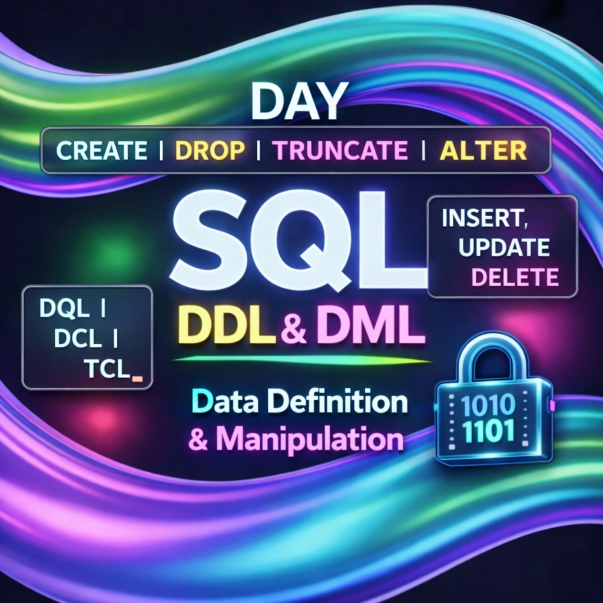

Day 26 – 100 Days Ethical Hacking Learning Challenge

SQL Command Types:-
SQL commands are categorized based on their purpose:-
DDL (Data Definition Language)
DML (Data Manipulation Language)
DQL (Data Query Language)
DCL (Data Control Language)
TCL (Transaction Control Language)

DDL (Data Definition Language):-
Used to define and modify database structures.

CREATE TABLE table_name (column datatype);
DROP TABLE table_name;
TRUNCATE TABLE table_name;
ALTER TABLE table_name ADD column datatype;

DML (Data Manipulation Language):-
Used to manipulate data inside tables.

INSERT INTO table_name VALUES (...);
UPDATE table_name SET column = value WHERE condition;
DELETE FROM table_name WHERE condition;

Day 26 completed successfully.

Learning via Skills Uprise Mentored by Manoj Kumar                         

LinkedIn: https://www.linkedin.com/company/skills-uprise

CEO: https://www.linkedin.com/in/manoj-kumar

