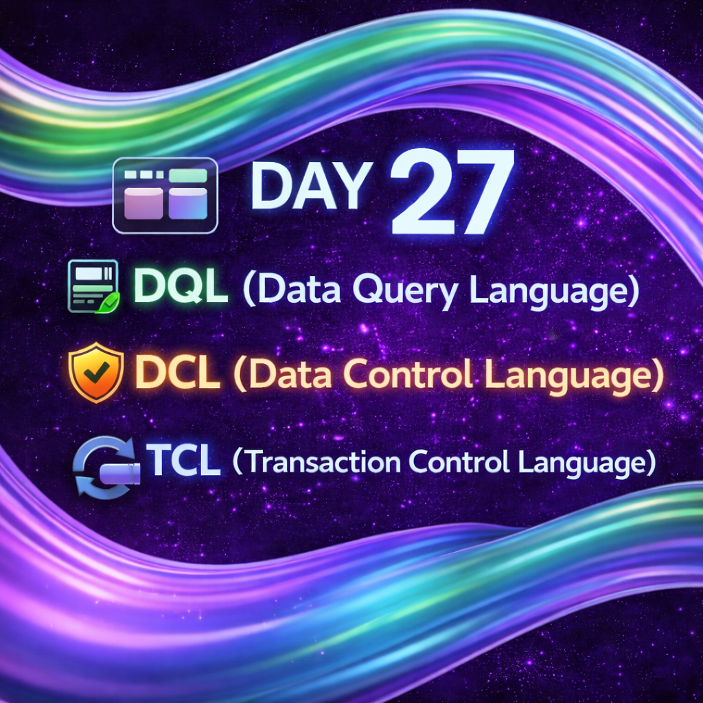

Day 27 – SQL Control & Query Commands

As part of my 100 Days of Ethical Hacking challenge, today I focused on understanding SQL command categories that are essential for database interaction and security.

Topics Covered:-

DQL (Data Query Language)
Used to retrieve data from databases using SELECT.

DCL (Data Control Language)
Learned how access control works using GRANT and REVOKE.

TCL (Transaction Control Language)
Understood how databases manage changes using COMMIT, ROLLBACK, and SAVEPOINT.

These concepts are important for understanding data access control, privilege management, and transaction safety, which are commonly tested in real-world security scenarios.
Consistent learning, one day at a time.

Learning via Skills Uprise Mentored by Manoj Kumar                         

LinkedIn: https://www.linkedin.com/company/skills-uprise

CEO: https://www.linkedin.com/in/manoj-kumar

