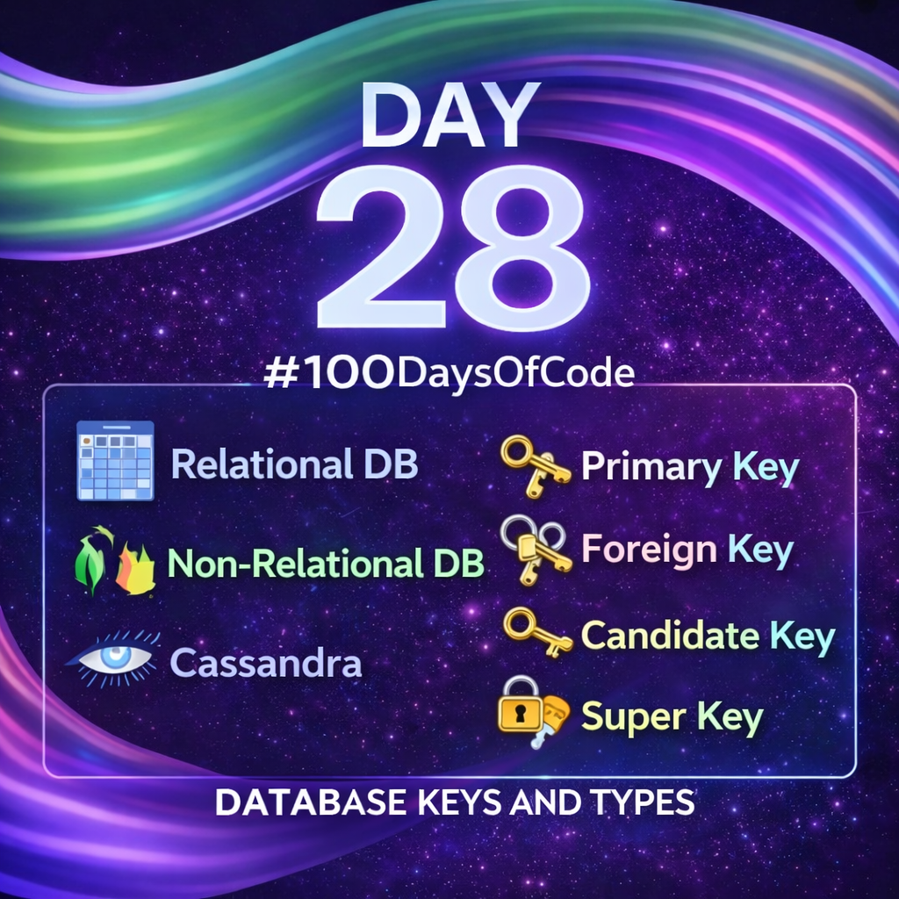

Day 28 – Database Concepts:-

Today’s learning focused on understanding how data is stored and managed inside applications.

I learned how relational databases organize data into structured tables and use relationships to maintain consistency. I also explored non-relational databases, which provide flexibility and scalability for modern applications handling large or changing data.
In addition, I studied database keys. Primary keys uniquely identify records, foreign keys create relationships between tables, candidate keys represent possible primary key options, and super keys uniquely identify records even when extra attributes are included.

These concepts are essential for understanding database design, backend logic, and common security weaknesses.

Day 28 completed under the #100DaysLearningEthicalHacking challenge.

Learning via Skills Uprise Mentored by Manoj Kumar                         

LinkedIn: https://www.linkedin.com/company/skills-uprise

CEO: https://www.linkedin.com/in/manoj-kumar

