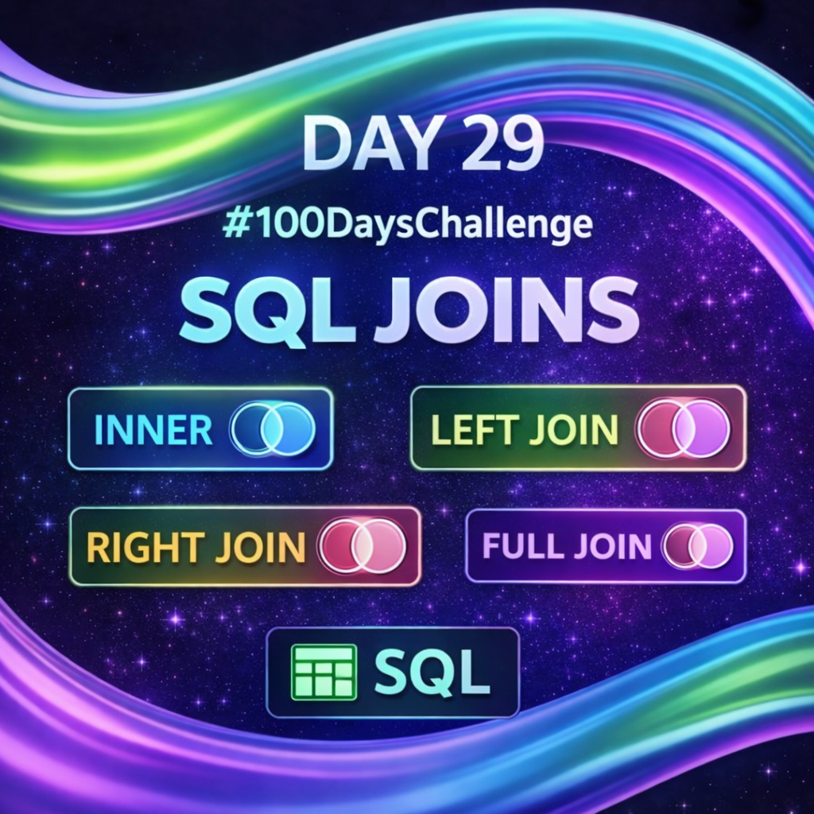
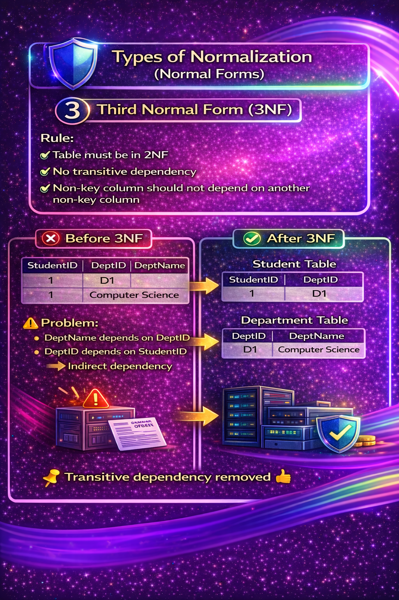
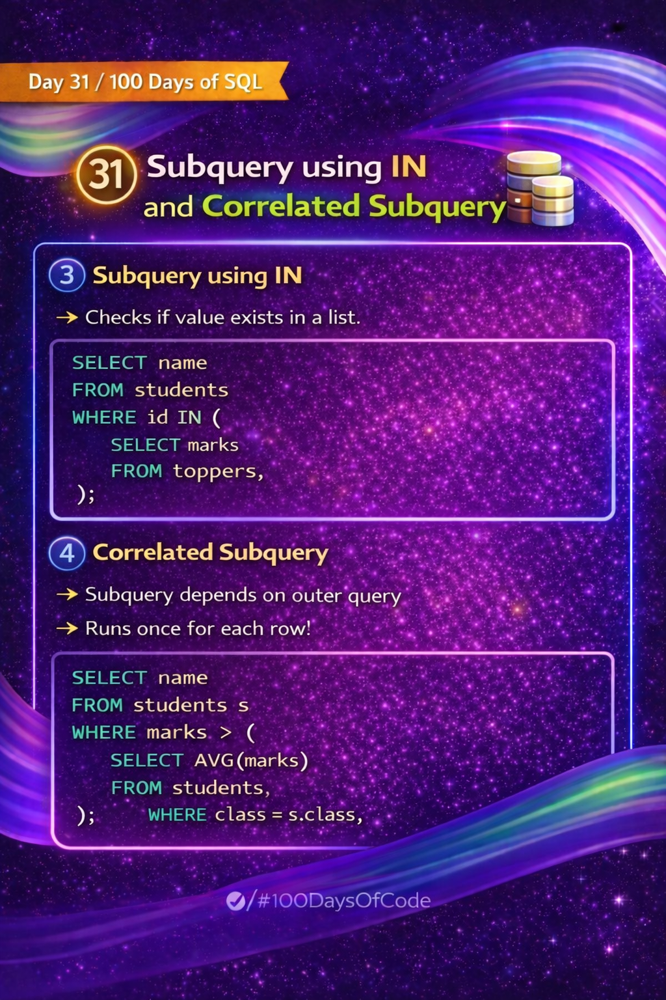
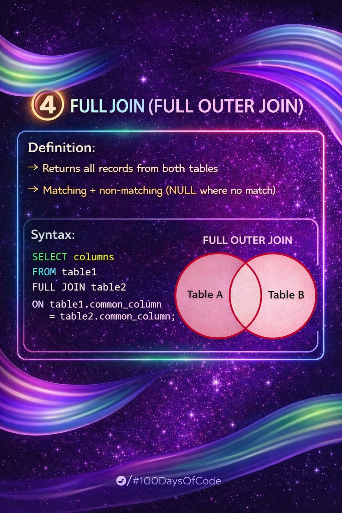

Day 29 – SQL JOINs

Today’s focus was on understanding JOINs in SQL, which are used to combine data from two or more tables using a common column.

-->Topics Covered:-
INNER JOIN – returns only matched records from both tables
LEFT JOIN (LEFT OUTER JOIN) – returns all records from the left table and matched records from the right
RIGHT JOIN (RIGHT OUTER JOIN) – returns all records from the right table and matched records from the left
FULL JOIN (FULL OUTER JOIN) – returns all records from both tables (matched + unmatched)
CROSS JOIN – returns all possible combinations of rows

Key Takeaway:-
JOINs are essential for real-world databases where data is split across multiple tables. This knowledge is especially useful for understanding backend systems and identifying database-related security issues.
Day 29 completed successfully.

Learning via Skills Uprise Mentored by Manoj Kumar                         

LinkedIn: https://www.linkedin.com/company/skills-uprise

CEO: https://www.linkedin.com/in/manoj-kumar

