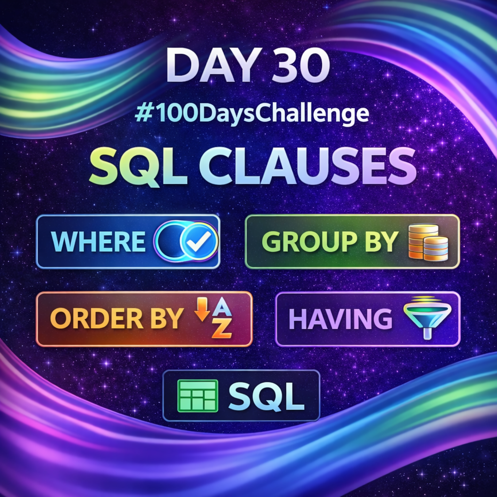

Day 30 – SQL Clauses

Today, I learned and practiced the following SQL clauses:-

WHERE – Filters rows based on conditions
GROUP BY – Groups rows with similar values
ORDER BY – Sorts query results (ASC/DESC)
HAVING – Filters grouped results after aggregation

These clauses are essential for writing optimized SQL queries and are highly relevant in database analysis and ethical hacking concepts.
Continuing my 100 Days Learning Ethical Hacking challenge.

Learning via Skills Uprise Mentored by Manoj Kumar                         

LinkedIn: https://www.linkedin.com/company/skills-uprise

CEO: https://www.linkedin.com/in/manoj-kumar

