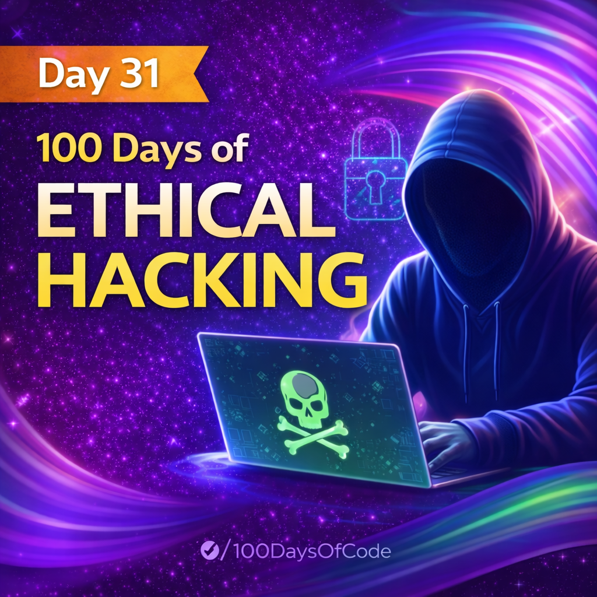

Day 31 – SQL Subqueries (IN & Correlated Subqueries)

Today, as part of my 100 Days of Ethical Hacking challenge, I focused on understanding advanced SQL querying techniques using subqueries.

What I learned:-
-->How Subqueries using IN allow filtering data based on results from another query.
-->How Correlated Subqueries depend on the outer query and execute once per row.

Why these concepts are important for analyzing complex datasets during security testing.
This day helped me improve my logical thinking and query-writing skills, which are essential for database security analysis and vulnerability assessment.

Learning via Skills Uprise Mentored by Manoj Kumar                         

LinkedIn: https://www.linkedin.com/company/skills-uprise

CEO: https://www.linkedin.com/in/manoj-kumar

