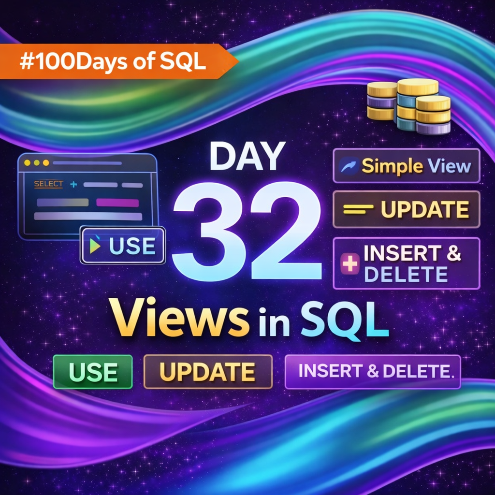

Day 32 – SQL Views | 100 Days Ethical Hacking Challenge

Today’s focus was on understanding Views in SQL and their importance in both data management and security.

Topics Covered:-
##What is a View in SQL (virtual table concept)
##Creating views using CREATE VIEW
##Using views just like tables with SELECT
##Performing UPDATE, INSERT, and DELETE operations via views
##Dropping views safely using DROP VIEW

Types of views:-
Simple View
Complex View
Updatable View
Read-Only View

Key Takeaway:-
Views are not just about convenience — they are a powerful security mechanism that helps restrict data exposure and simplify access control.

Day 32 completed successfully.
Moving forward with Day 33.

#100DaysOfCode #SQL #EthicalHacking #DatabaseSecurity #LearningInPublic

Learning via Skills Uprise Mentored by Manoj Kumar                         

LinkedIn: https://www.linkedin.com/company/skills-uprise

CEO: https://www.linkedin.com/in/manoj-kumar

