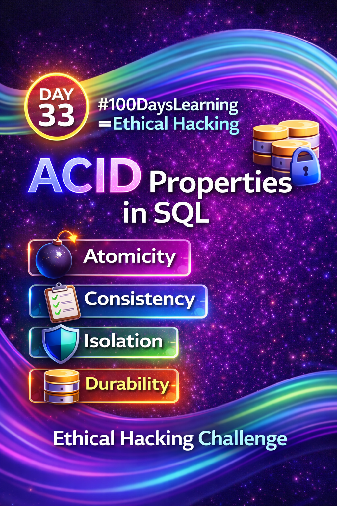
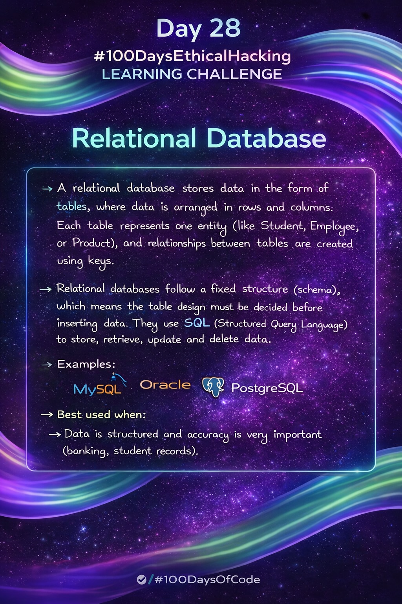
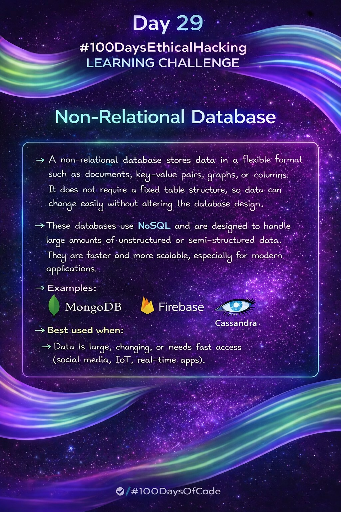
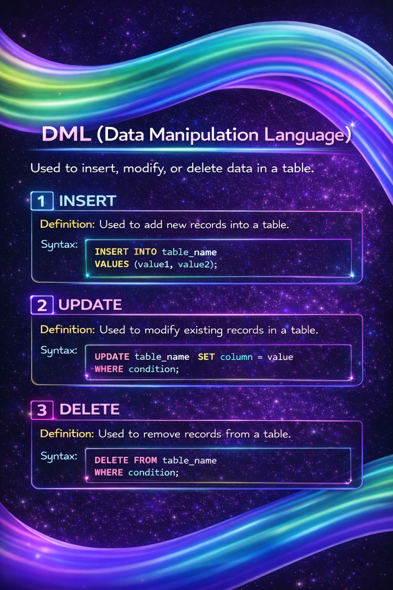

Day 33 – ACID Properties in SQL

Today’s focus was on understanding ACID properties, which are fundamental to maintaining reliability and integrity in database transactions.

What I learned:-
##Atomicity ensures transactions are fully completed or fully rolled back.
##Consistency maintains database rules and constraints.
##Isolation prevents conflicts when multiple transactions run concurrently.
##Durability guarantees committed data persists even after system failures.

Why this matters:-
ACID properties form the backbone of reliable systems used in banking, e-commerce, and critical applications. This knowledge strengthens my understanding of backend security and data integrity—an essential part of ethical hacking and system analysis.

--->Progressing one concept per day under the #100DaysLearningEthicalHacking challenge.

Learning via Skills Uprise Mentored by Manoj Kumar                         

LinkedIn: https://www.linkedin.com/company/skills-uprise

CEO: https://www.linkedin.com/in/manoj-kumar

