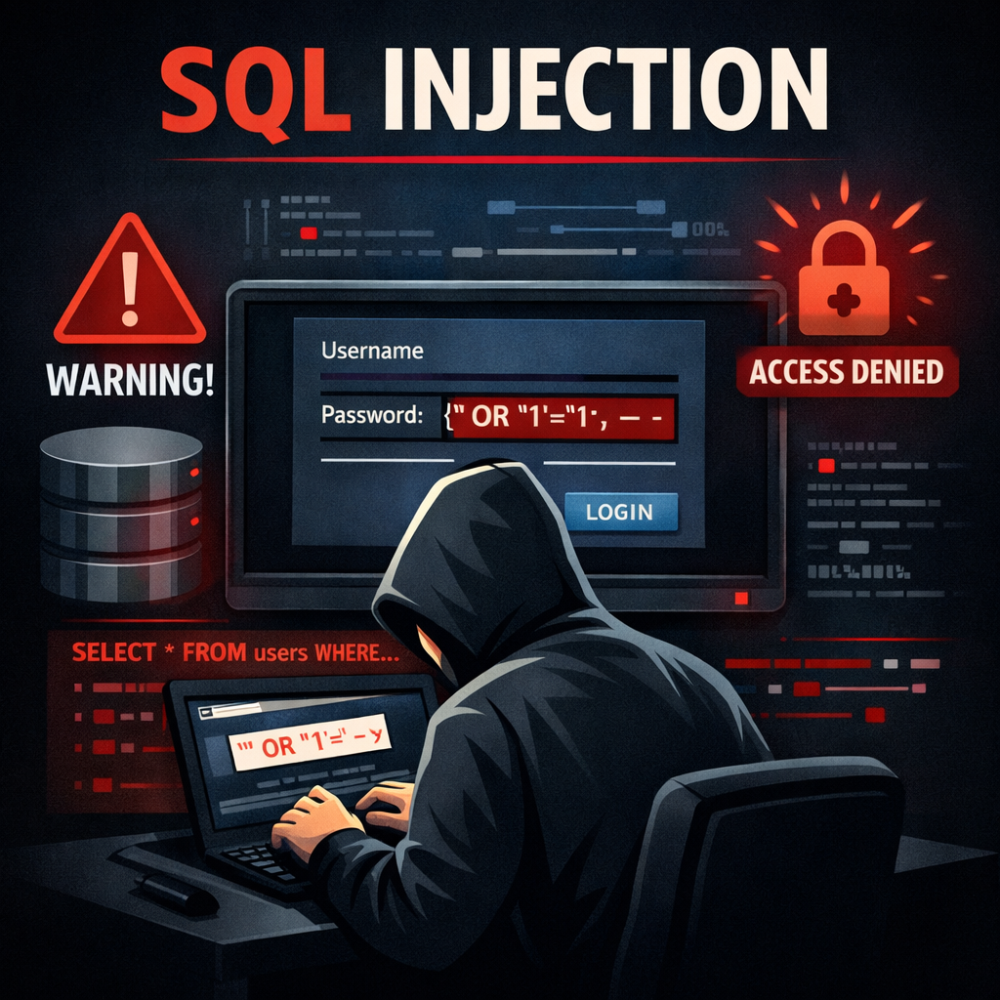
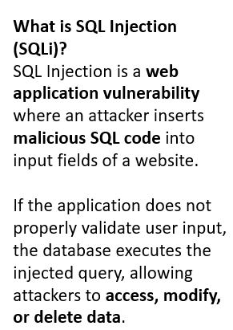
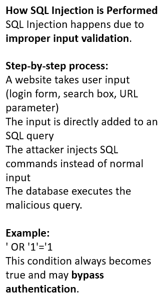
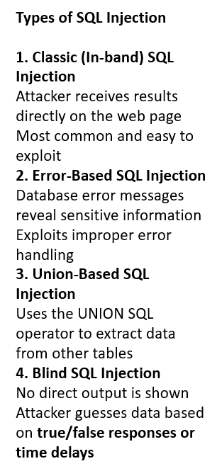
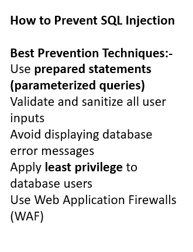

Day 35 – SQL Injection
SQL Injection is a web vulnerability where attackers send harmful SQL code through user inputs.

How it works:-
Input is not validated
SQL code is injected
Database executes it

Types:-
Classic
Blind
Error-Based
Union-Based

Prevention:-
Validate inputs
Use parameterized queries

Key Point:-
Always write secure code to protect databases.

Learning via Skills Uprise Mentored by Manoj Kumar                         

LinkedIn: https://www.linkedin.com/company/skills-uprise

CEO: https://www.linkedin.com/in/manoj-kumar

