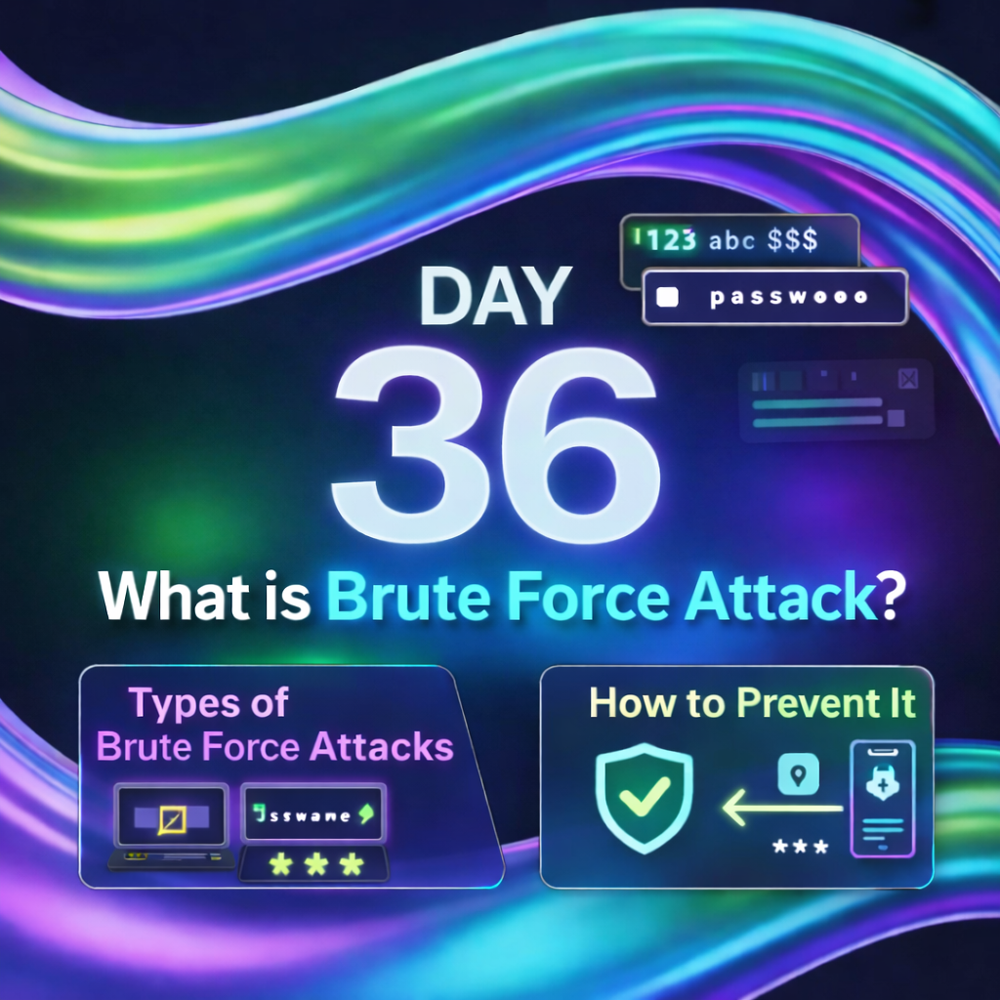

Day 36 – Brute Force Attacks

In this learning note, I explored the basics of Brute Force Attacks.

A brute force attack is when an attacker repeatedly tries different usernames and passwords until login is successful.

Topics Covered:-
What is a brute force attack
Types of brute force attacks (simple, dictionary, credential stuffing, etc.)
Basic prevention methods

Key Learnings:-
Weak and reused passwords are a major risk
Simple security controls like account lockout and 2FA can stop attacks
Monitoring failed login attempts is very important

Learning via Skills Uprise Mentored by Manoj Kumar                         

LinkedIn: https://www.linkedin.com/company/skills-uprise

CEO: https://www.linkedin.com/in/manoj-kumar

