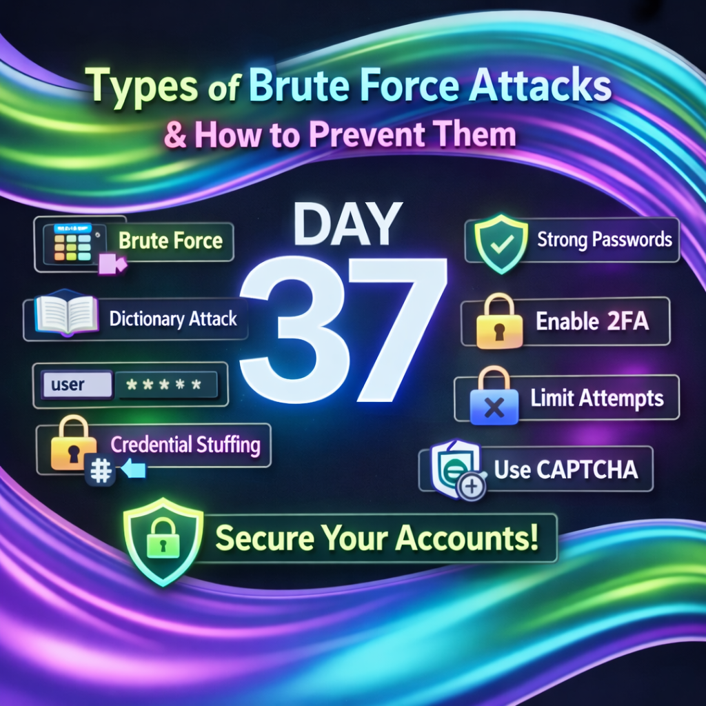
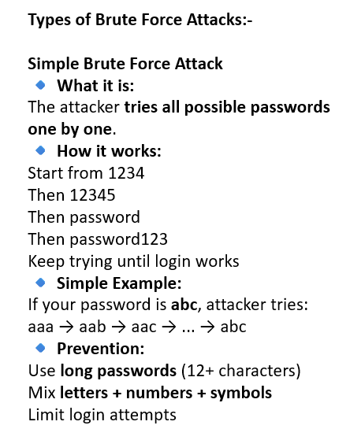
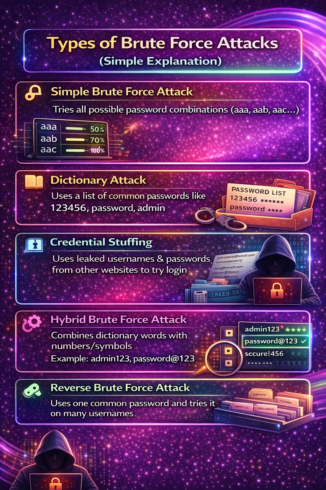
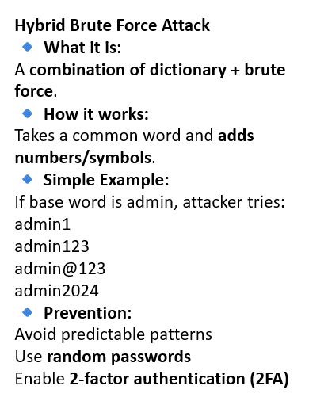
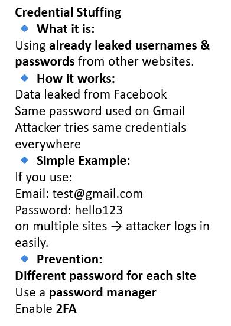
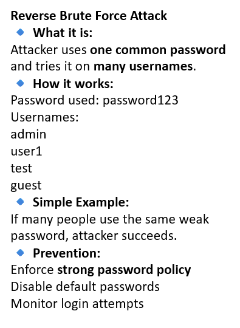
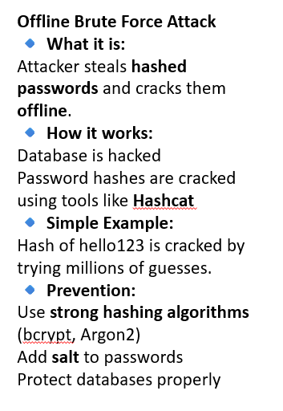

Day 37 – Brute Force Attacks Types & Prevention 🔐

On Day 37, I learned about brute force attacks, where attackers try multiple password combinations to gain unauthorized access.

I studied different types such as:-
Simple brute force attacks
Dictionary attacks
Credential stuffing

I also learned key prevention techniques like:-
Using strong and unique passwords
Enforcing login attempt limits
Implementing CAPTCHA and 2FA

This topic helped me understand how basic security mechanisms can effectively defend against common attacks.

Learning via Skills Uprise Mentored by Manoj Kumar                         

LinkedIn: https://www.linkedin.com/company/skills-uprise

CEO: https://www.linkedin.com/in/manoj-kumar

