Day 38 – Brute Force Attack (Low Level) using Burp Suite | DVWA

Target Application: Damn Vulnerable Web Application (DVWA)
Security Level: Low
Vulnerability: Brute Force
Tool Used: Burp Suite

What I Did
On Day 38 of my 100 Days Ethical Hacking Challenge, I tested the Brute Force vulnerability on DVWA at the Low security level using Burp Suite. I intercepted the login request, analyzed its parameters, and sent multiple credential attempts. Due to weak security controls, authentication was successfully bypassed.

What I Learned
Using Burp Suite to intercept and modify HTTP requests
How brute force attacks exploit weak login mechanisms
Importance of implementing rate limiting and strong authentication

Disclaimer
This activity was performed only in a controlled and intentionally vulnerable lab environment (DVWA) for ethical and educational purposes.
This knowledge should never be used for illegal or unauthorized access.

Learning via Skills Uprise Mentored by Manoj Kumar                         

LinkedIn: https://www.linkedin.com/company/skills-uprise

CEO: https://www.linkedin.com/in/manoj-kumar

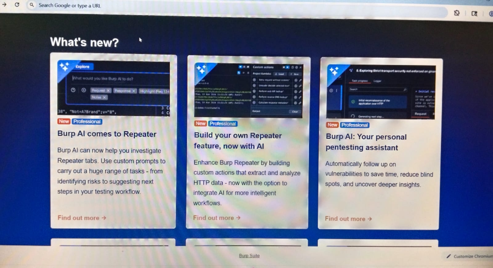
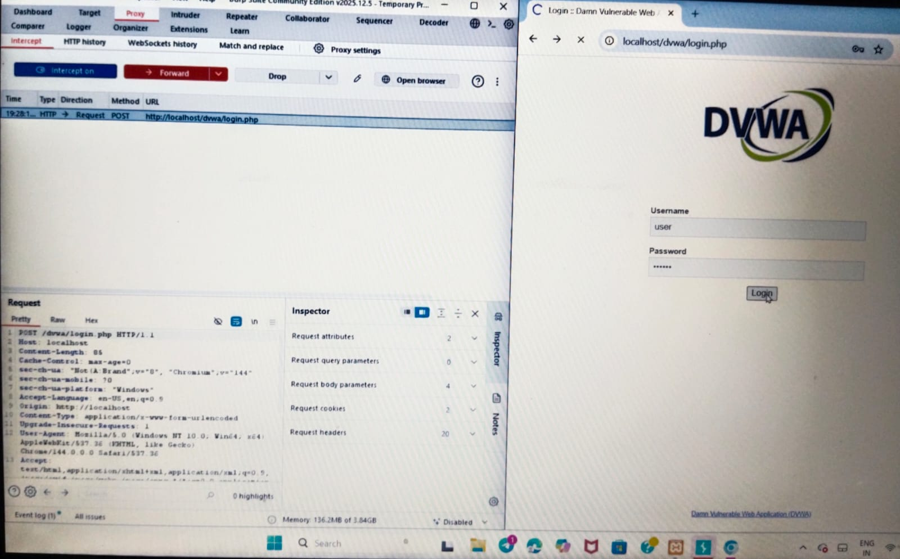
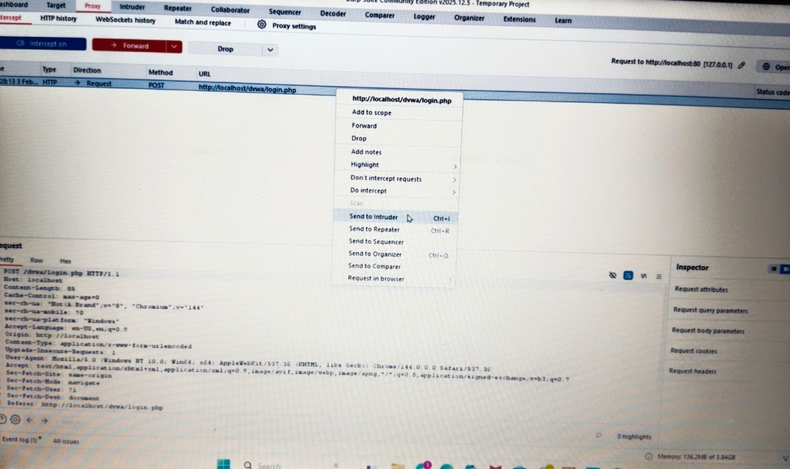
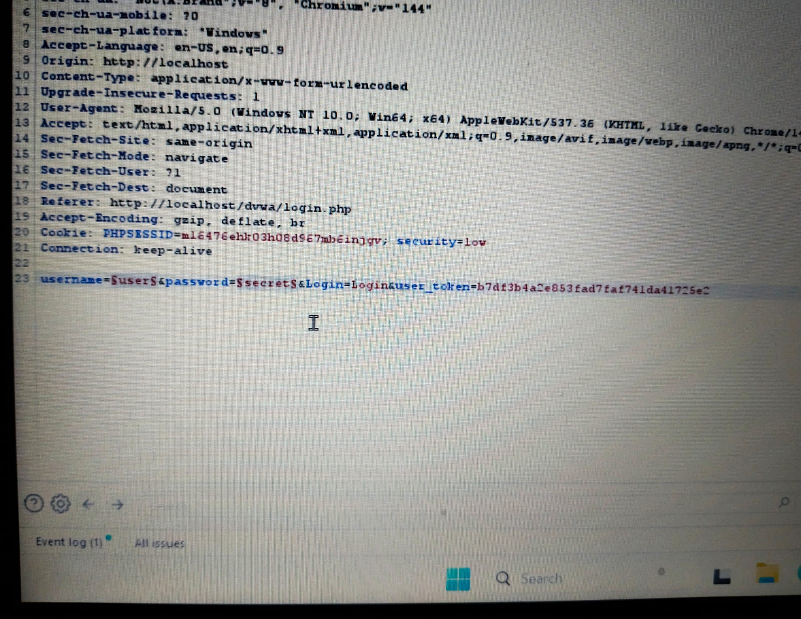
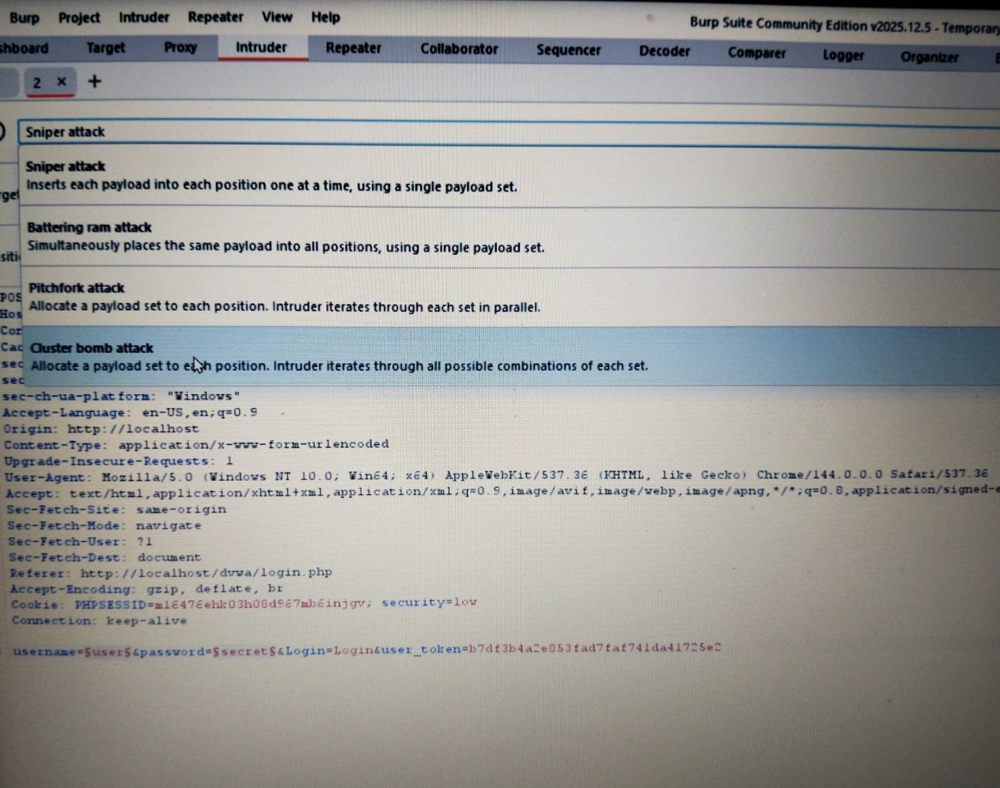
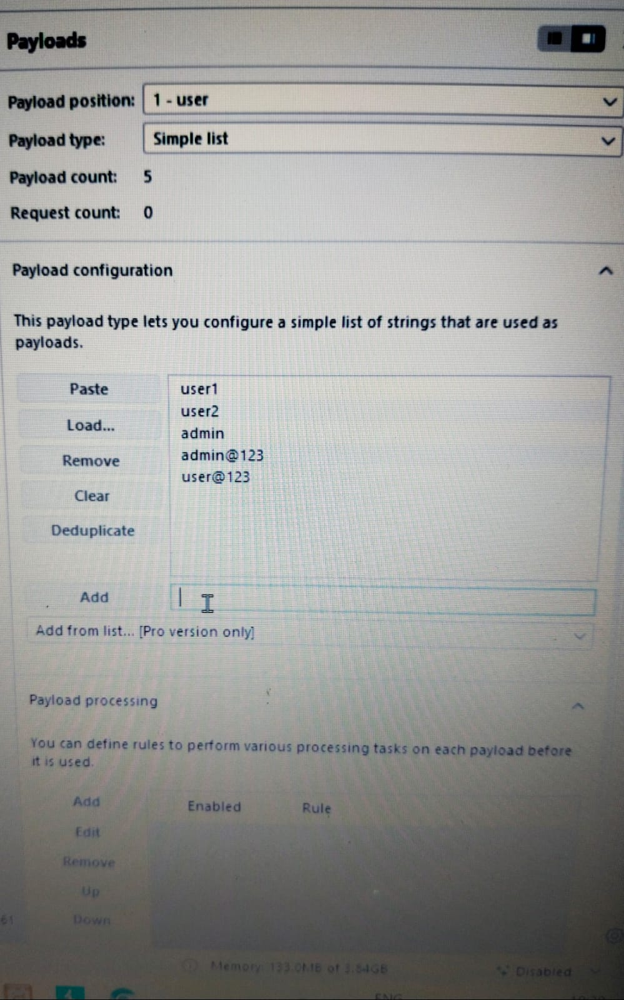
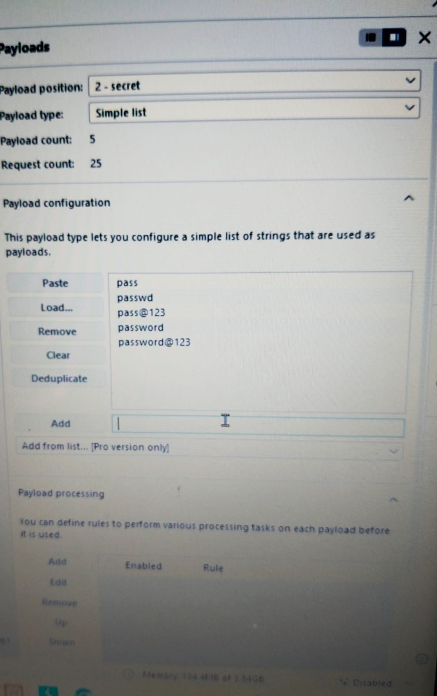
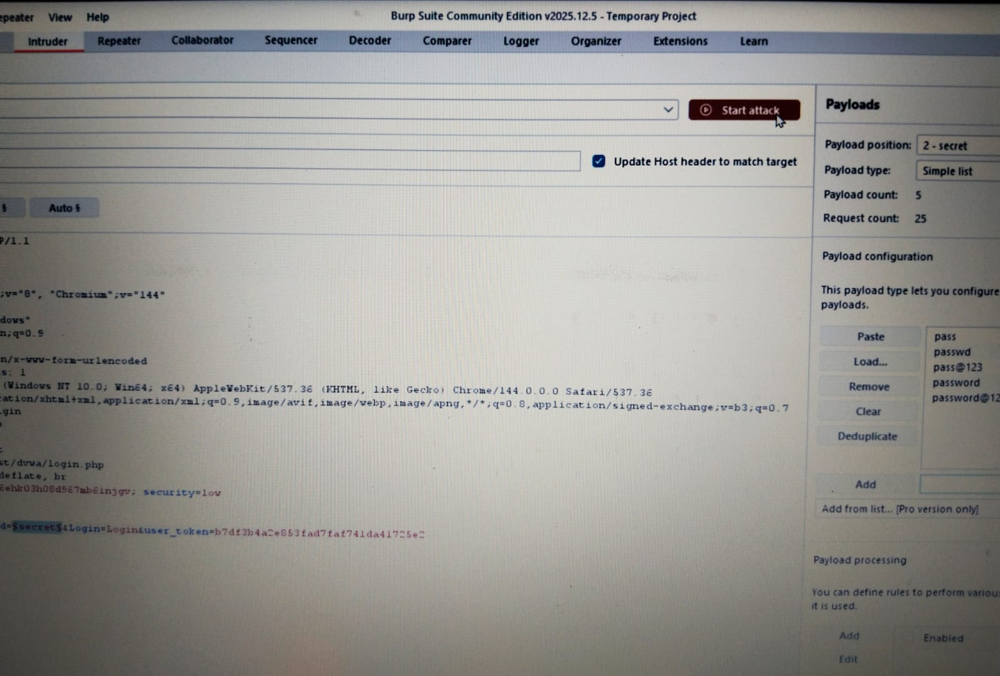
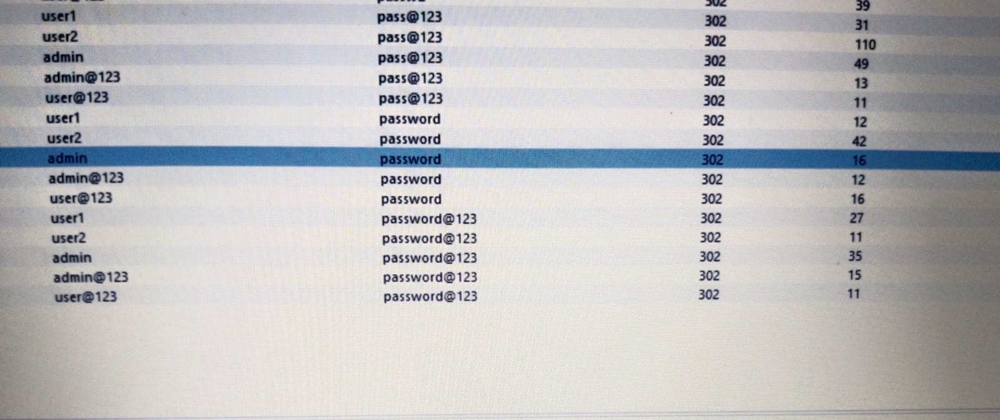
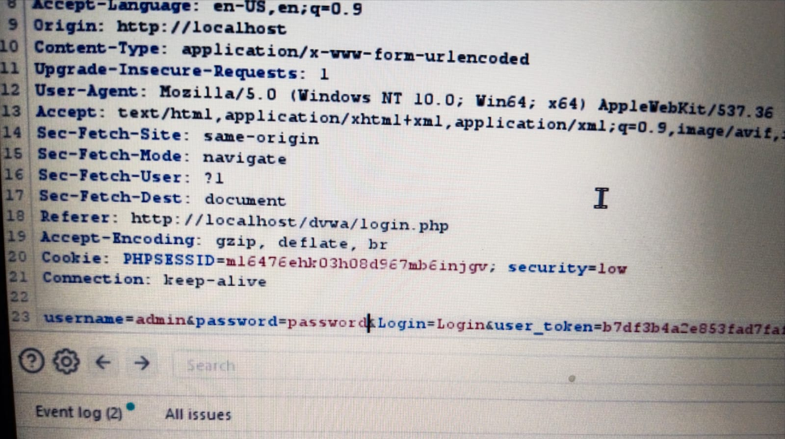
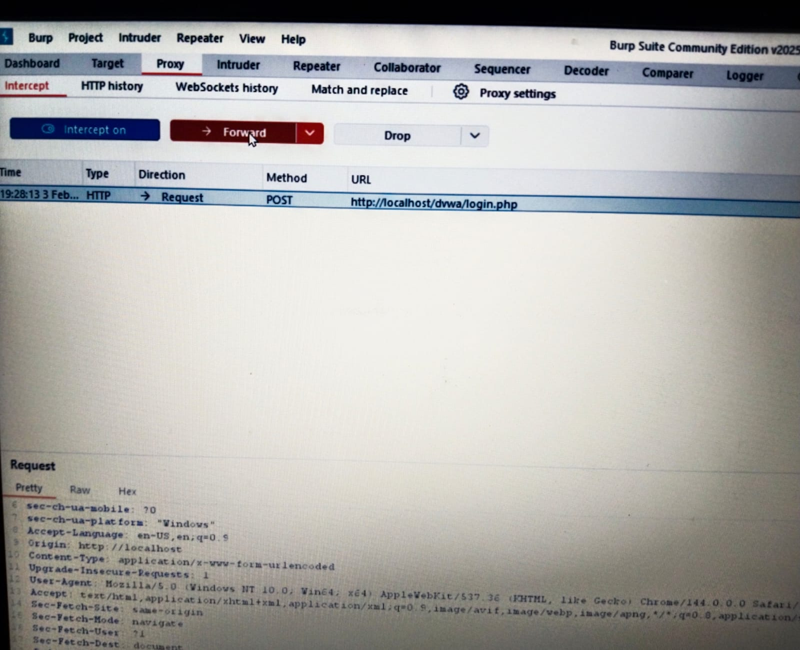

