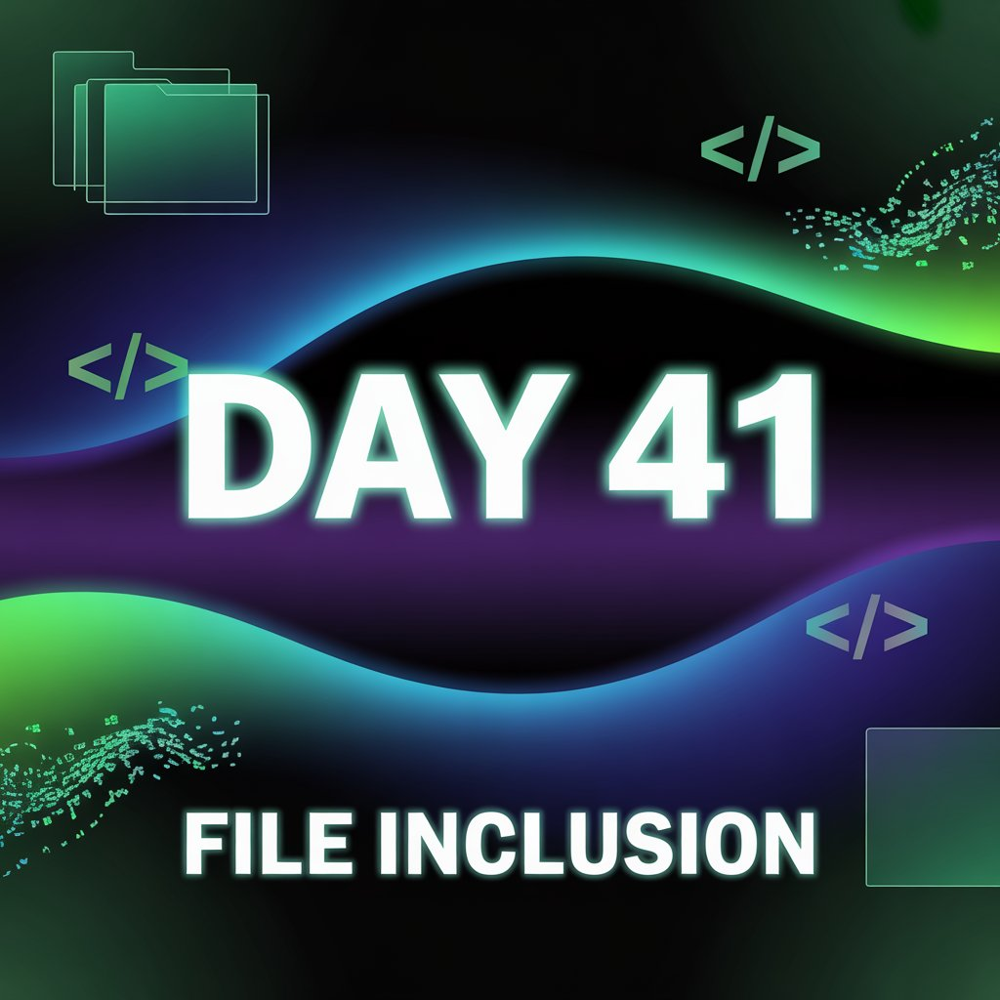
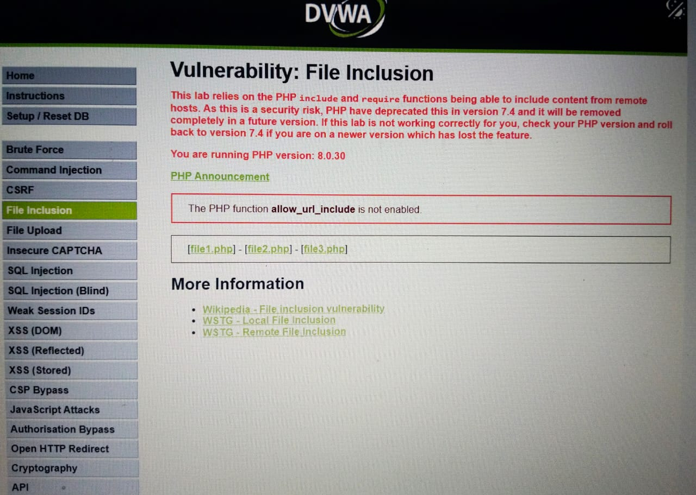
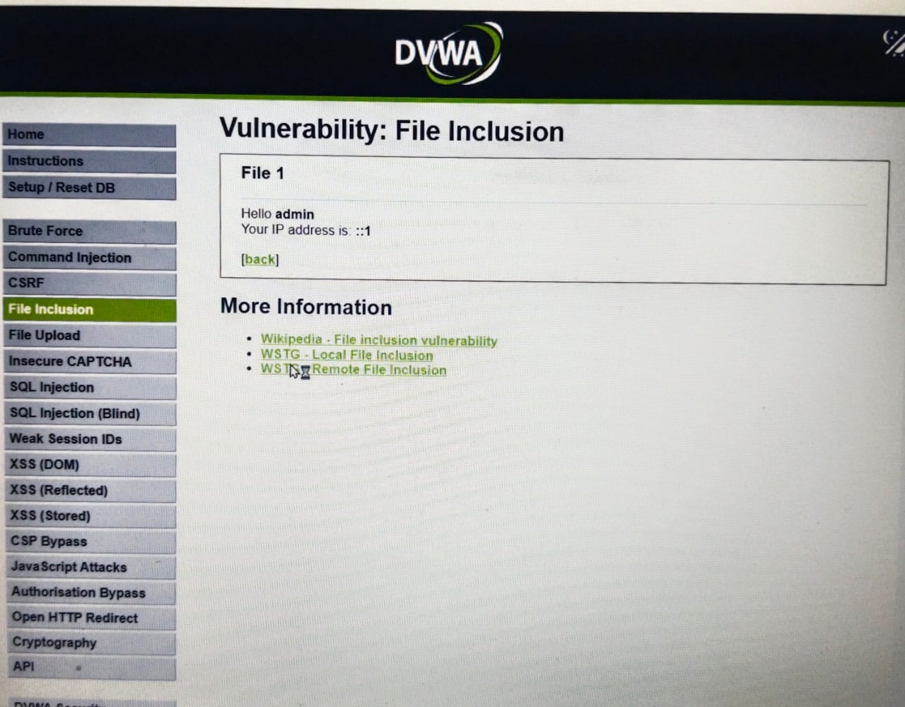
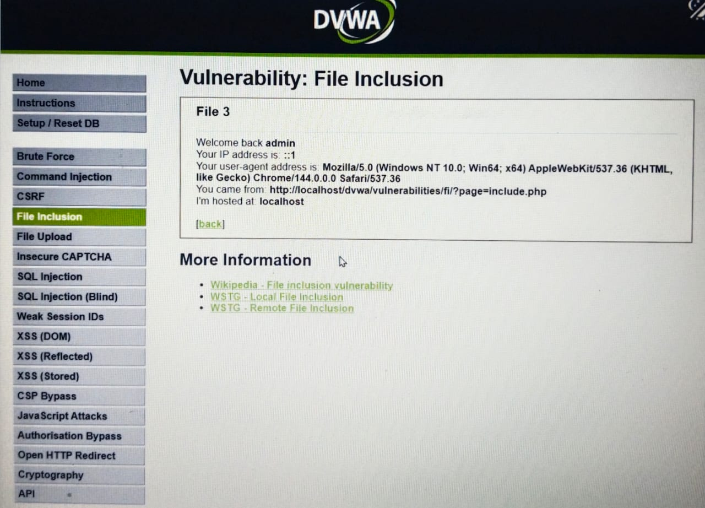
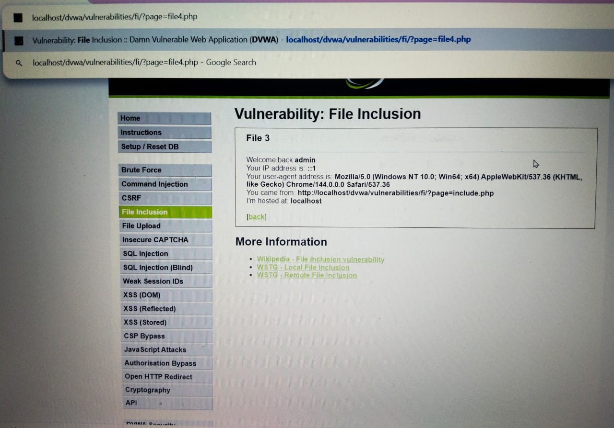
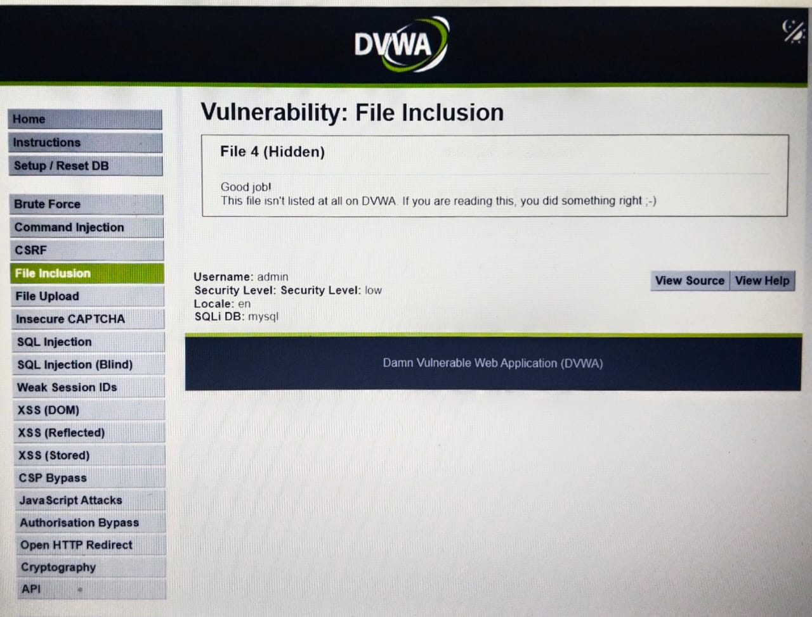

Day 41 – File Inclusion Vulnerability (DVWA)

As part of my 100 Days of Learning Ethical Hacking challenge, I practiced a File Inclusion vulnerability on the intentionally vulnerable DVWA platform.

What I did:
Accessed files like file1, file2, and file3 via URL parameters.
Observed that the application dynamically loads files based on user input.
Manually changed the URL parameter from file3 to file4.
The server responded by opening file4, which was internally present but not publicly listed.

Key Learning:
Browsers do not validate input; they simply forward it to the server.
Lack of server-side input validation can lead to unauthorized file access.
Proper file handling and validation are critical to prevent such vulnerabilities.

Disclaimer:
This activity was performed legally on an intentionally vulnerable lab environment (DVWA) for educational and learning purposes only.

Learning via Skills Uprise Mentored by Manoj Kumar                         

LinkedIn: https://www.linkedin.com/company/skills-uprise

CEO: https://www.linkedin.com/in/manoj-kumar

