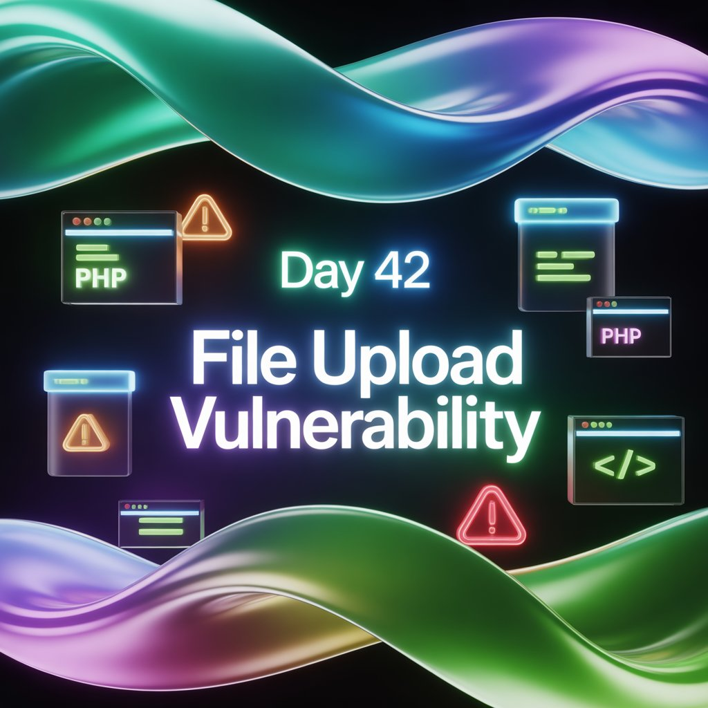
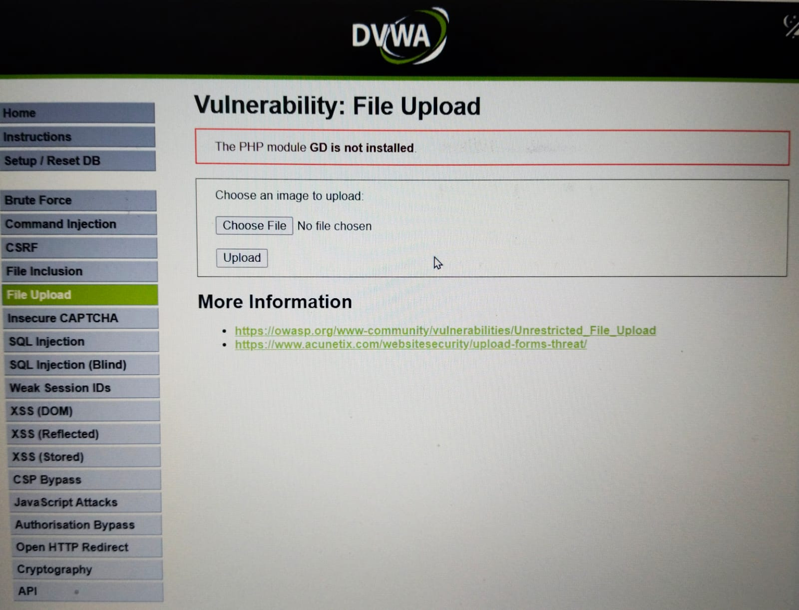
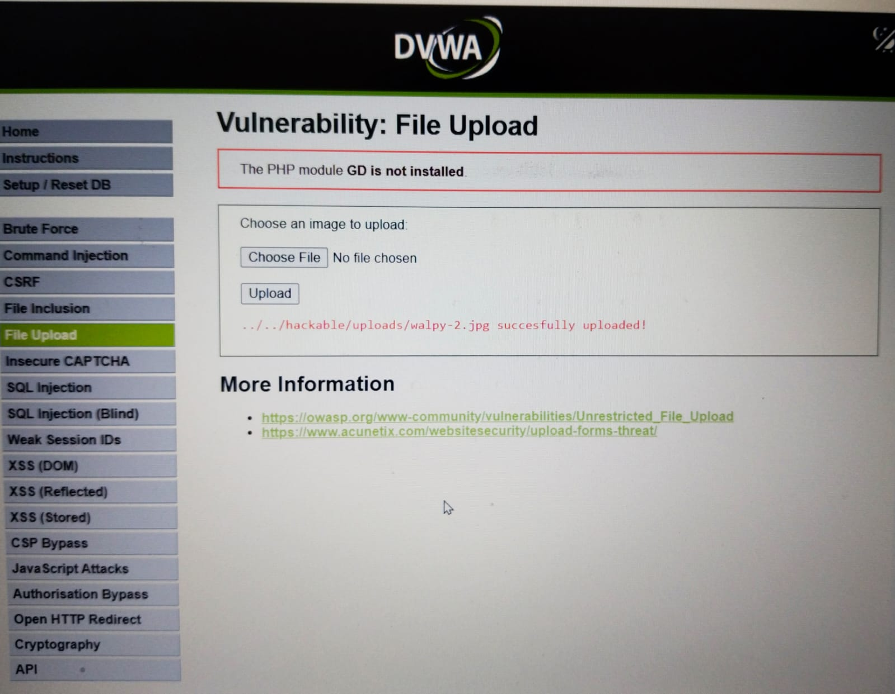
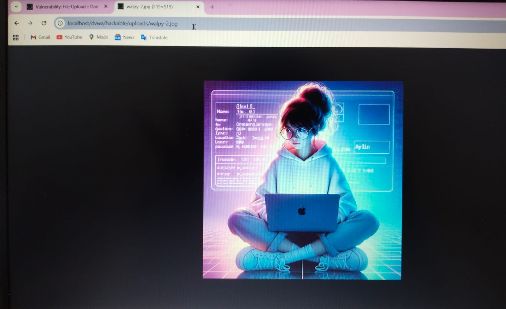
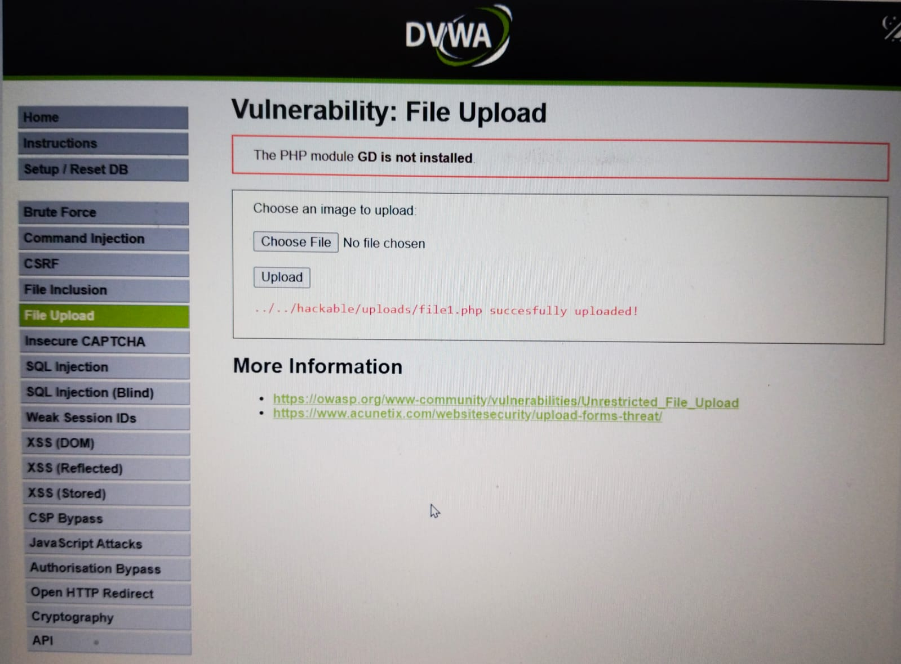
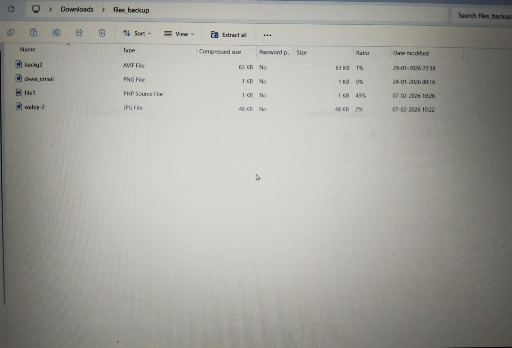

Day 42 – File Upload Vulnerability (DVWA)

As part of my 100 Days Learning Ethical Hacking Challenge, I practiced File Upload Vulnerability on an intentionally vulnerable application (DVWA) in a fully ethical and legal environment.

During this practice:
Uploaded a normal image file and identified its server path
Used the same path to upload a PHP file
Executed the PHP file to understand how attackers can misuse file upload flaws
Observed how improper validation can lead to serious risks like server file access or data misuse

This exercise helped me understand real-world attack scenarios and the importance of secure file handling, validation, and permission management.

For educational purposes only. Practiced strictly on intentionally vulnerable platforms.

Learning via Skills Uprise Mentored by Manoj Kumar                         

LinkedIn: https://www.linkedin.com/company/skills-uprise

CEO: https://www.linkedin.com/in/manoj-kumar

