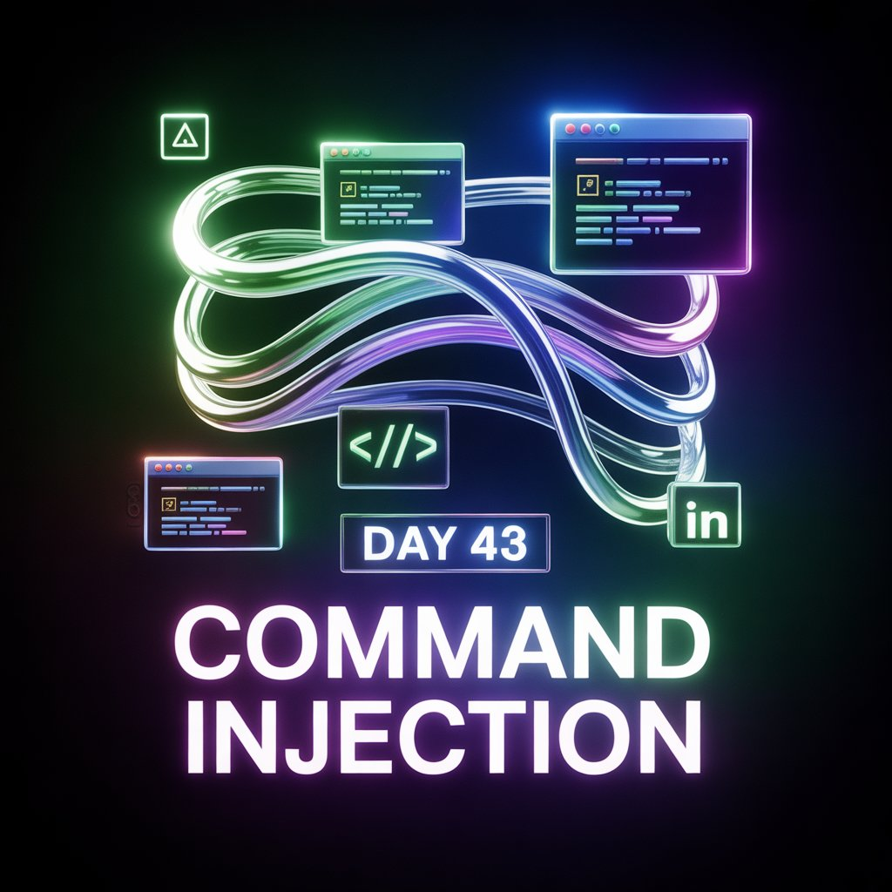
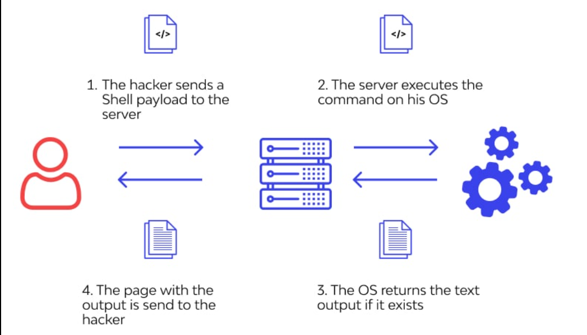
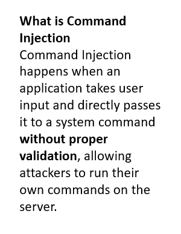
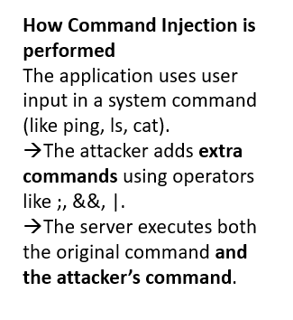
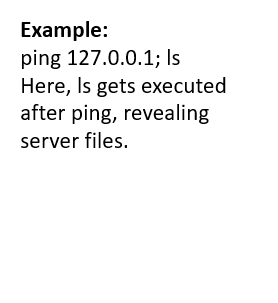
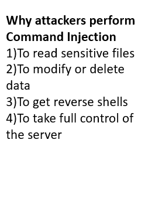
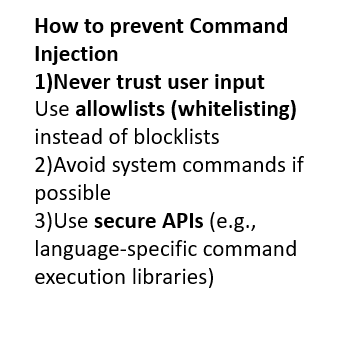
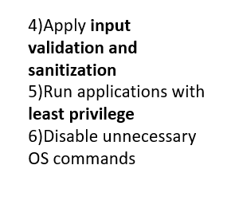

Day 43 – Command Injection (Theoretical Study)

Command Injection is a vulnerability that occurs when user input is executed as part of system commands on a server due to lack of proper validation. Attackers exploit this to run unauthorized commands.

During Day 43 of my 100 Days Ethical Hacking Challenge, I studied:
How Command Injection works
Common attack patterns

Prevention techniques like input validation, allowlisting, and least privilege
This entry documents my theoretical understanding before practical implementation.

Learning via Skills Uprise Mentored by Manoj Kumar                         

LinkedIn: https://www.linkedin.com/company/skills-uprise

CEO: https://www.linkedin.com/in/manoj-kumar

