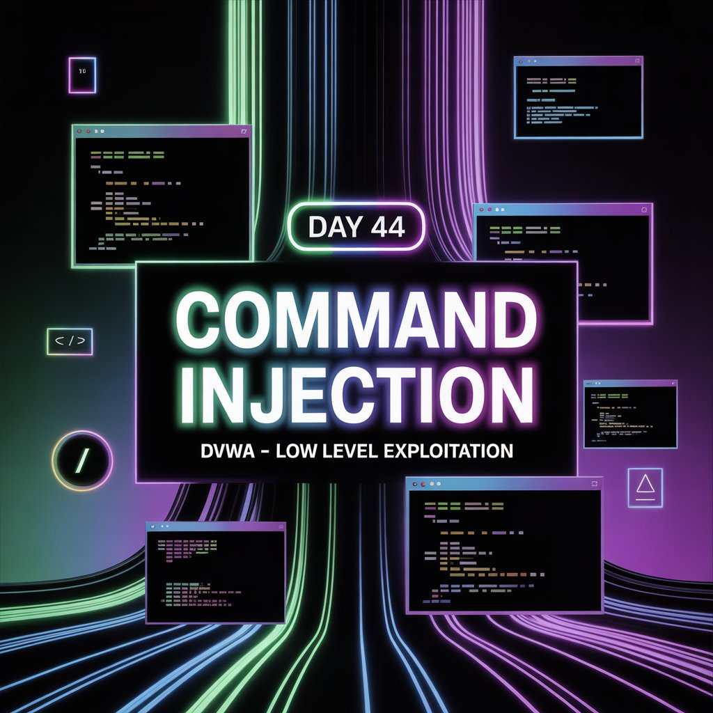

Day 44 – Command Injection (DVWA)

Today’s practice focused on Command Injection using the intentionally vulnerable application DVWA (Low Security Level).

I began by testing normal functionality using ping 127.0.0.1 to confirm that the application was executing system commands. After confirming this, I attempted command injection. Since ls did not work, I inferred that the server environment was likely Windows-based. Using 127.0.0.1 && dir, I was able to successfully list the directories.

This demonstrates how unsanitized user input can be exploited to execute system-level commands.

Note: This activity was performed ethically and legally on a deliberately vulnerable platform for educational purposes only.

Learning via Skills Uprise Mentored by Manoj Kumar                         

LinkedIn: https://www.linkedin.com/company/skills-uprise

CEO: https://www.linkedin.com/in/manoj-kumar

