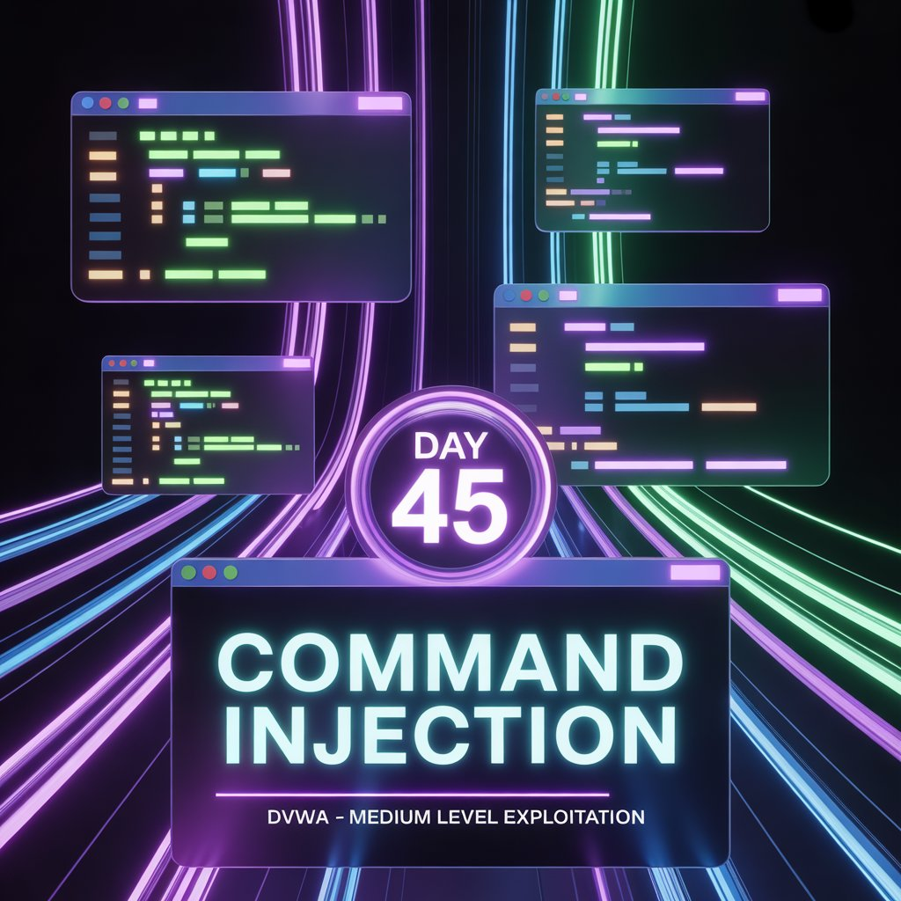
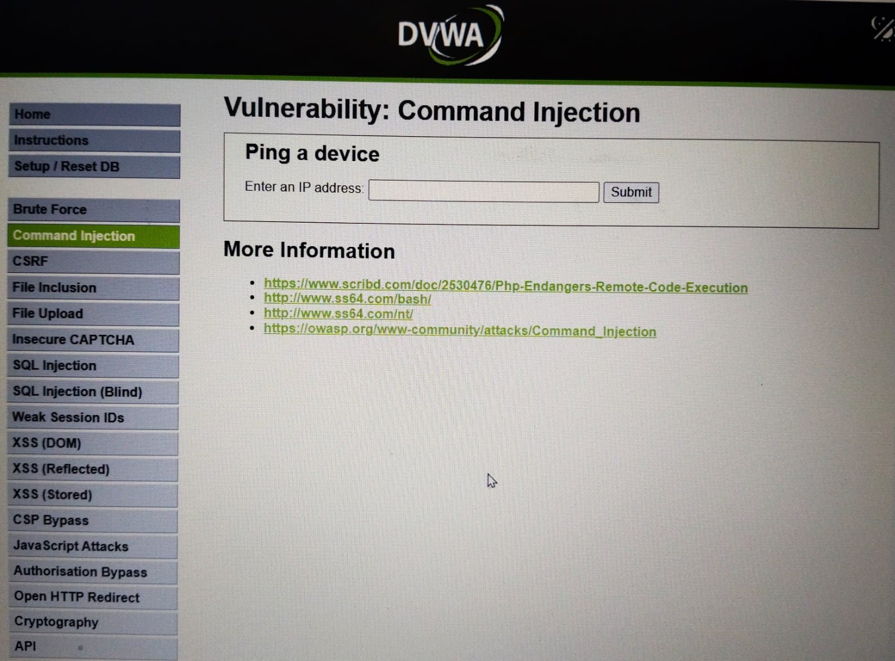
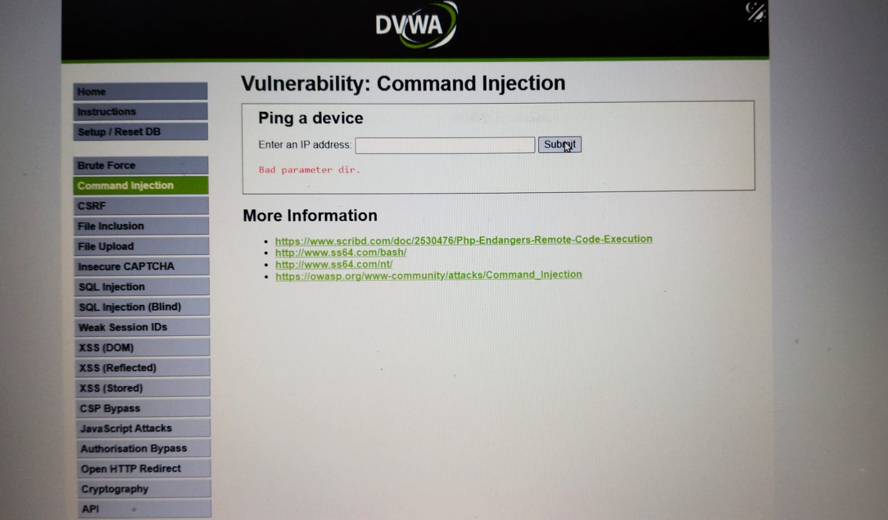
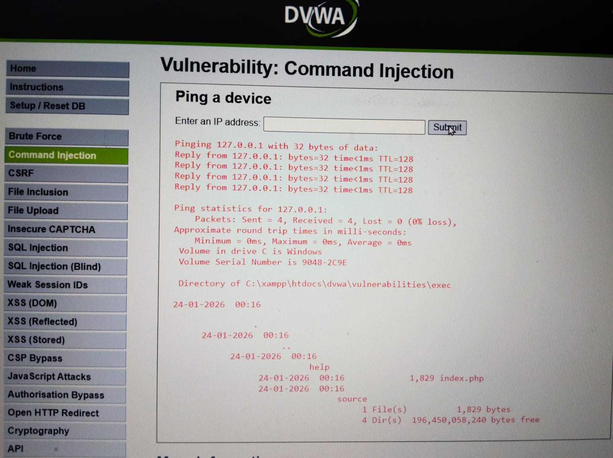
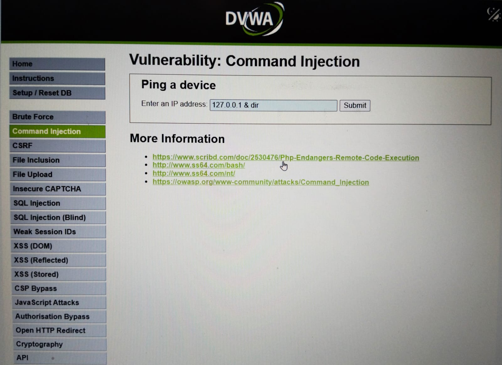
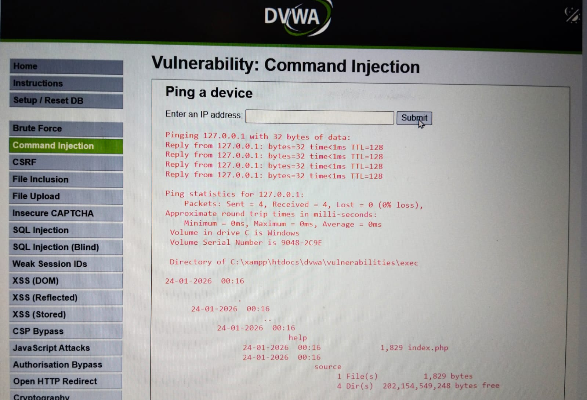

Day XX – Command Injection (Medium) | DVWA

While practicing command injection on DVWA (medium level), common operators like && and ; failed due to input filtering.

Instead of brute-forcing payloads, I analyzed the source code and observed a blacklist-based validation blocking specific symbols. By identifying operators not present in the blacklist, I was able to execute a command and retrieve directory listings.

Key takeaway:-
Exploitation depends more on logic, code analysis, and understanding defenses than on payload memorization.

Tested legally on DVWA
Part of my 100 Days Ethical Hacking Challenge

Learning via Skills Uprise Mentored by Manoj Kumar                         

LinkedIn: https://www.linkedin.com/company/skills-uprise

CEO: https://www.linkedin.com/in/manoj-kumar

