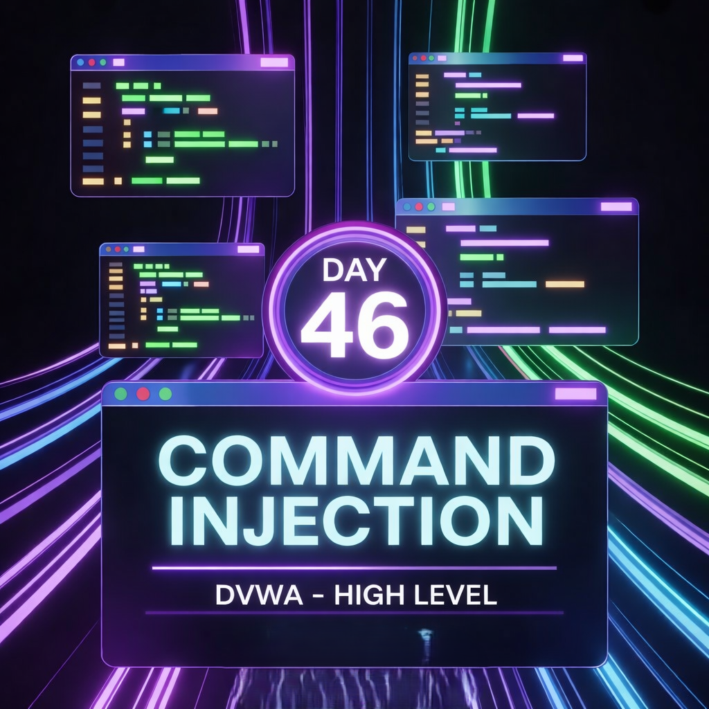

Day 46 – Command Injection (High Security Level) – DVWA

Objective:
Test command injection vulnerability at High security level in DVWA.

Initial Observation:
Common operators used in Low/Medium levels:
&&
;
&
|
All appeared to be filtered.
Standard payloads failed.

Approach:
Instead of trial-and-error, reviewed the application source code.

Finding:
The pipe operator | was included in the blacklist.
However, it was implemented with improper spacing.

Bypass Technique:
Modified payload formatting:
127.0.0.1 |dir
Removing the expected spacing allowed command execution.

Result:
Successfully retrieved directory listing.

Key Takeaway:
Blacklisting is not a reliable security mechanism.
Improper filter implementation can lead to bypass vulnerabilities.

Learning via Skills Uprise Mentored by Manoj Kumar                         

LinkedIn: https://www.linkedin.com/company/skills-uprise

CEO: https://www.linkedin.com/in/manoj-kumar

Environment: DVWA (Intentionally Vulnerable Web Application)
Practice performed ethically for educational purposes.
