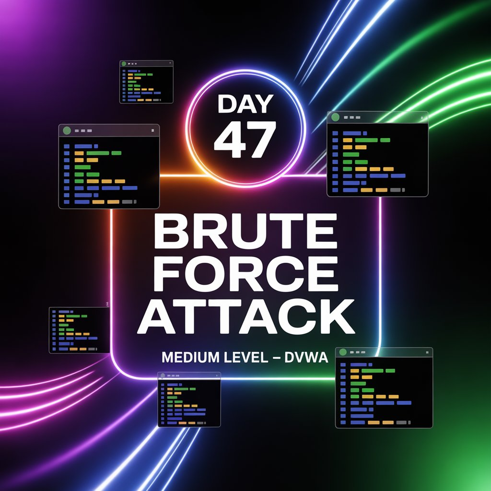
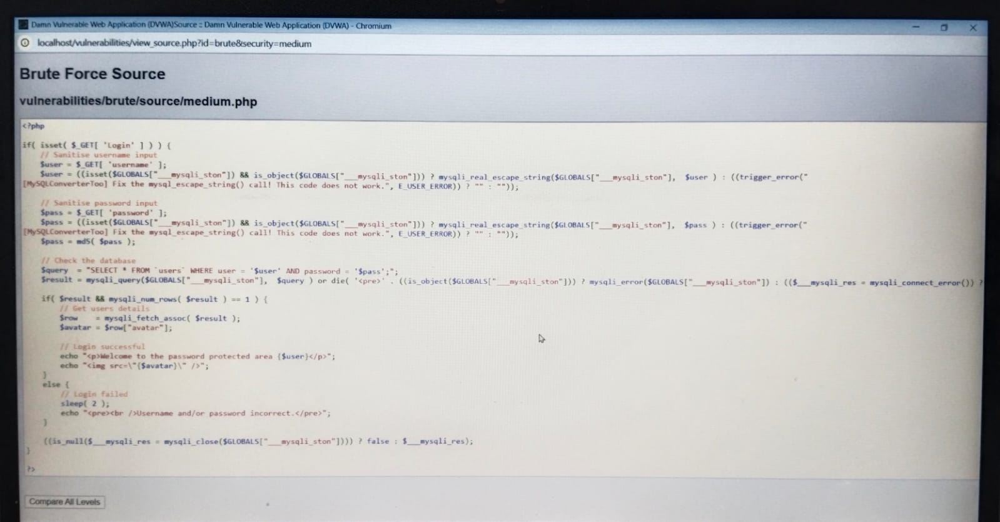
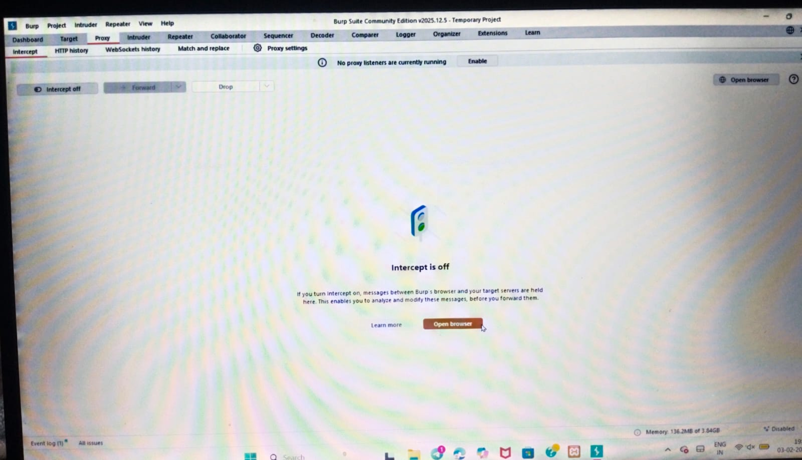

Day 47 – Brute Force Attack (DVWA – Medium Level)

Environment:-
DVWA (Medium Security Level)
Burp Suite (Proxy + Intruder)
Legal & Ethical Practice Lab

Methodology:
Intercepted login request using Burp Proxy
Forwarded request to Intruder
Selected payload positions
Chose attack type
Loaded username/password payload lists
Started attack

Key Finding:
Credentials identified by analyzing varying response lengths

Source code review revealed:
Input sanitization
Implemented sleep() delay to slow brute force attempts

Conclusion:
Medium level introduces basic defensive controls such as sanitization and rate delay, which significantly reduce brute force efficiency but do not fully prevent it.

Learning via Skills Uprise Mentored by Manoj Kumar                         

LinkedIn: https://www.linkedin.com/company/skills-uprise

CEO: https://www.linkedin.com/in/manoj-kumar

