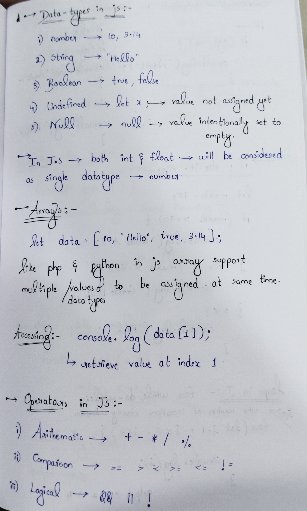
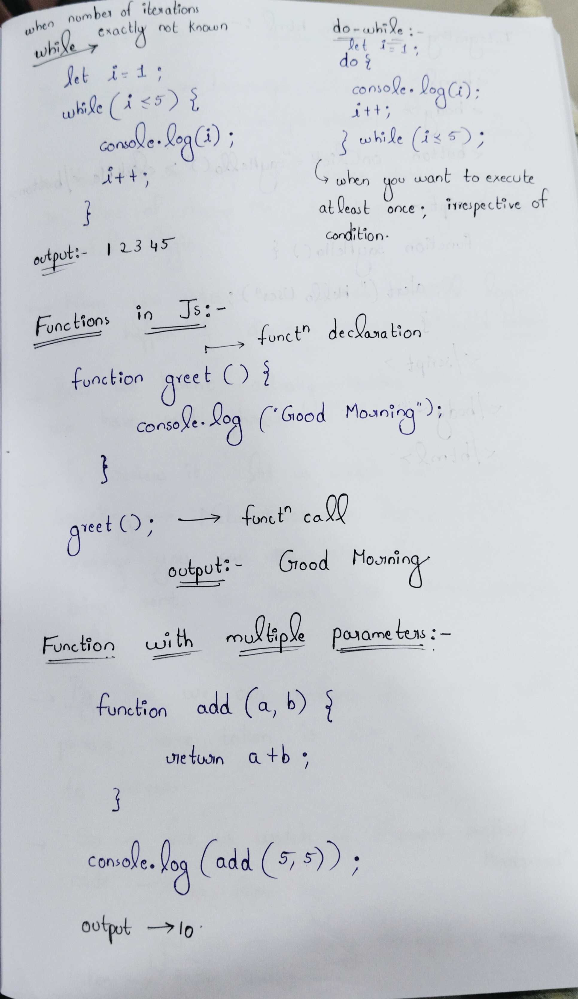
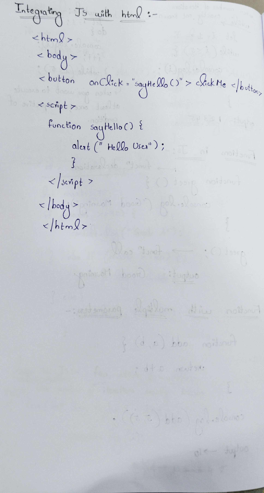

Day 53 – JavaScript Fundamentals

As part of my 100 Days Ethical Hacking Challenge, today I focused on strengthening my JavaScript fundamentals.

Topics Covered:
Data Types in JavaScript
Arrays
Operators
Conditional Statements
Loops
Functions
Integrating JavaScript with HTML

This foundation is essential for understanding client-side behavior in web applications and analyzing security vulnerabilities such as XSS.

Learning via Skills Uprise Mentored by Manoj Kumar                         

LinkedIn: https://www.linkedin.com/company/skills-uprise

CEO: https://www.linkedin.com/in/manoj-kumar

