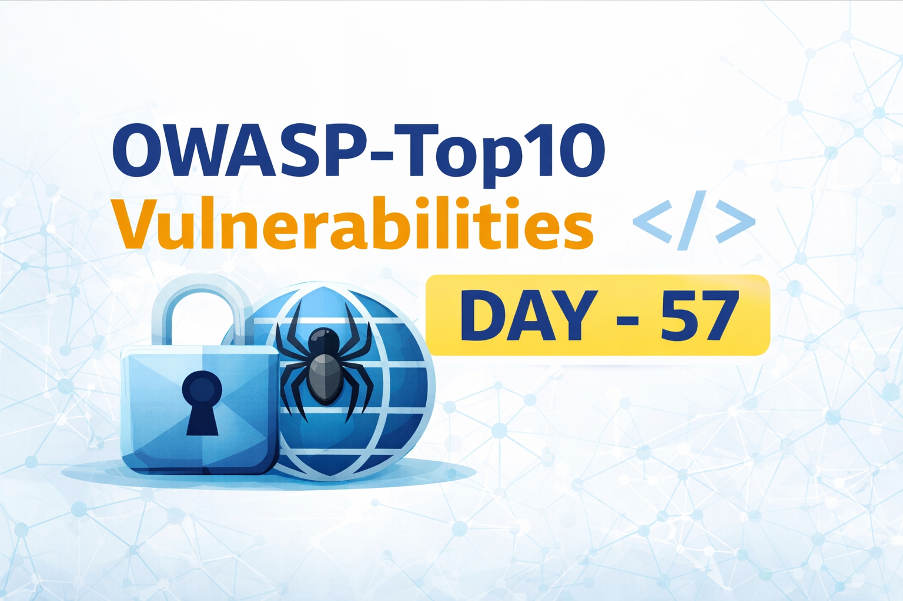
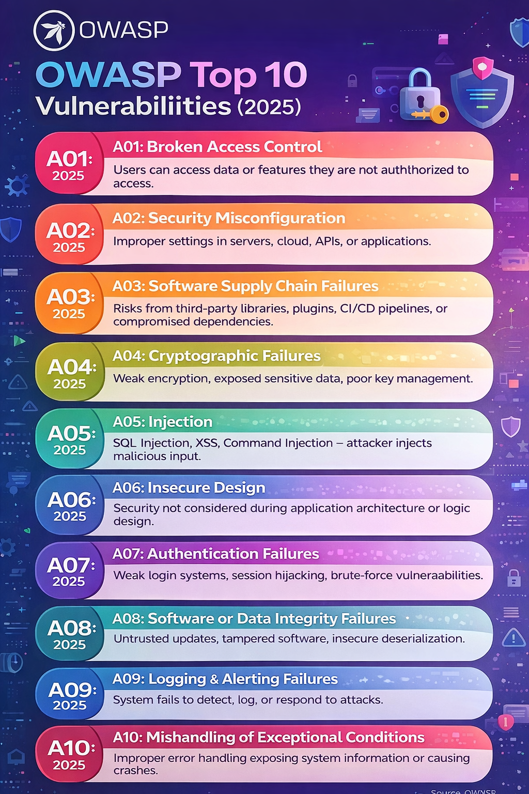
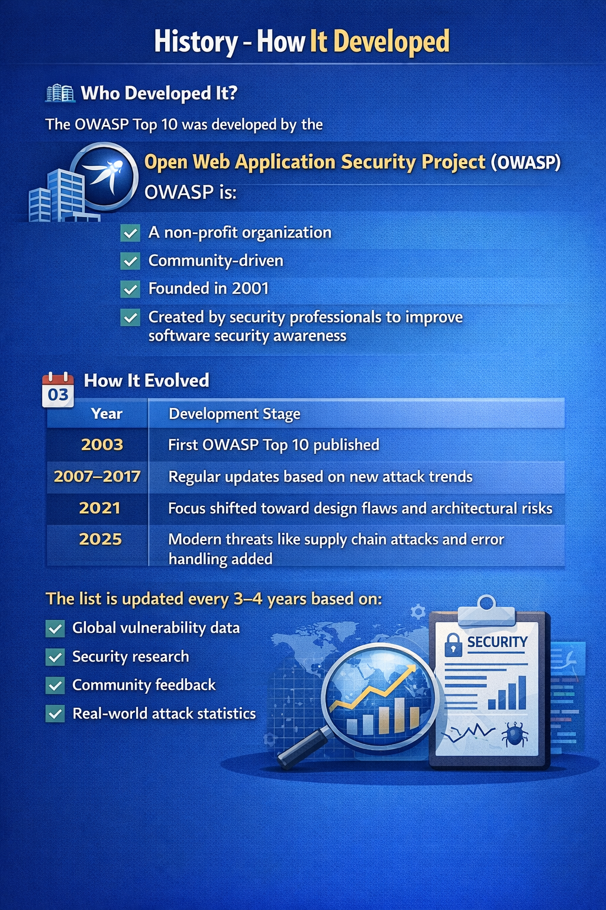
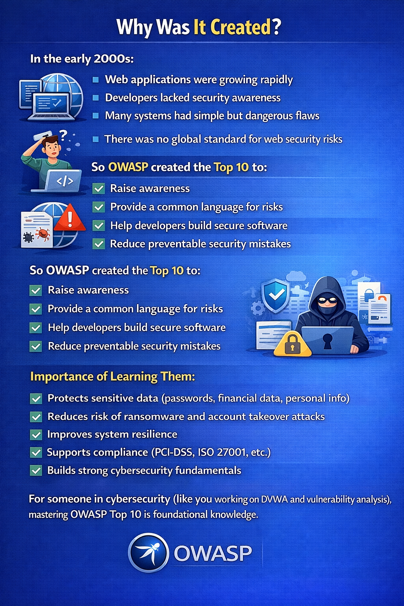
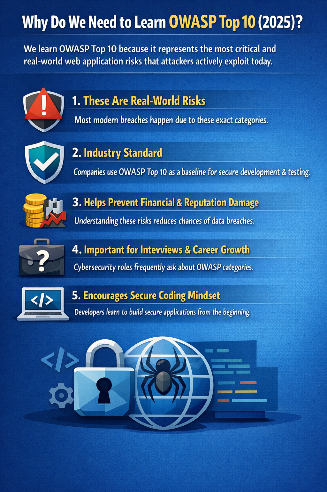

Day 57 – OWASP Top 10

Why It Was Created
In the early 2000s:
Rapid growth of web applications
Low security awareness
Common but critical vulnerabilities
No global risk standard

OWASP introduced the Top 10 to improve awareness and promote secure development practices.

Importance
Protects sensitive data
Reduces breach risks
Supports compliance standards
Builds foundational cybersecurity knowledge

Understanding OWASP Top 10 is essential for penetration testing and secure coding.

Learning via Skills Uprise Mentored by Manoj Kumar                         

LinkedIn: https://www.linkedin.com/company/skills-uprise

CEO: https://www.linkedin.com/in/manoj-kumar

