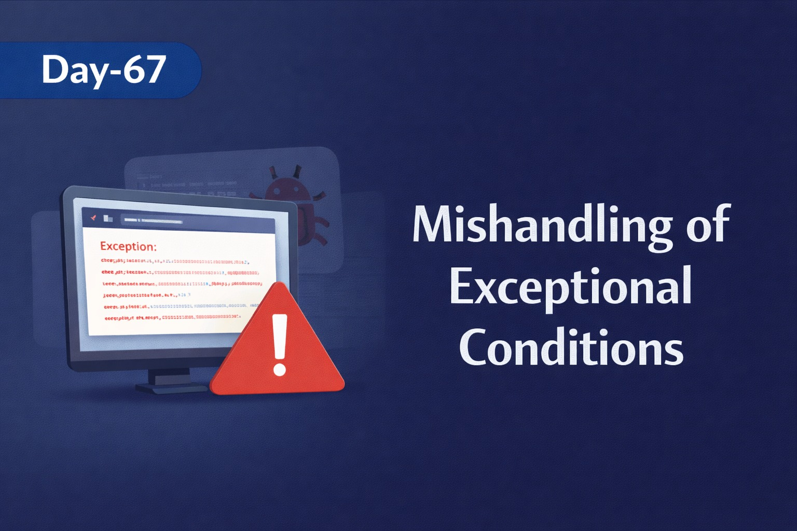
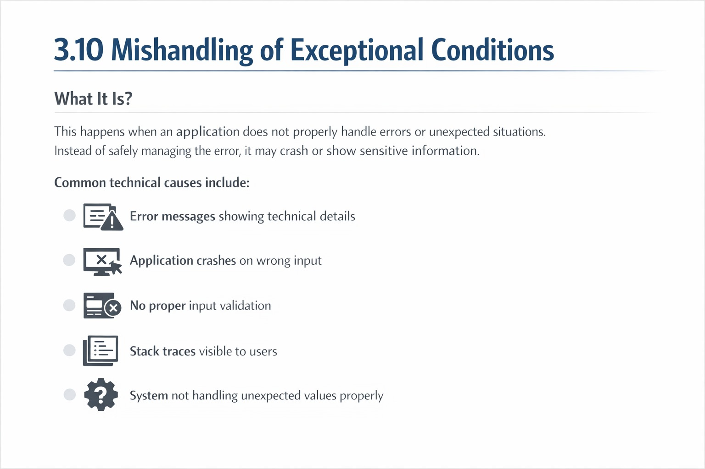
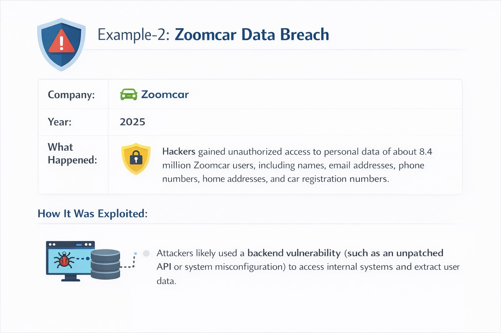
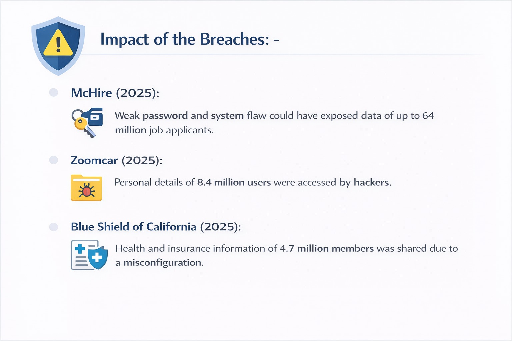
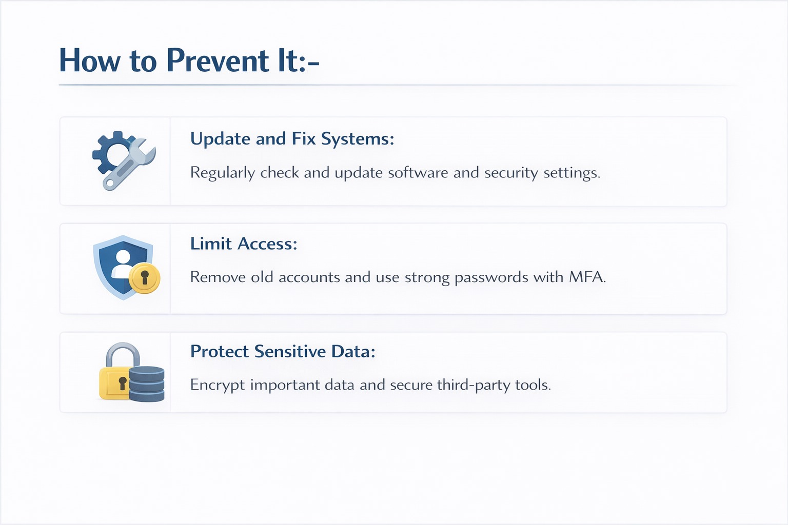

Day 67 – Mishandling of Exceptional Conditions (OWASP Study)
#100DaysOfEthicalHacking

Concept Learned:
Mishandling of Exceptional Conditions
When applications do not properly handle unexpected errors (API failures, database errors, misconfigurations), attackers may exploit these weaknesses.

Case Study Explored:
Zoomcar (2025) Incident
Attackers accessed backend systems and extracted sensitive user data.
Possible contributing factors:
Improper backend exception handling
Unpatched API endpoints
Weak system configuration

Lessons Learned:
Always handle errors securely.
Do not expose stack traces or internal system details.
Patch APIs regularly.
Implement strict backend access controls.

Small error handling mistakes can create big security risks.

Learning via Skills Uprise Mentored by Manoj Kumar                         

LinkedIn: https://www.linkedin.com/company/skills-uprise

CEO: https://www.linkedin.com/in/manoj-kumar

