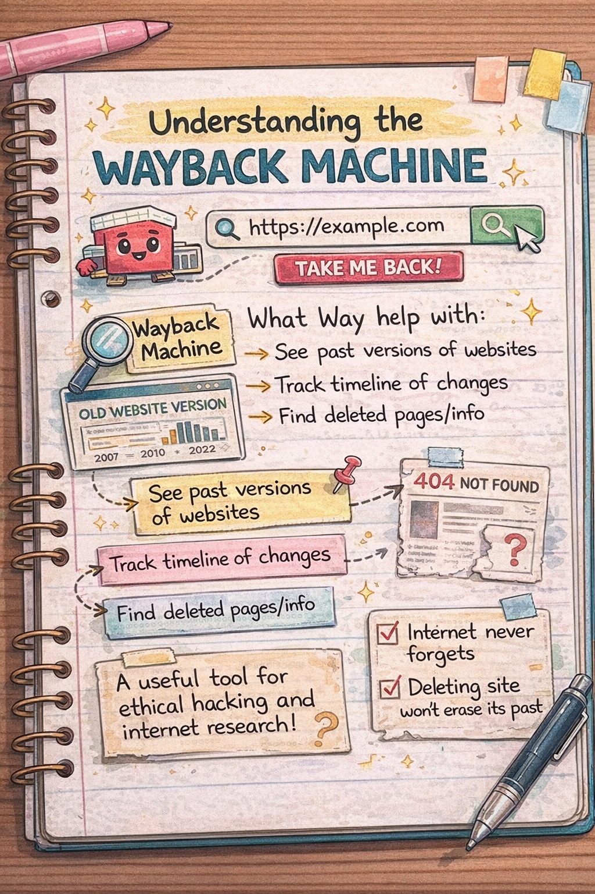
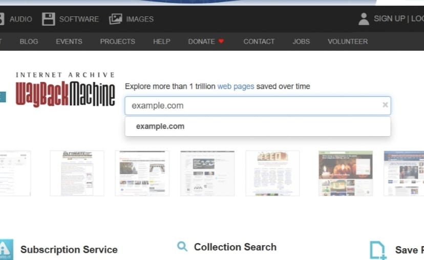
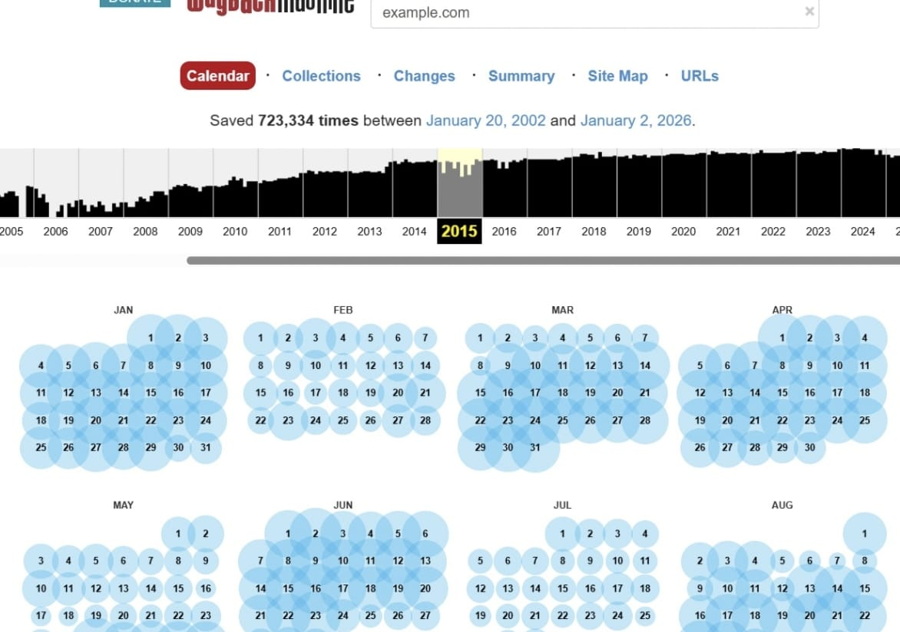
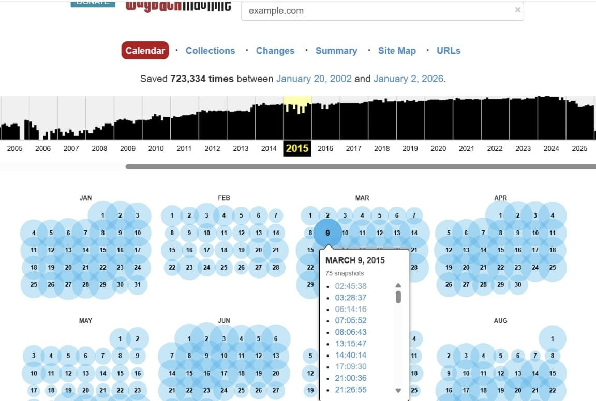
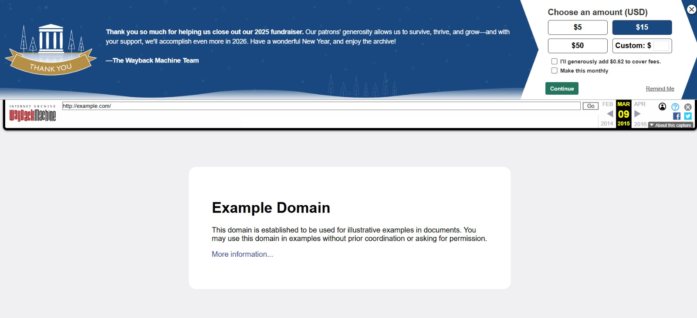

Day 7 – Ethical Hacking Learning Challenge

Objective:Explore historical snapshots of websites using the "Wayback Machine" and understand digital footprints.

Experiment:-
 1. Created a dummy website for practice.
 2. Accessed the website using the **Wayback Machine** to see archived versions.
 3. Observed changes over time:
    --> Pages added, modified, or removed.
    -->Multiple snapshots from the same day showing small updates
    -->Deleted content (offers, placeholders, contact info) still accessible
    -->Structural changes in menus and sections

-->Key Learnings:-
-->Website history is persistent:-Deleting a site doesn’t erase old versions.
-->Digital footprints reveal timelines:-Snapshots show changes over hours, days, or years.
-->Security awareness:-Sensitive info might still be exposed in archives; auditing past data is important.

-->Notes:-
 All screenshots are from a dummy/practice website.
 No real websites were used, following ethical guidelines.

-->Lesson Learned:Historical snapshots can reveal patterns, deleted content, and timelines — essential knowledge for ethical hacking and investigations.

Learning via Skills Uprise Mentored by Manoj Kumar

LinkedIn: https://www.linkedin.com/company/skills-uprise

CEO: https://www.linkedin.com/in/manoj-kumar

