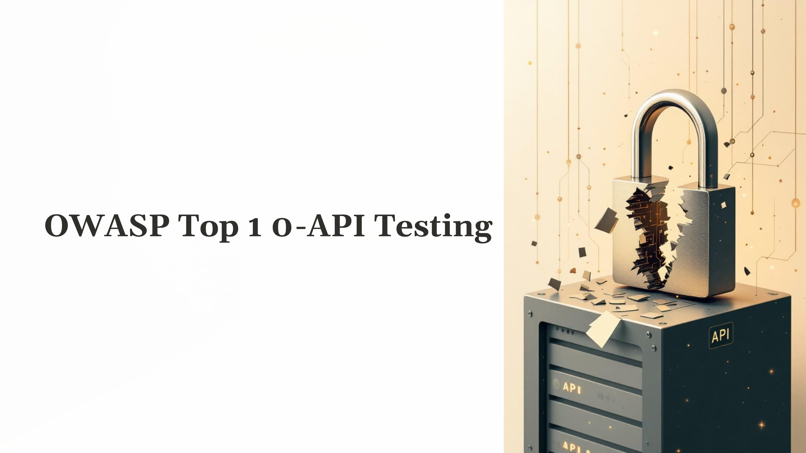
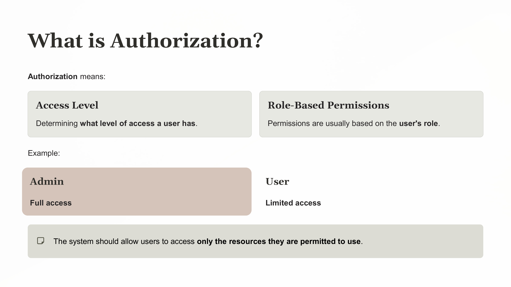
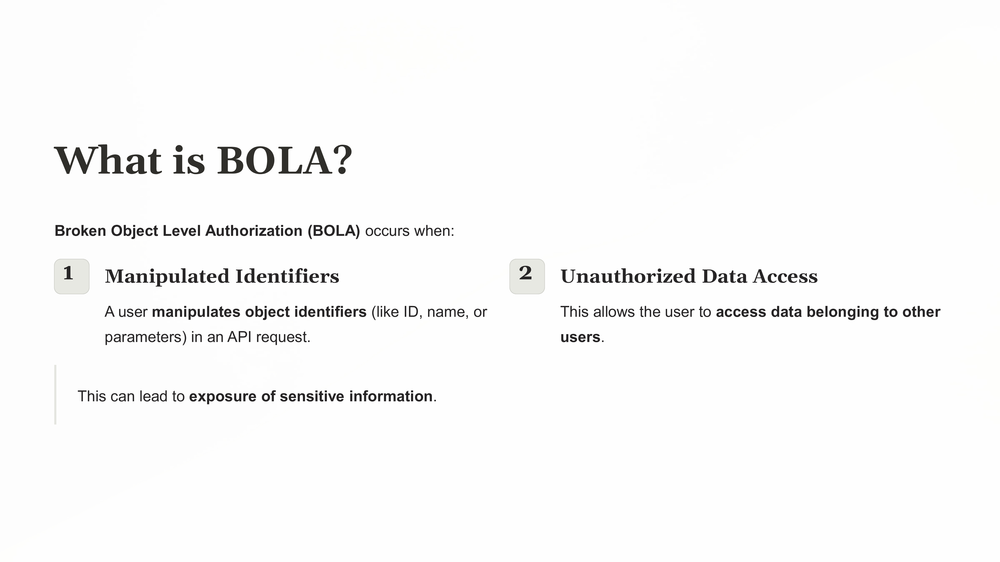
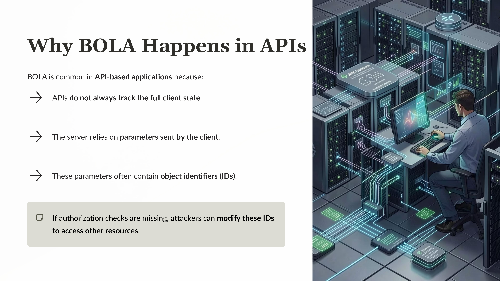
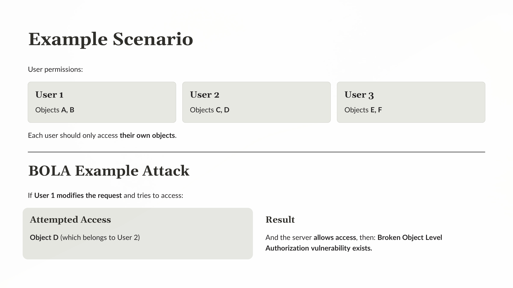
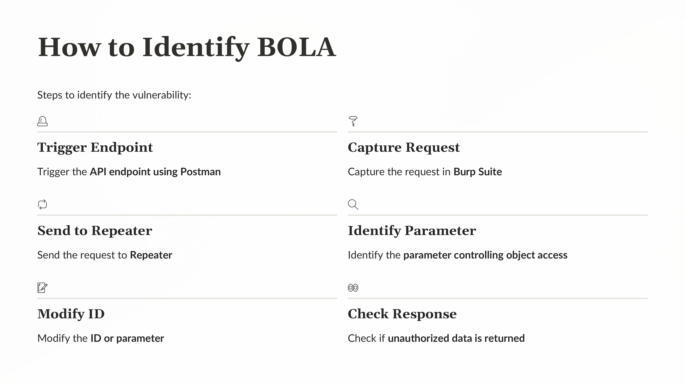
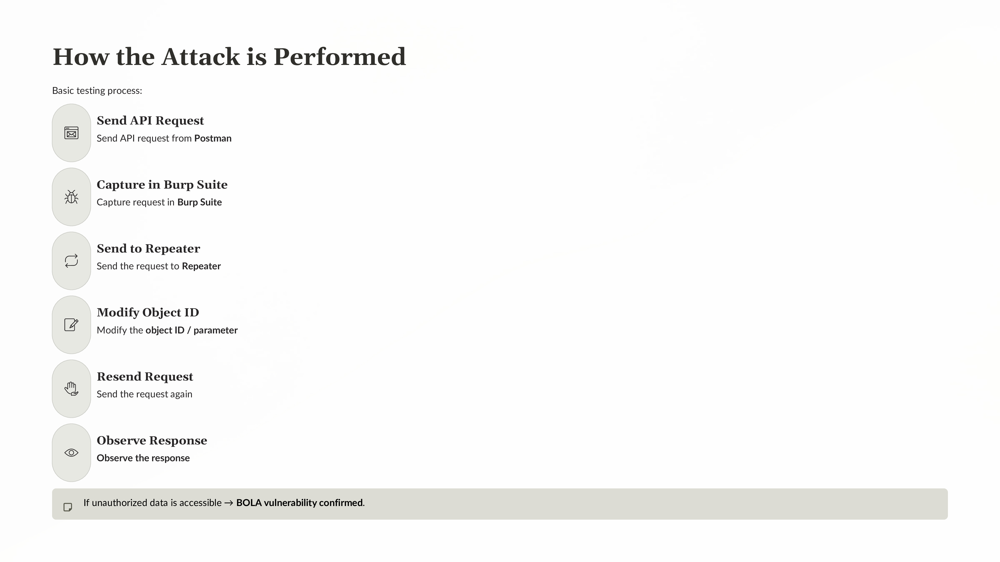

Day 70 – API Testing (OWASP Top 10): Broken Object Level Authorization

Today I continued my API security learning journey by exploring BOLA (Broken Object Level Authorization) from the OWASP API Top 10.

BOLA occurs when an API fails to properly check whether a user has permission to access a particular object. If object identifiers such as IDs are directly used in API requests, attackers may manipulate them to access other users' data.

Practical Exploration
Sent API requests using Postman
Intercepted requests with Burp Suite
Modified object identifiers in Burp Repeater
Observed server responses to check for unauthorized access

Key Insight
Proper server-side authorization validation is essential to prevent unauthorized access to resources in APIs.

Learning via Skills Uprise Mentored by Manoj Kumar                         

LinkedIn: https://www.linkedin.com/company/skills-uprise

CEO: https://www.linkedin.com/in/manoj-kumar

