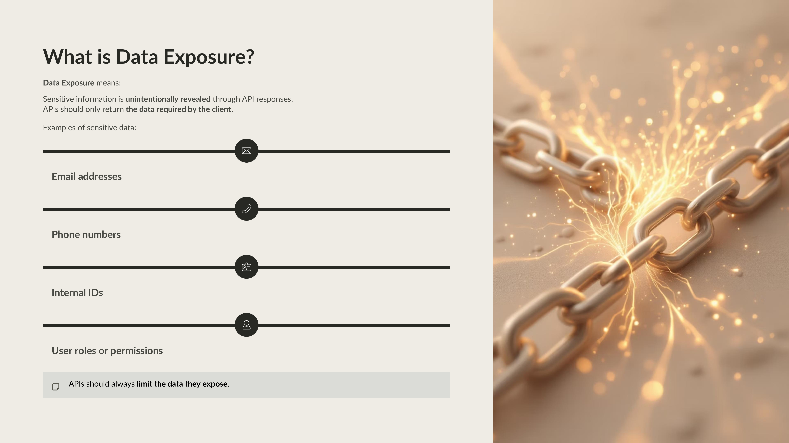
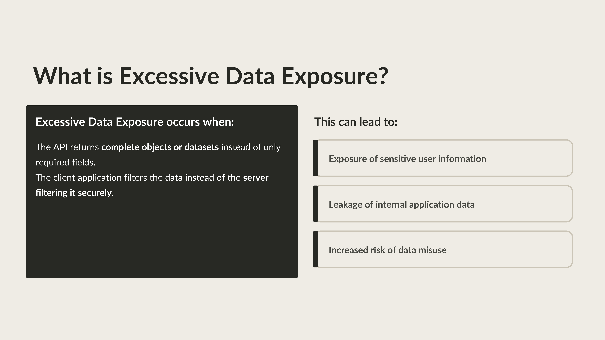
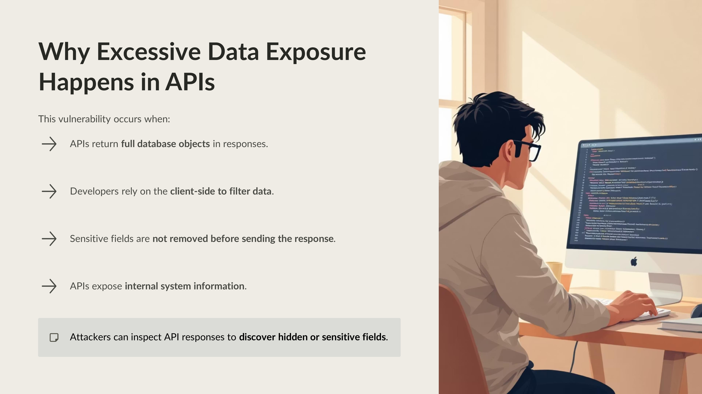
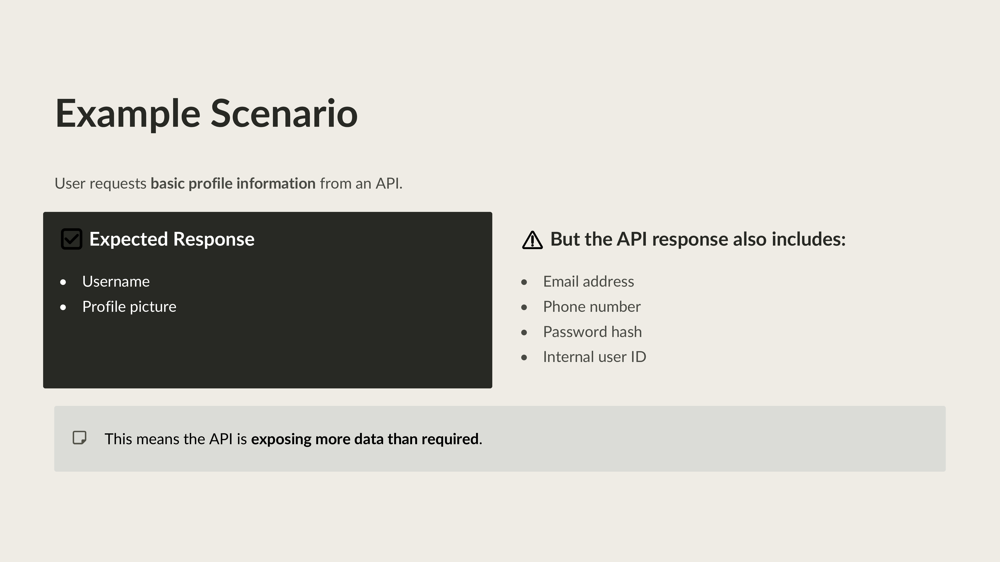
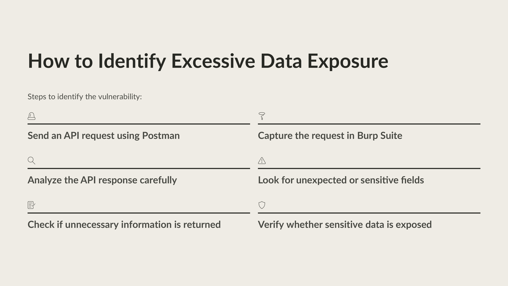
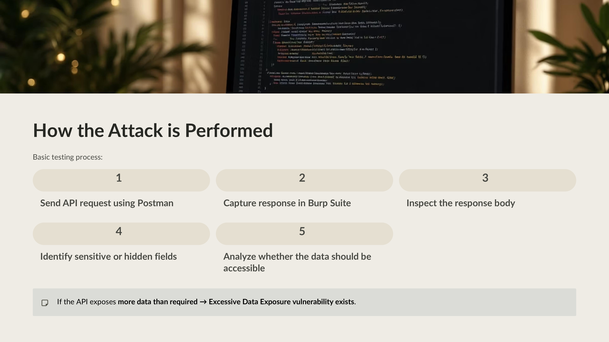

Day 72 – API Testing: Excessive Data Exposure (OWASP API Top 10)

Today I studied Excessive Data Exposure as part of my API security learning journey.

This vulnerability occurs when an API returns more information than required, exposing sensitive fields that should not be visible to users.

Practical Exploration

Sent API requests using Postman

Intercepted responses using Burp Suite

Inspected API responses for unnecessary or sensitive fields

Key Learning

APIs should follow the principle of minimum data exposure and only return the data required for the request.

#100DaysOfEthicalHacking #APISecurity #OWASP #CyberSecurity

Learning via Skills Uprise Mentored by Manoj Kumar                         

LinkedIn: https://www.linkedin.com/company/skills-uprise

CEO: https://www.linkedin.com/in/manoj-kumar

