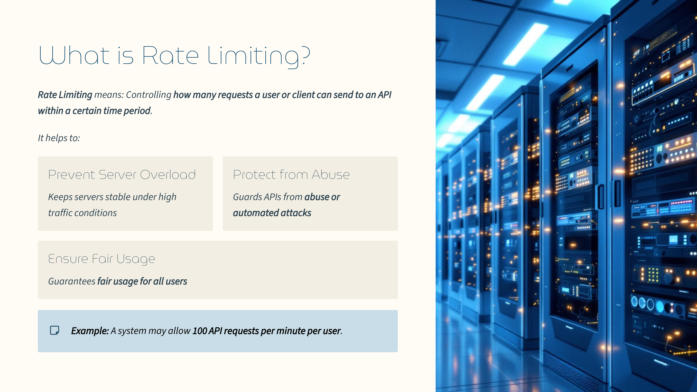
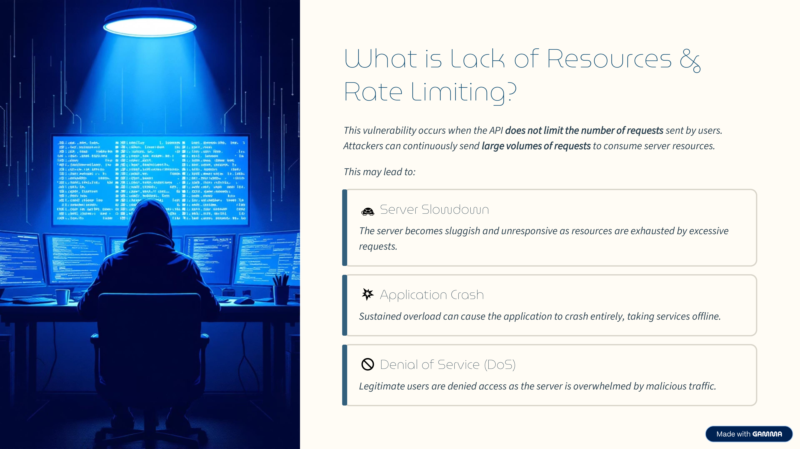
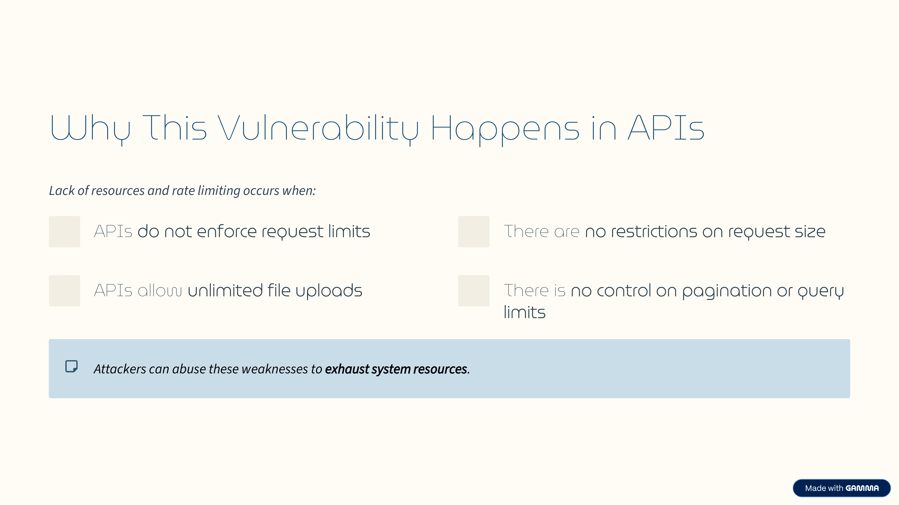
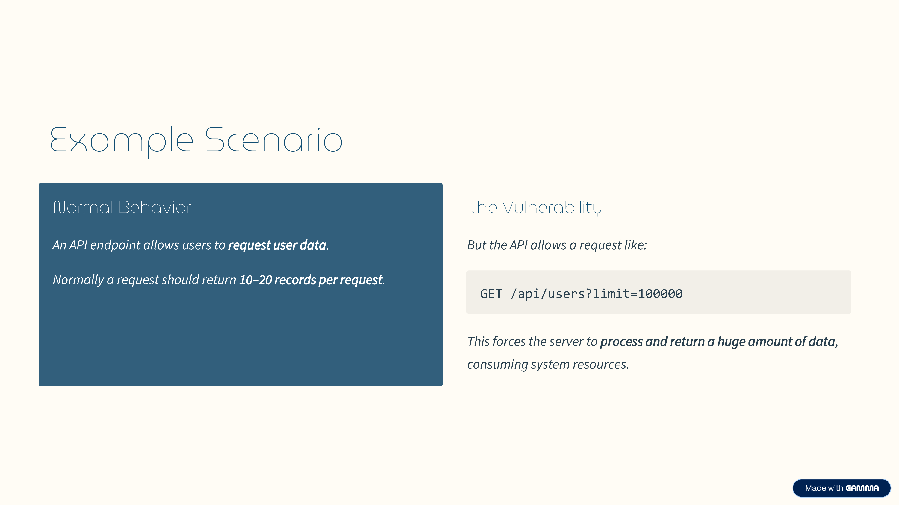
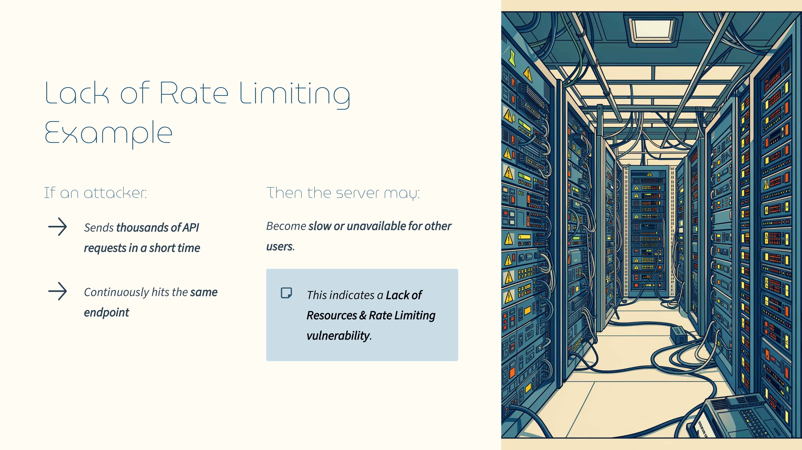
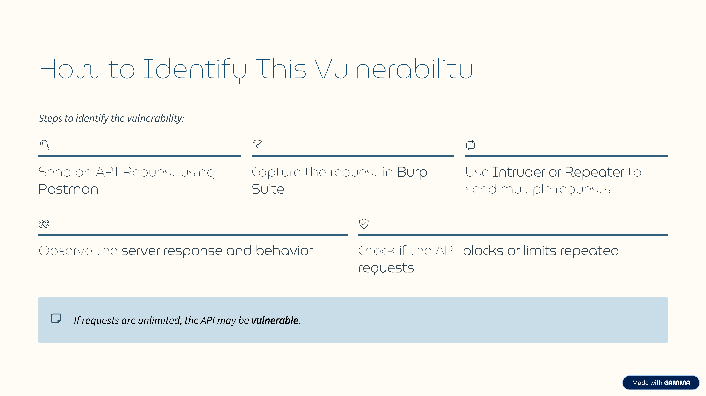
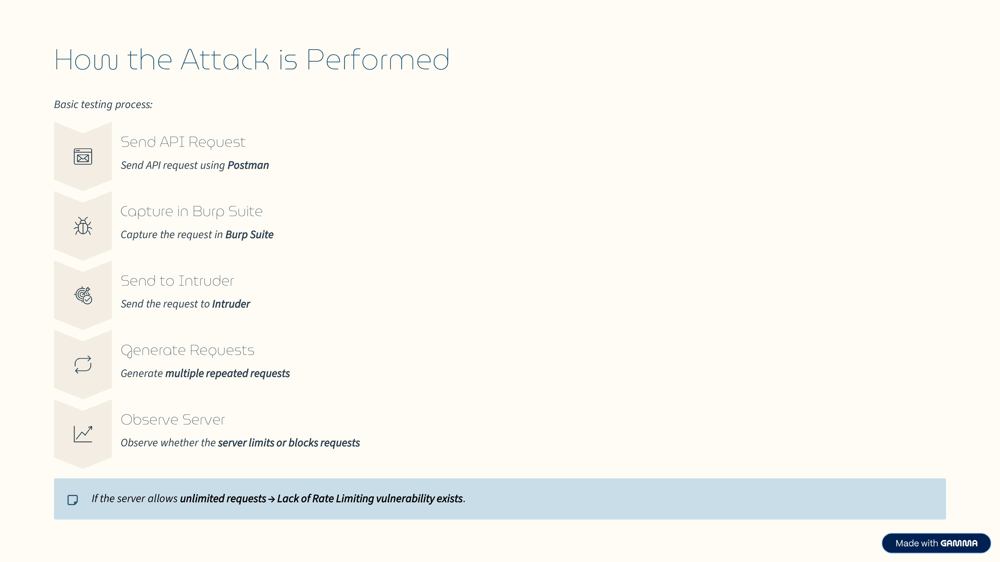

Day 73 – API Testing: Lack of Resources & Rate Limiting (OWASP API Top 10)

Today I explored Lack of Resources & Rate Limiting as part of my API security learning journey.

This vulnerability occurs when an API does not properly limit the number or size of requests a client can send, allowing attackers to overwhelm the system with repeated requests and exhaust server resources.

Practical Exploration

Sent API requests using Postman

Intercepted and analyzed requests with Burp Suite

Observed how APIs respond to repeated or high-volume requests

Key Learning

Proper rate limiting and resource control mechanisms are essential to ensure API availability and prevent abuse.

#100DaysOfEthicalHacking #APISecurity #OWASP #CyberSecurity

Learning via Skills Uprise Mentored by Manoj Kumar                         

LinkedIn: https://www.linkedin.com/company/skills-uprise

CEO: https://www.linkedin.com/in/manoj-kumar

