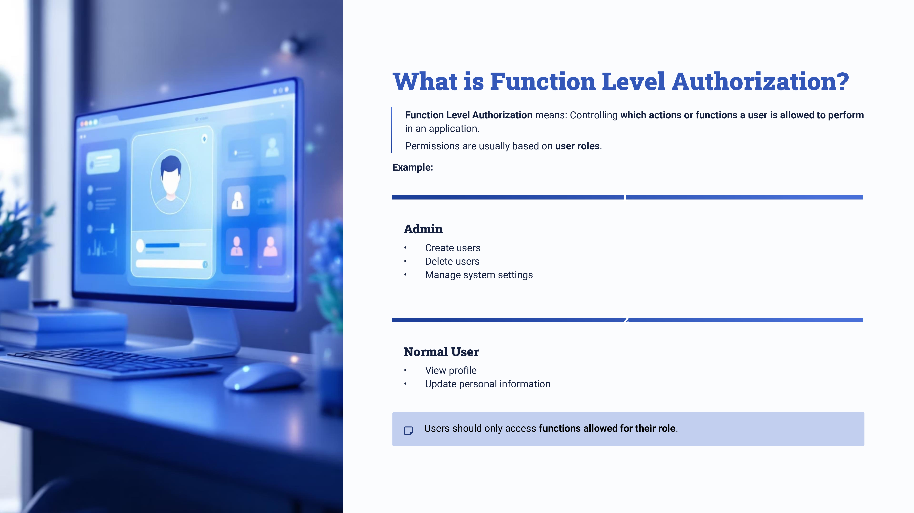
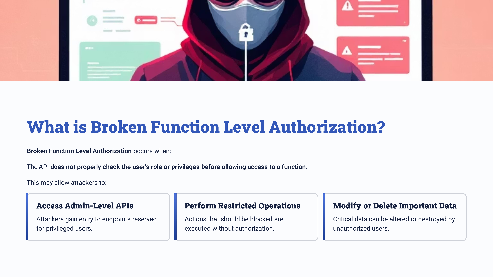
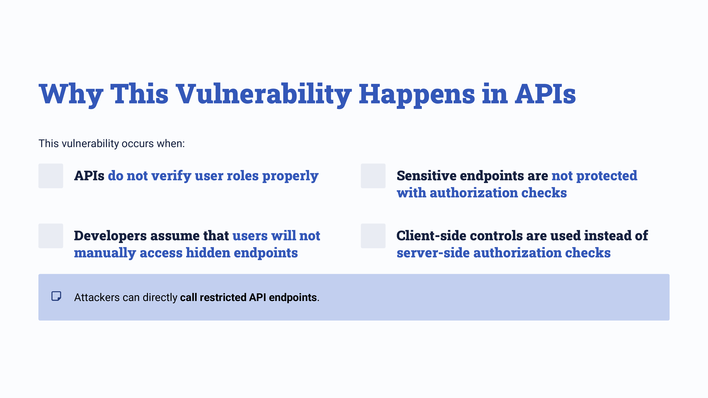
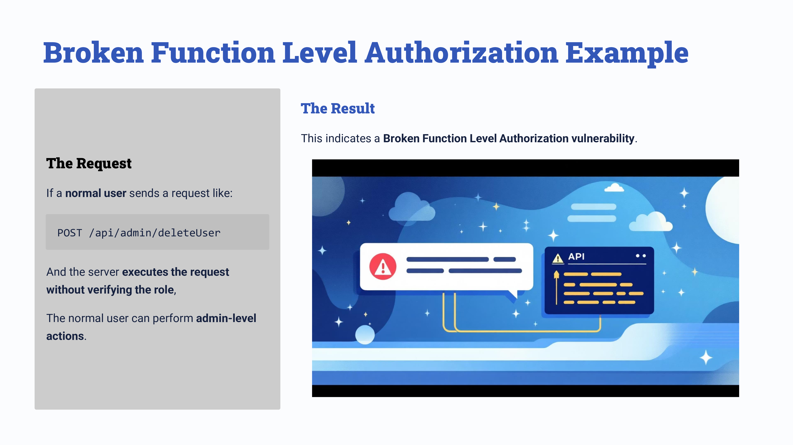
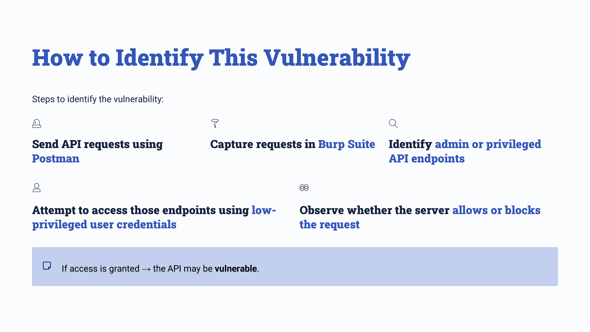
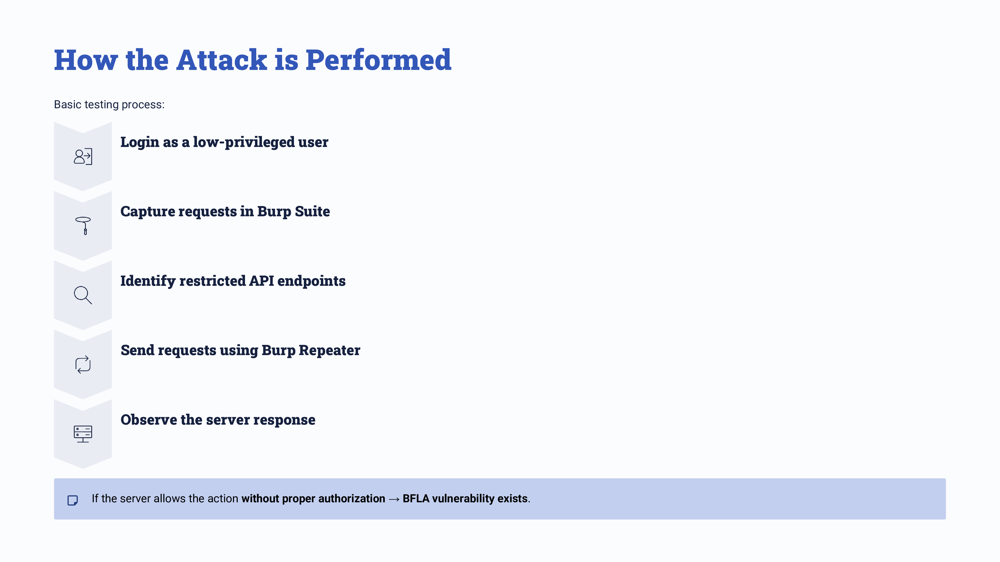

Day 74 – API Testing: Broken Function Level Authorization (OWASP API Top 10)

Today I studied Broken Function Level Authorization (BFLA) as part of my API security learning journey.

This vulnerability occurs when an API fails to properly verify whether a user has permission to perform a particular function, allowing low-privileged users to access restricted endpoints such as admin APIs.

Practical Exploration

Sent API requests using Postman

Intercepted and analyzed requests with Burp Suite

Tested access to restricted endpoints using low-privileged accounts

Key Learning

APIs must enforce proper role-based authorization checks for every endpoint and function to prevent unauthorized actions.

#100DaysOfEthicalHacking #APISecurity #OWASP #CyberSecurity

Learning via Skills Uprise Mentored by Manoj Kumar                         

LinkedIn: https://www.linkedin.com/company/skills-uprise

CEO: https://www.linkedin.com/in/manoj-kumar

