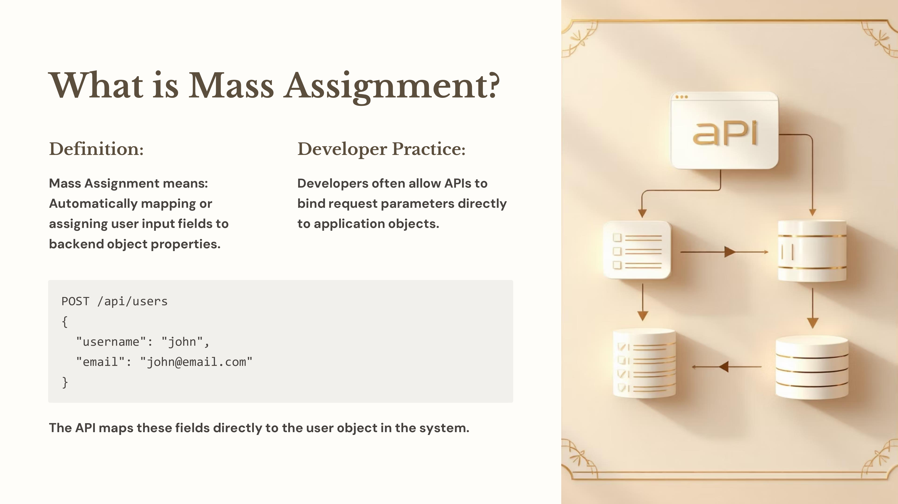
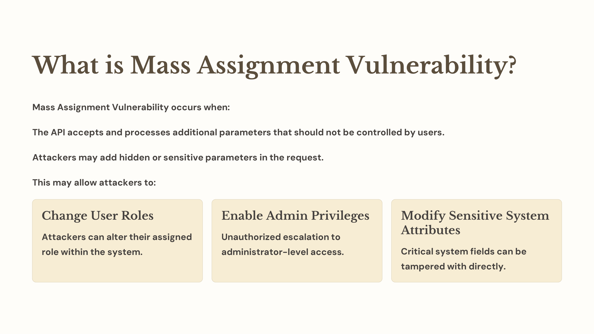
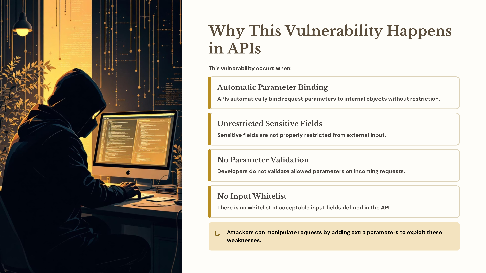
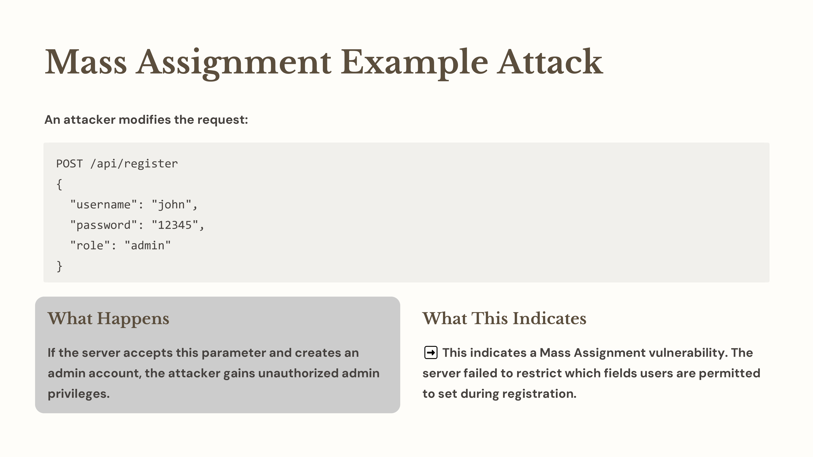
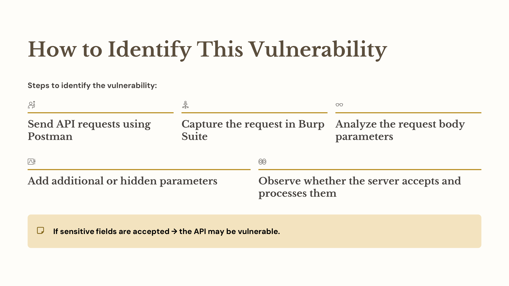
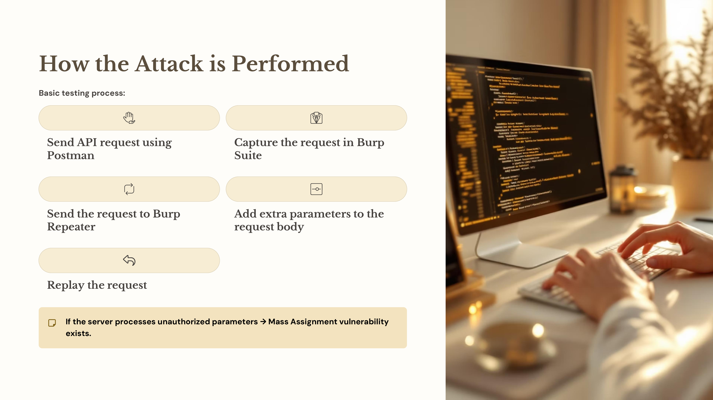

Day 75 – Mass Assignment Vulnerability (API Testing)

Today I studied Mass Assignment from the OWASP API Top 10.

This vulnerability happens when an API accepts and processes extra parameters sent by users, allowing attackers to modify sensitive fields like roles or permissions.

Practice
Sent API requests using Postman
Modified requests using Burp Suite
Added extra parameters to test API behavior

Key Learning
APIs should validate inputs and allow only required parameters.

#100DaysOfEthicalHacking #APISecurity #OWASP

Learning via Skills Uprise Mentored by Manoj Kumar                         

LinkedIn: https://www.linkedin.com/company/skills-uprise

CEO: https://www.linkedin.com/in/manoj-kumar

