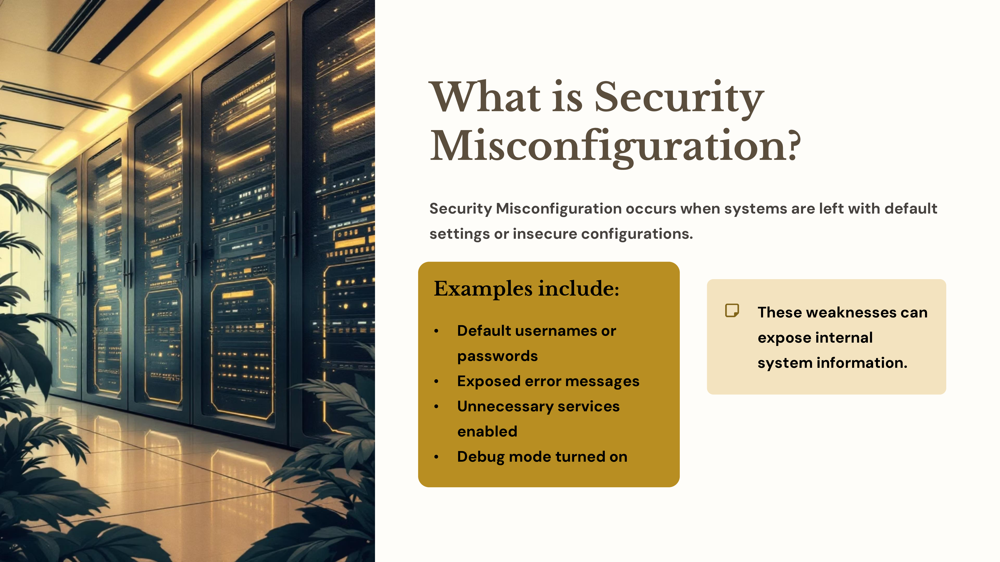
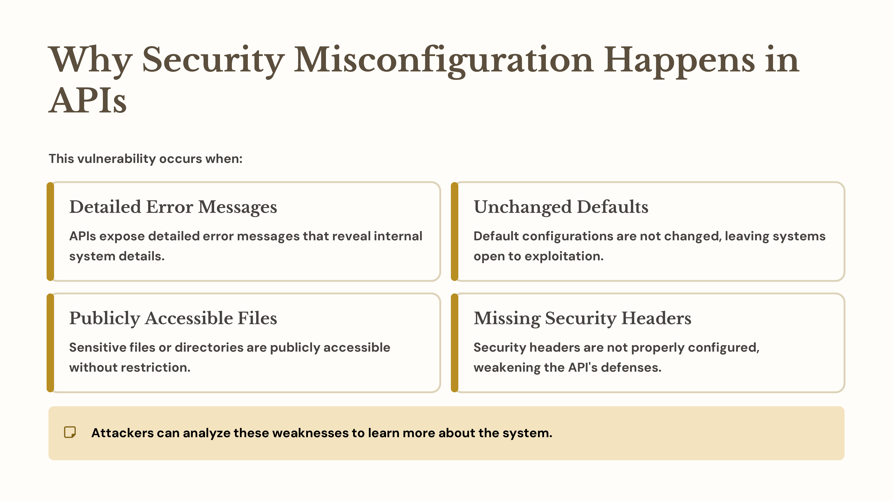
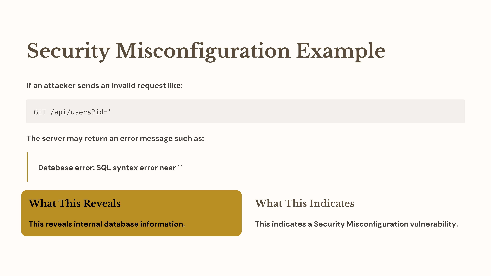
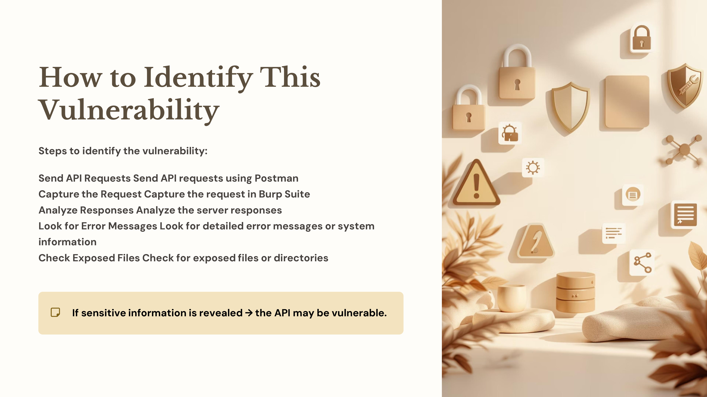
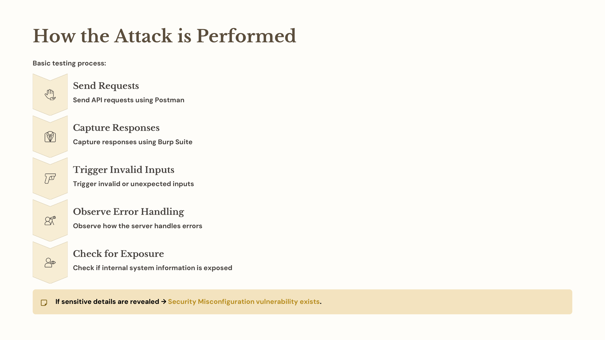

Day 76 – Security Misconfiguration (API Testing)

Today I studied Security Misconfiguration from the OWASP API Top 10.

This vulnerability occurs when APIs or servers are not securely configured, which may expose internal system information.

Practice

Sent API requests using Postman

Analyzed responses using Burp Suite

Observed error messages and server responses

Key Learning

Systems should hide internal error details and use secure configurations to prevent information leakage.

#100DaysOfEthicalHacking #APISecurity #OWASP #CyberSecurity

Learning via Skills Uprise Mentored by Manoj Kumar                         

LinkedIn: https://www.linkedin.com/company/skills-uprise

CEO: https://www.linkedin.com/in/manoj-kumar

