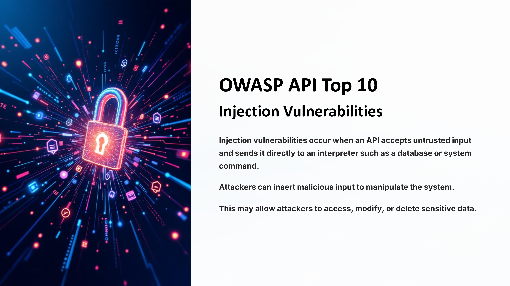
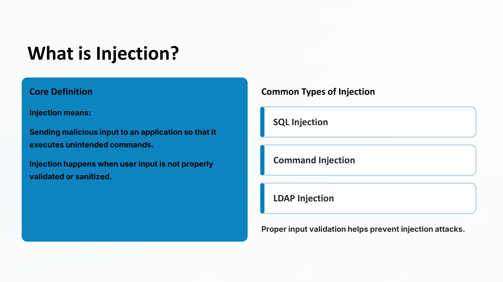
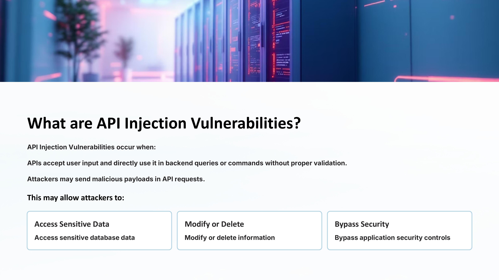
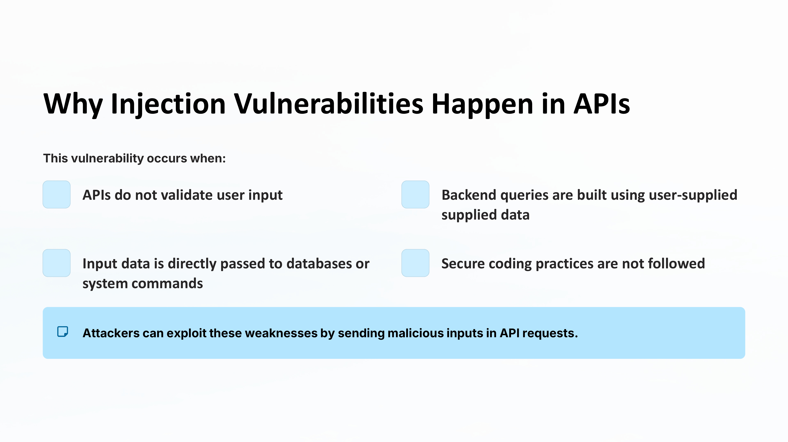
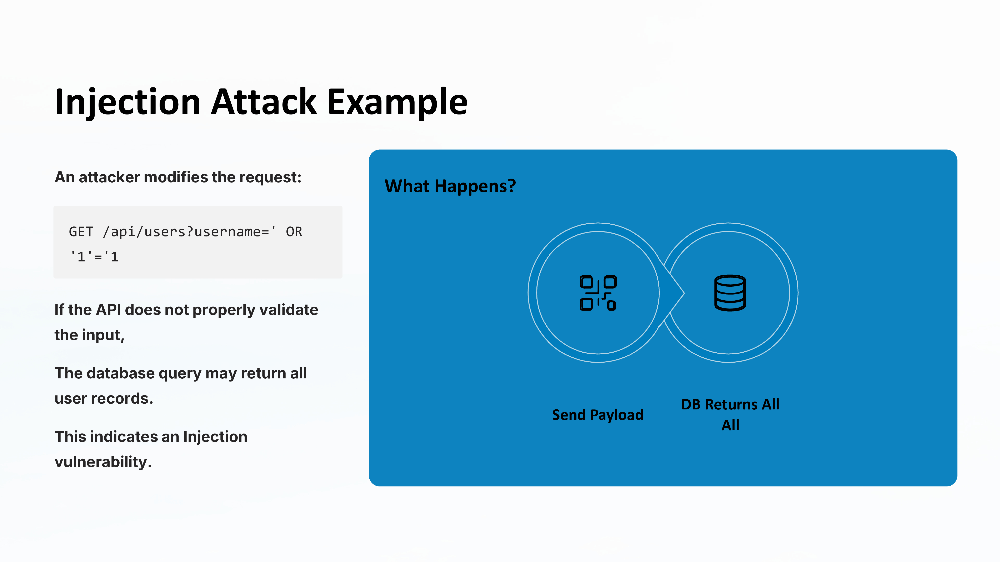
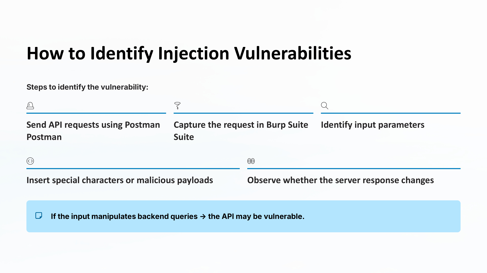
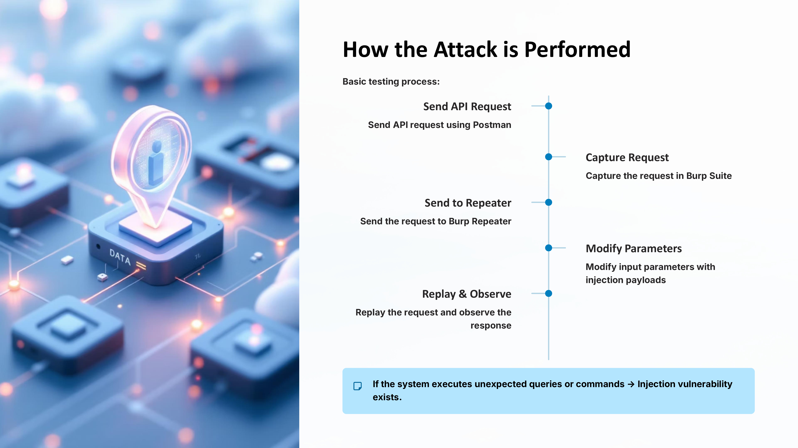

Day 77 – Injection Vulnerabilities (API Testing)

Today I studied Injection vulnerabilities from the OWASP API Top 10.

This occurs when APIs directly use user input in backend queries or commands without proper validation, allowing attackers to manipulate system behavior.

Practice
Sent API requests using Postman
Intercepted requests using Burp Suite
Tested parameters with basic injection payloads

Key Learning
Always validate and sanitize user input to prevent injection attacks.

#100DaysOfEthicalHacking #APISecurity #OWASP #CyberSecurity

Learning via Skills Uprise Mentored by Manoj Kumar                         

LinkedIn: https://www.linkedin.com/company/skills-uprise

CEO: https://www.linkedin.com/in/manoj-kumar

