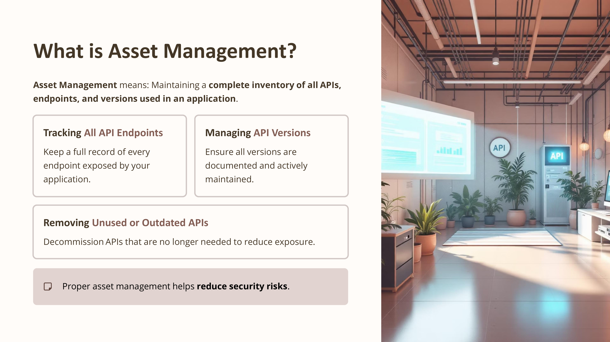
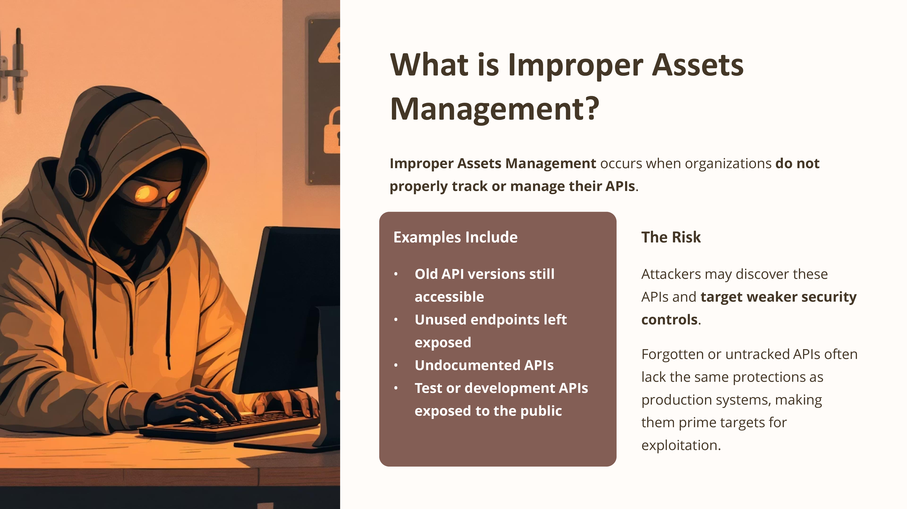
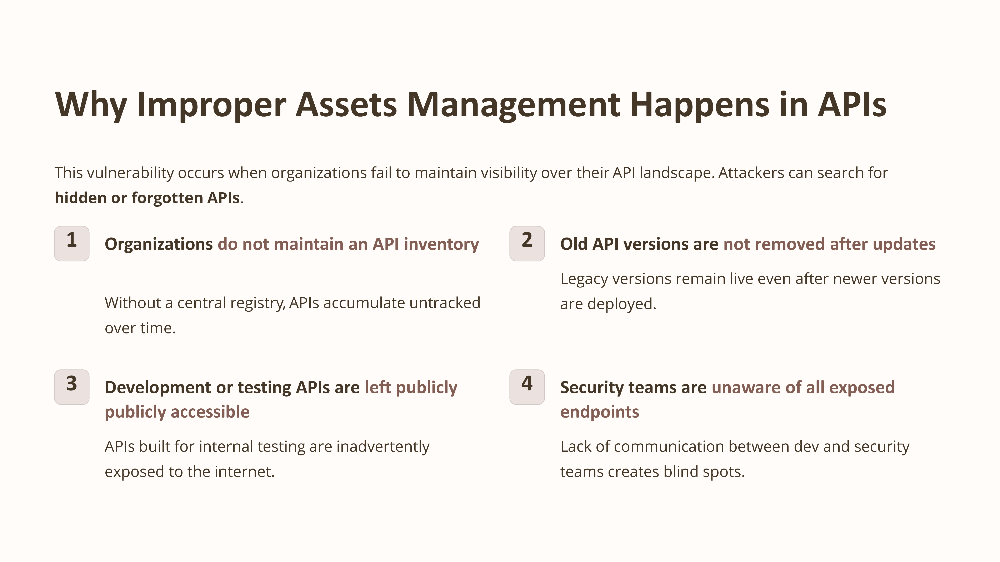
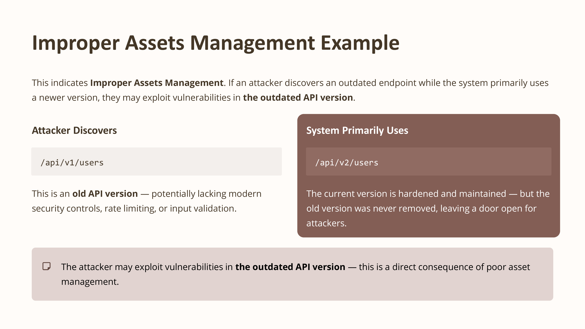
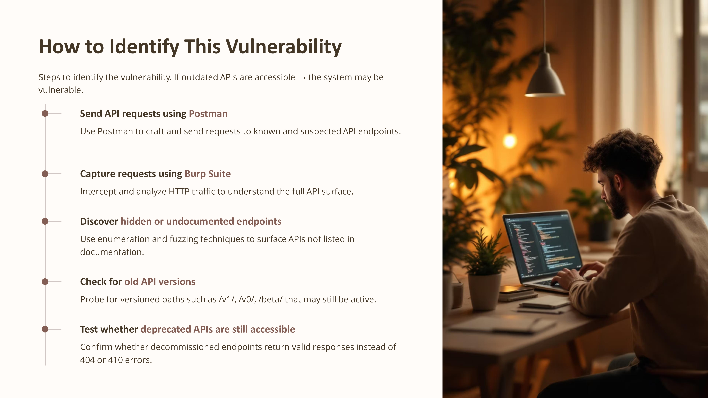
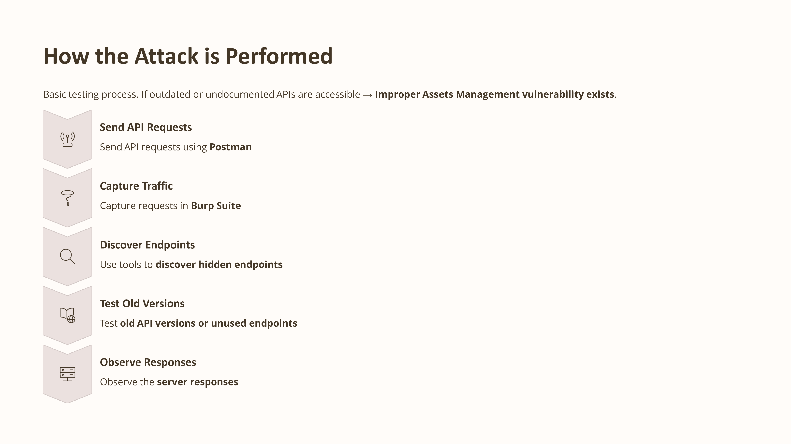

Day 78 – Improper Assets Management (API Testing)

Today I studied Improper Assets Management from the OWASP API Top 10.

This vulnerability occurs when organizations do not properly track or manage their APIs, leaving old or unused endpoints accessible.

Practice
Sent API requests using Postman
Analyzed endpoints using Burp Suite
Checked for old or undocumented API versions

Key Learning
Organizations should maintain an updated API inventory and remove unused endpoints.

#100DaysOfEthicalHacking #APISecurity #OWASP #CyberSecurity

Learning via Skills Uprise Mentored by Manoj Kumar                         

LinkedIn: https://www.linkedin.com/company/skills-uprise

CEO: https://www.linkedin.com/in/manoj-kumar

