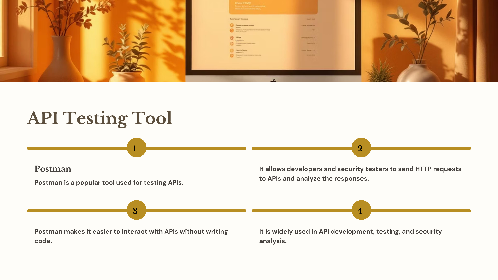
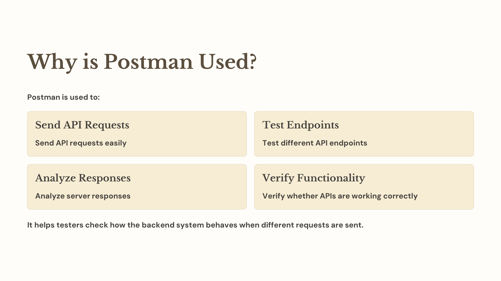
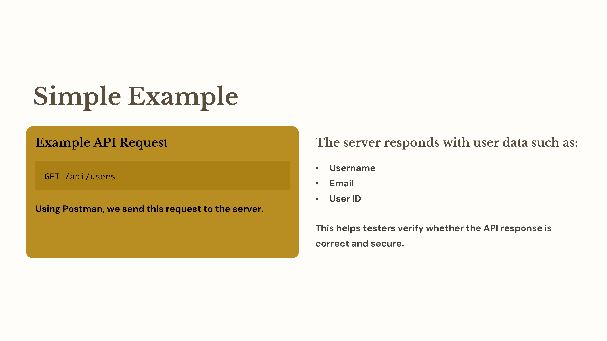
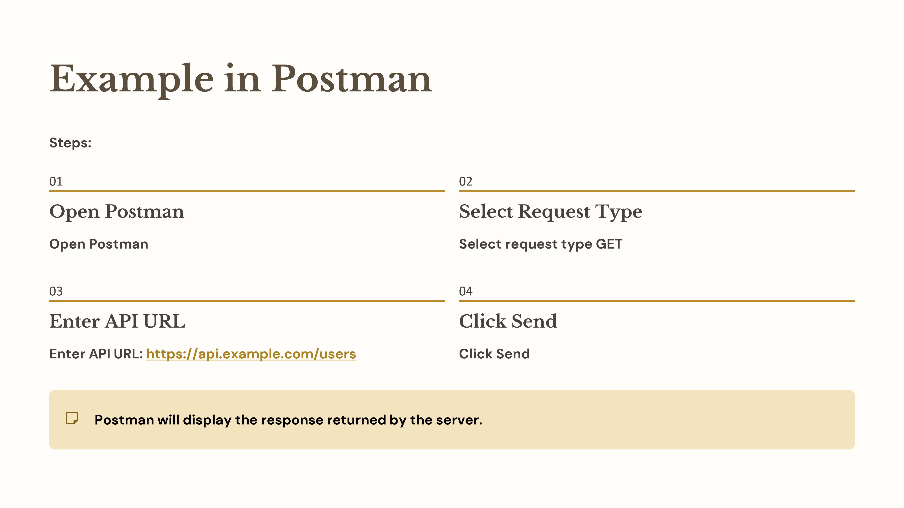
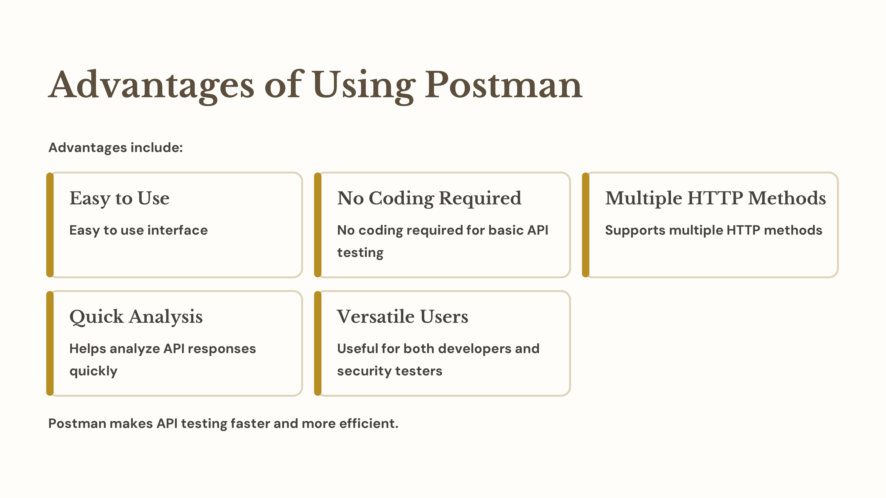

Day 79 – Postman Tool for API Testing

Today I learned about Postman, a popular tool used for testing APIs.

What is Postman
Postman is a tool that allows testers and developers to send HTTP requests to APIs and analyze the responses.

Why it is used
It helps in verifying whether API endpoints are working correctly and allows testers to inspect responses, headers, and status codes.

Simple Example
Request:
GET /api/users
Using Postman, we can send this request and observe the data returned by the server.

Advantages
Easy to use interface
Supports multiple HTTP methods
Helps analyze API responses quickly
Useful for debugging and API security testing

#100DaysOfEthicalHacking
#APITesting
#CyberSecurityLearning

Learning via Skills Uprise Mentored by Manoj Kumar                         

LinkedIn: https://www.linkedin.com/company/skills-uprise

CEO: https://www.linkedin.com/in/manoj-kumar

