Day 8 – Ports & Protocols: A New Perspective.

Before this session, ports were just numbers and protocols were just names.
Today’s learning connected the dots.

I explored how port numbers allow multiple services to run on the same system without conflict, and how hardware ports differ from software ports in real-world usage.

Learning about protocols helped me understand why communication is predictable and secure — every service follows a defined set of rules.

Mapping protocols to their default ports, such as HTTP (80), HTTPS (443), FTP (21), and SSH (22), made network behavior easier to visualize.

This session helped me move from memorizing concepts to actually **understanding how data flows inside a network**.

Lesson learned:-
Networking fundamentals are the base layer of ethical hacking and security analysis.

Learning via Skills Uprise Mentored by Manoj Kumar

LinkedIn: https://www.linkedin.com/company/skills-uprise

CEO: https://www.linkedin.com/in/manoj-kumar

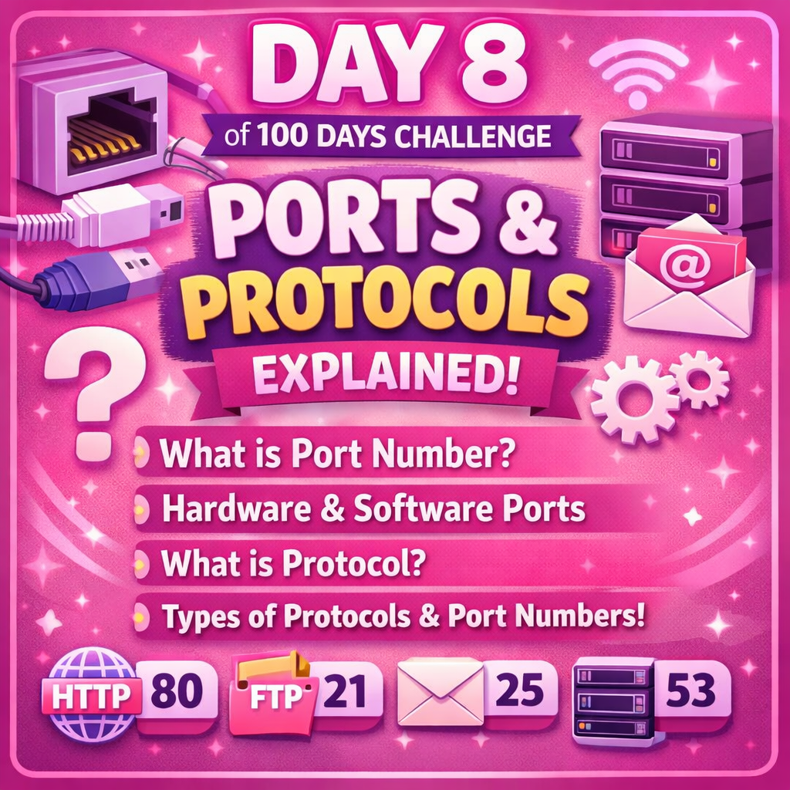
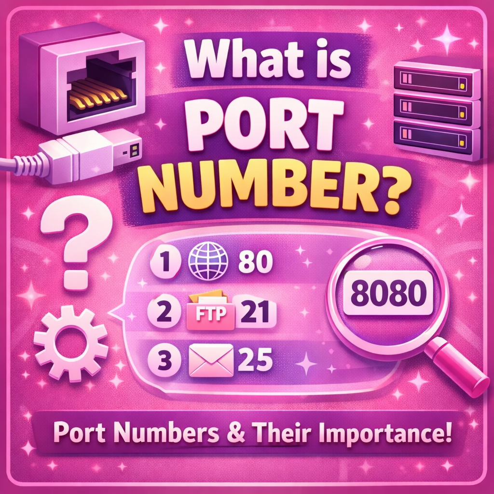
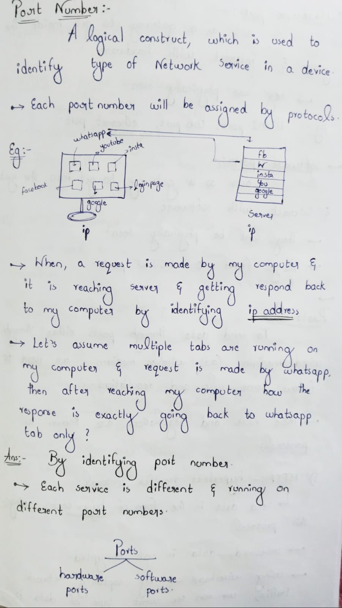
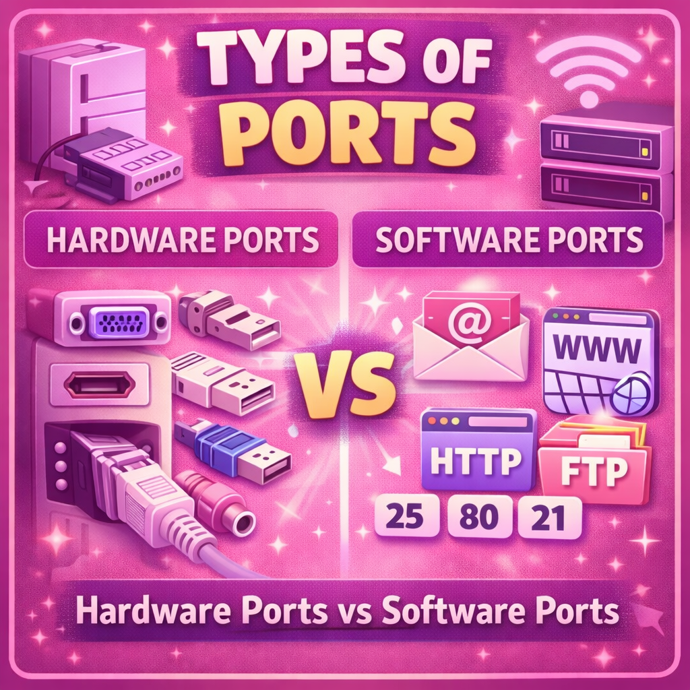
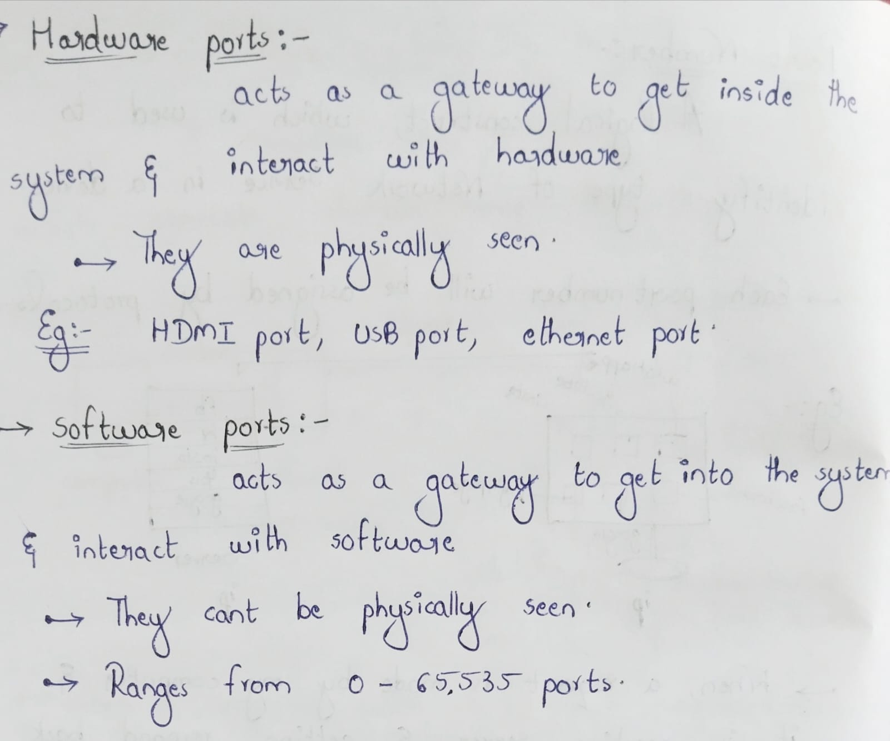
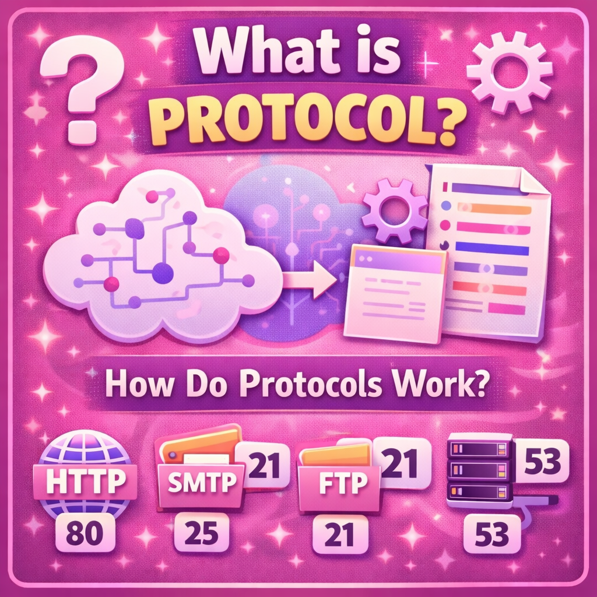

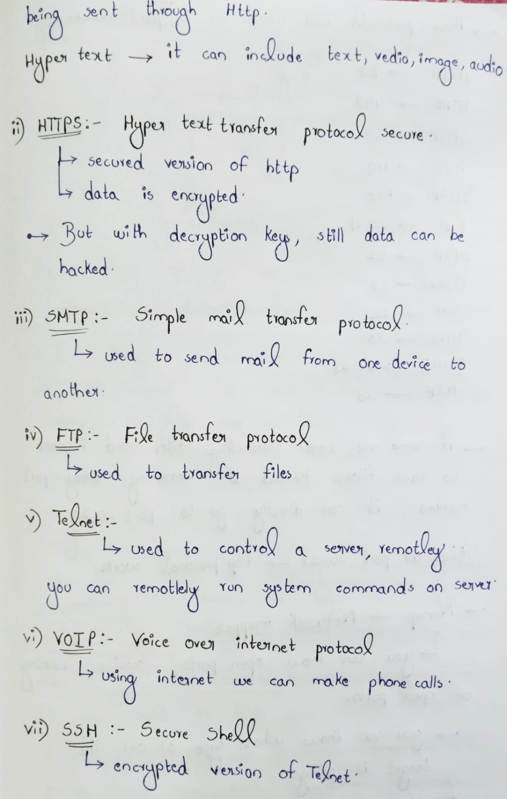
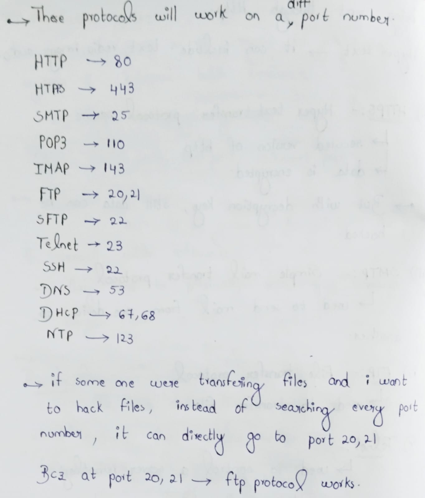
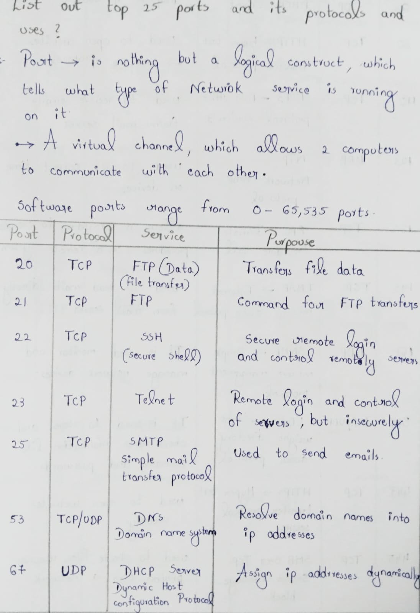
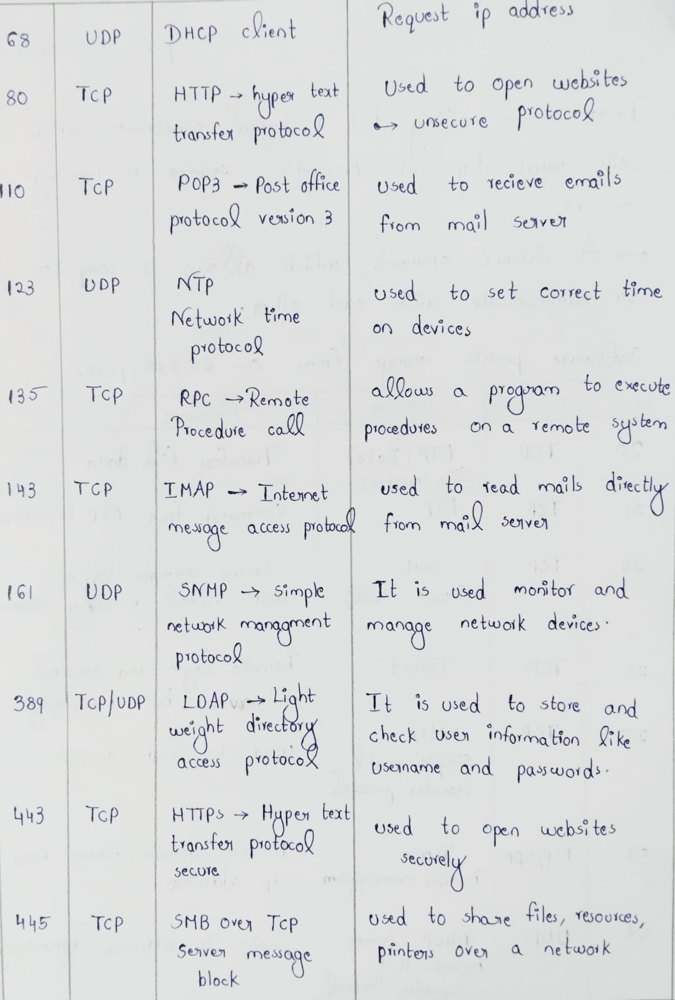
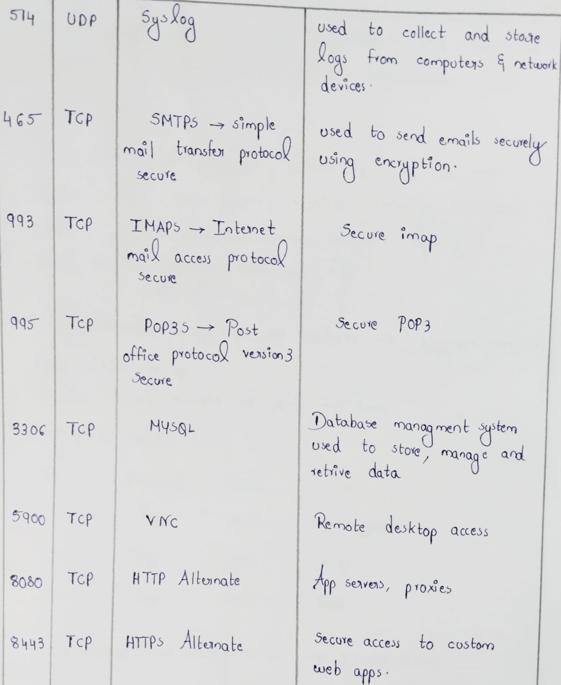
