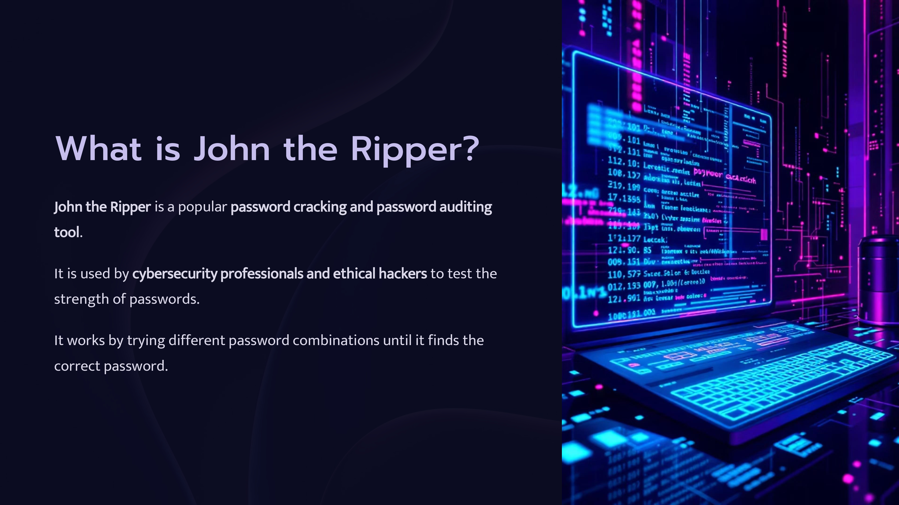
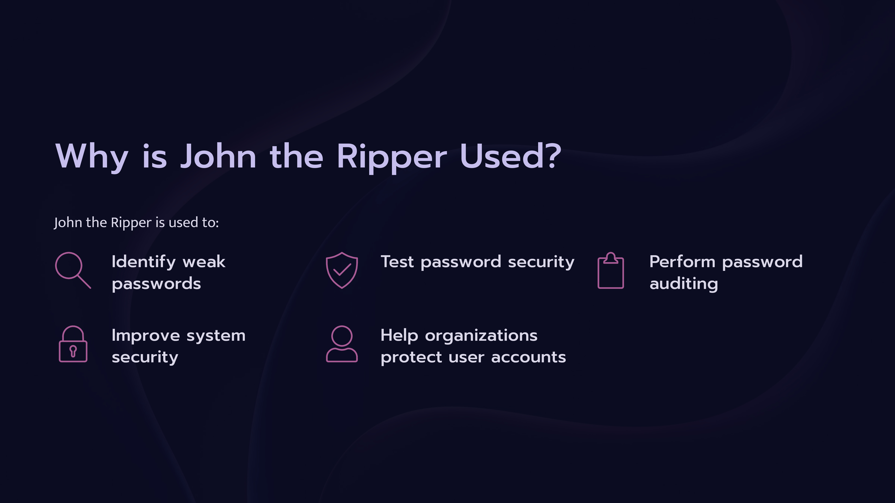
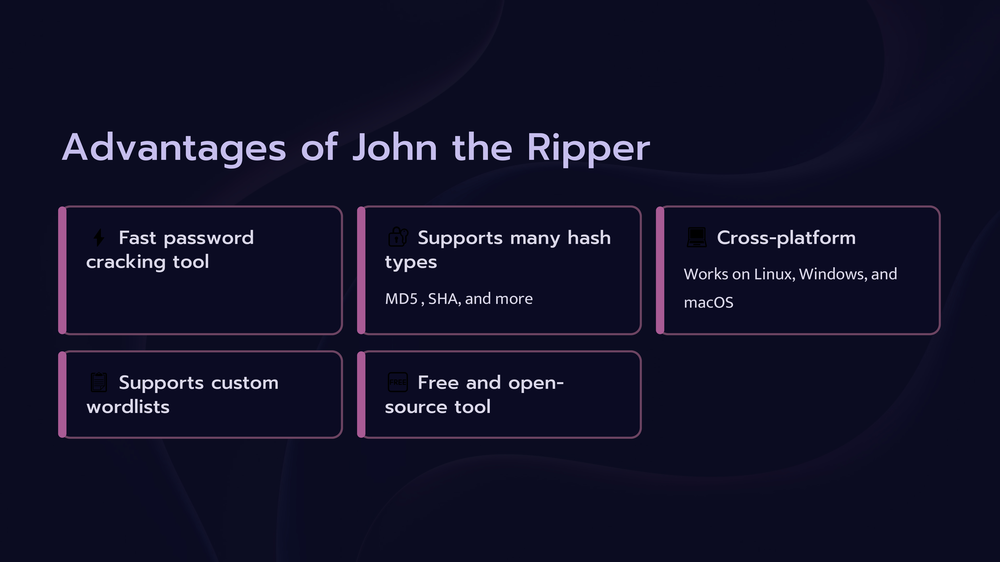
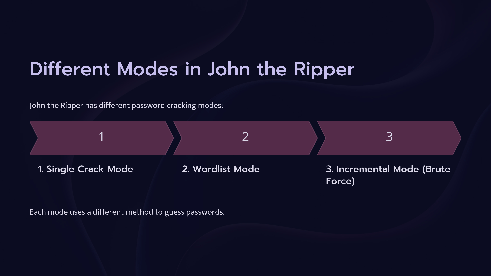
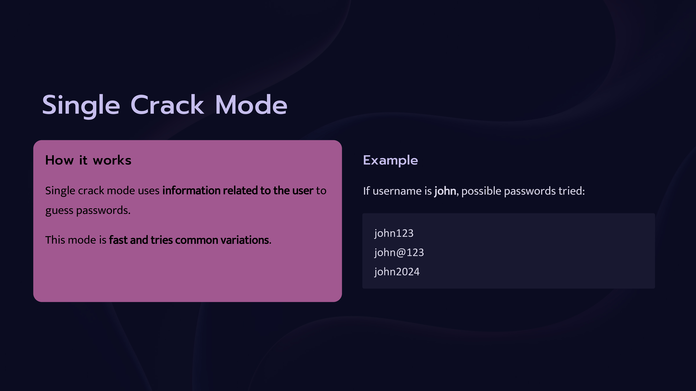
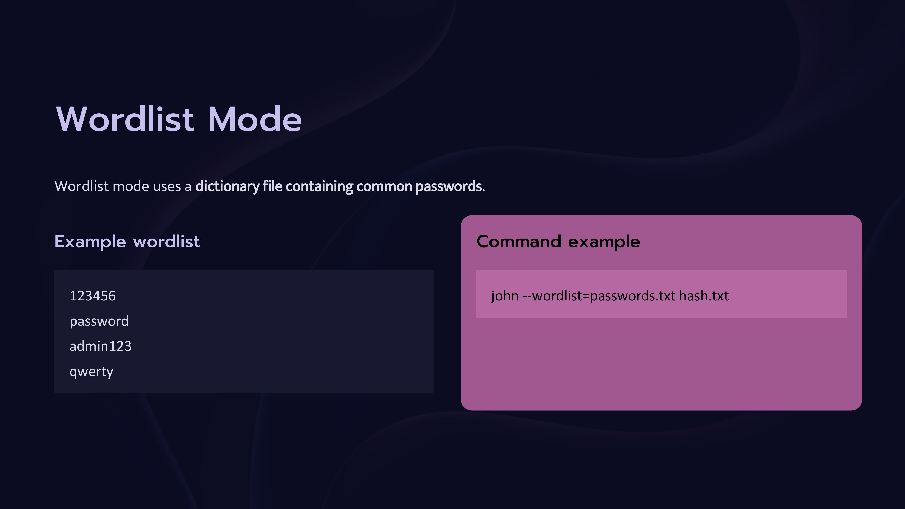
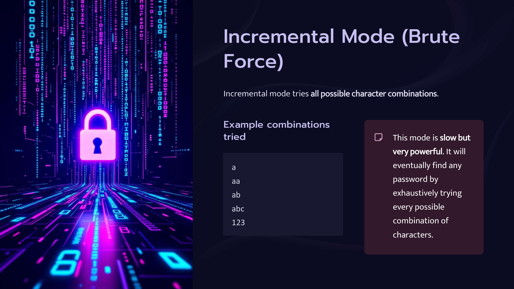
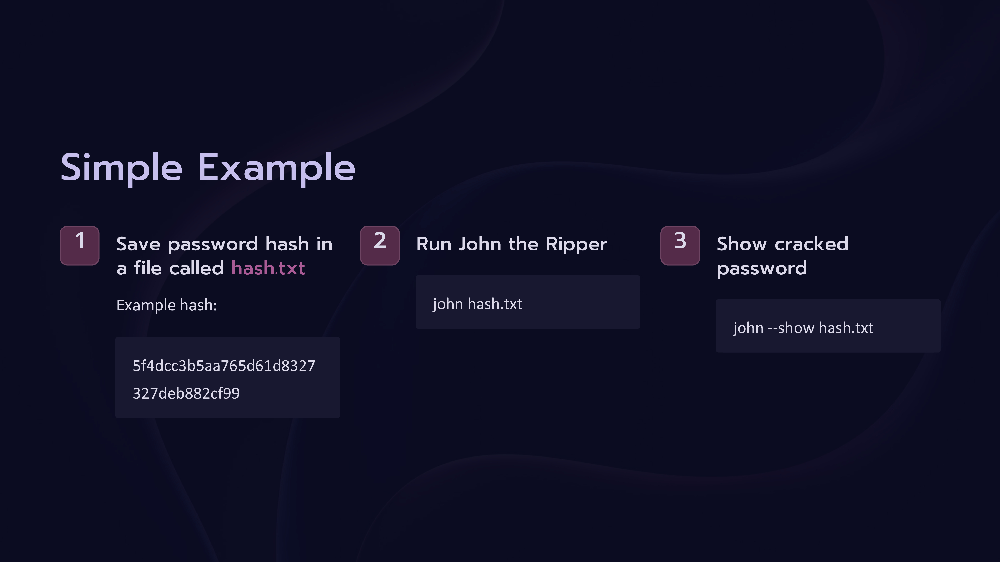

Day 80 – 100 Days Ethical Hacking Challenge

Today I learned about John the Ripper, a popular password cracking and password auditing tool used in cybersecurity.

Key Concepts Learned
What is John the Ripper?
A tool used to crack password hashes and identify weak passwords.

Why it is used
Password auditing
Testing password strength
Identifying weak credentials
Cracking Modes
Single Crack Mode
Wordlist Mode
Incremental Mode (Brute Force)

Learning how tools like John the Ripper work helps in understanding password security and penetration testing techniques.

Learning via Skills Uprise Mentored by Manoj Kumar                         

LinkedIn: https://www.linkedin.com/company/skills-uprise

CEO: https://www.linkedin.com/in/manoj-kumar

