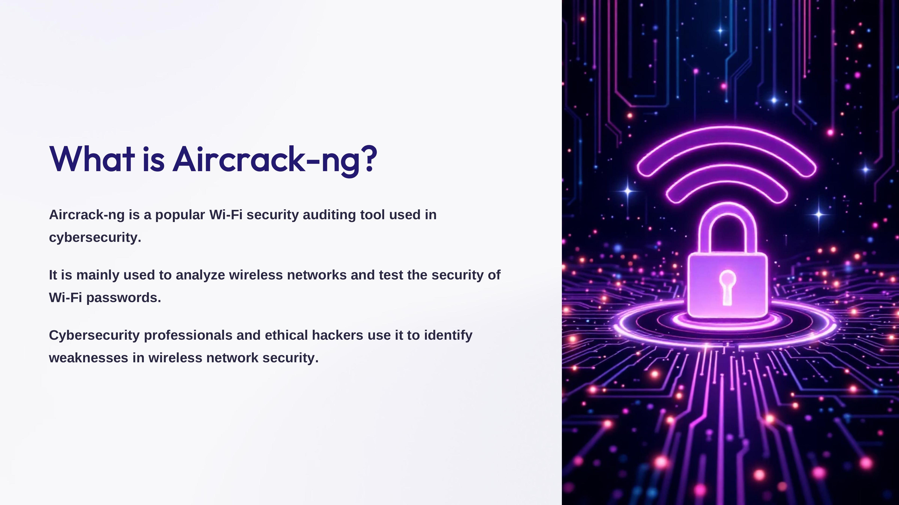
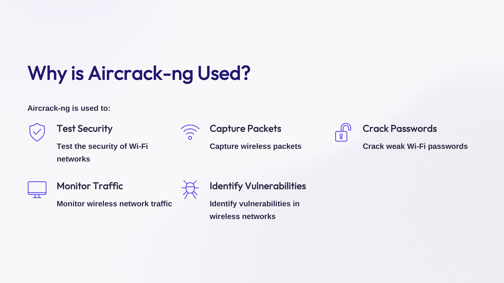
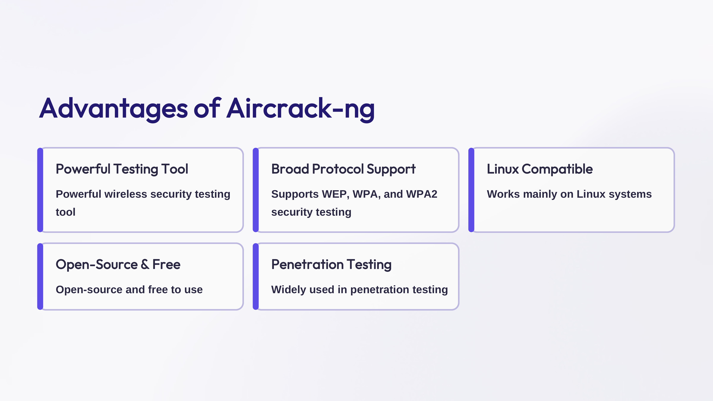
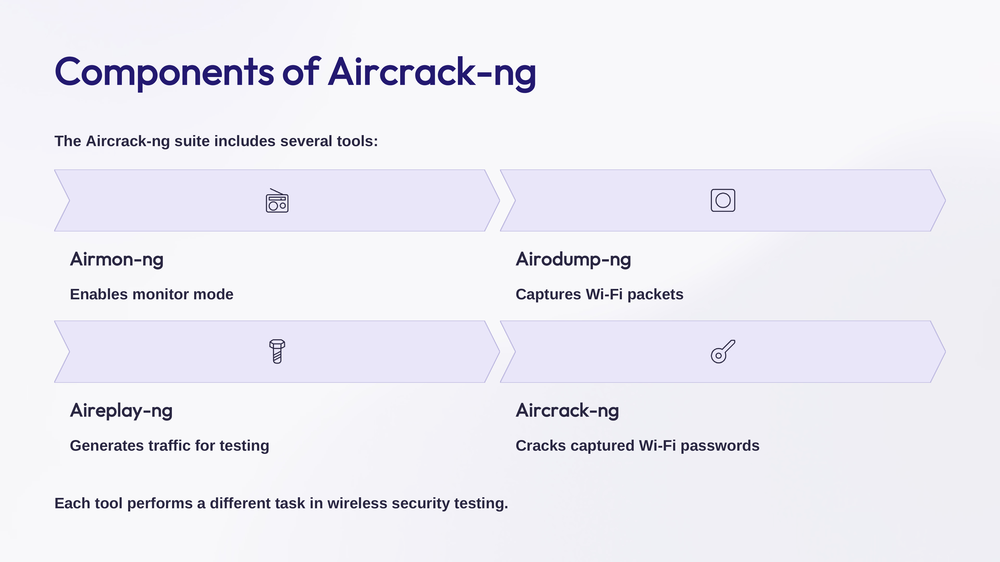
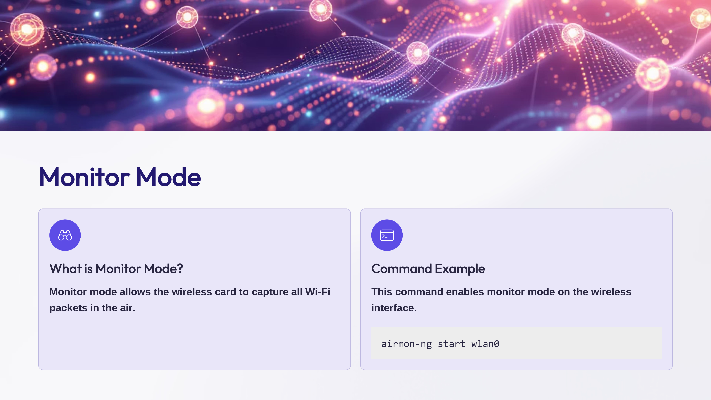
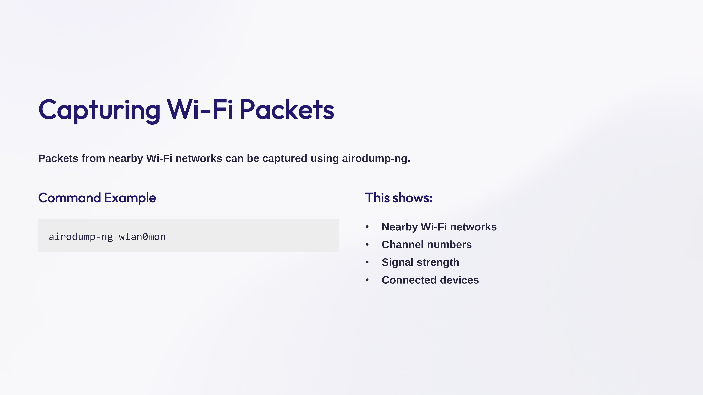
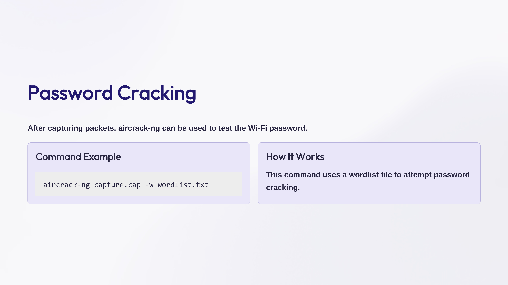
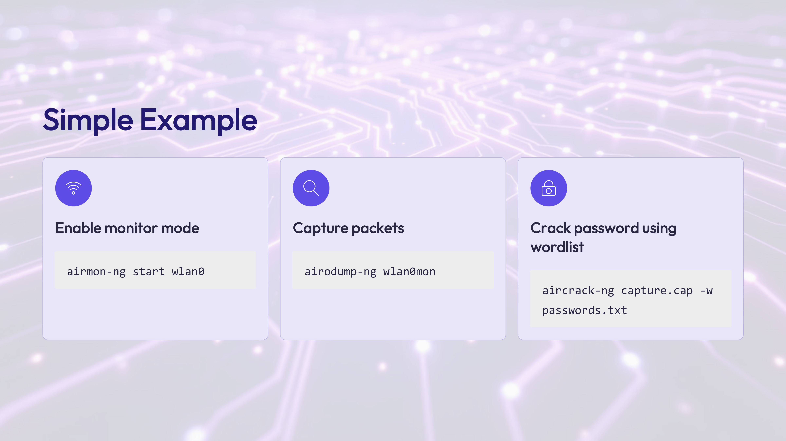

Day 81 – 100 Days Ethical Hacking Challenge

Today I learned about Aircrack-ng, a popular tool used for wireless network security auditing.

Key Concepts Learned

What is Aircrack-ng?
Aircrack-ng is a tool used to analyze Wi-Fi networks and test the security of wireless passwords.

Main Components
Airmon-ng – Enables monitor mode
Airodump-ng – Captures Wi-Fi packets
Aireplay-ng – Generates traffic for testing
Aircrack-ng – Attempts to crack captured Wi-Fi passwords

Learning tools like Aircrack-ng helps in understanding how wireless security works and how weak Wi-Fi configurations can be identified during penetration testing.

Learning via Skills Uprise Mentored by Manoj Kumar                         

LinkedIn: https://www.linkedin.com/company/skills-uprise

CEO: https://www.linkedin.com/in/manoj-kumar

