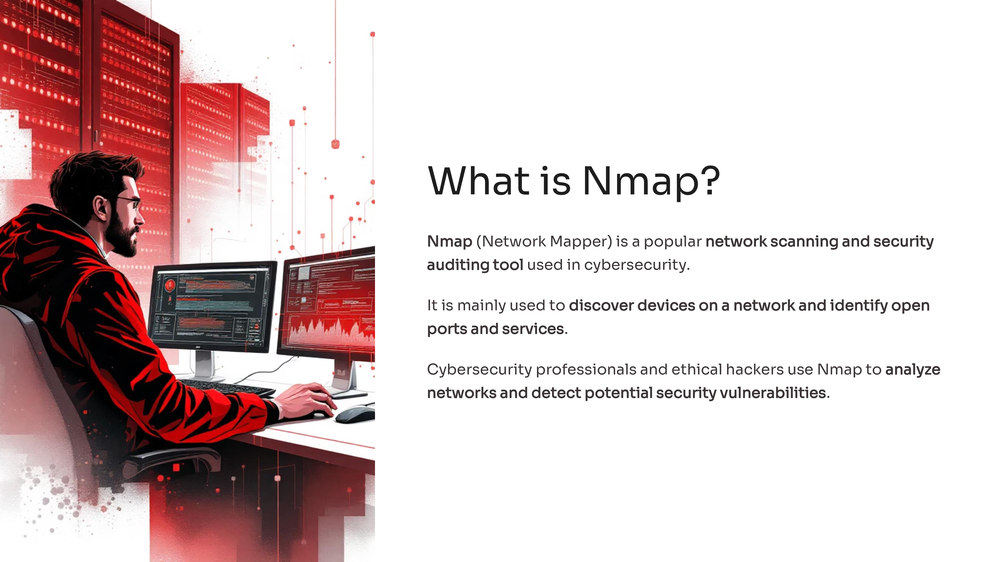
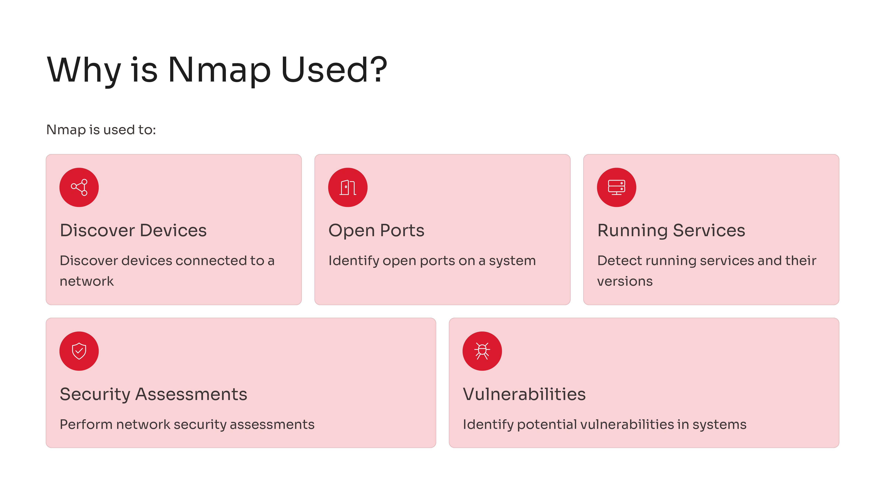
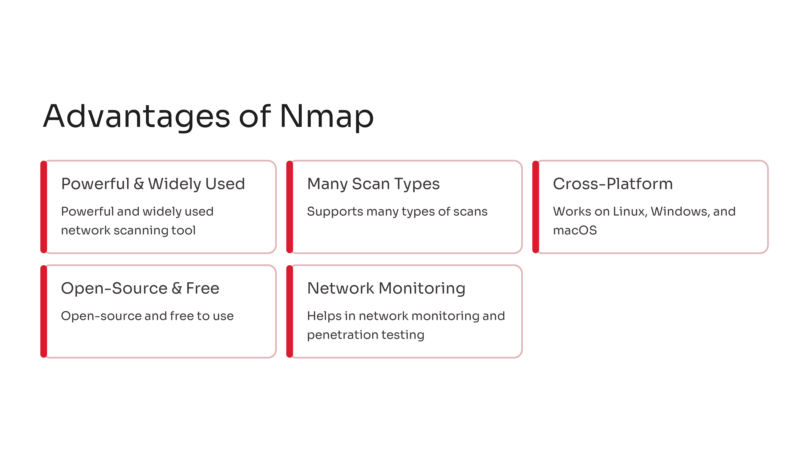
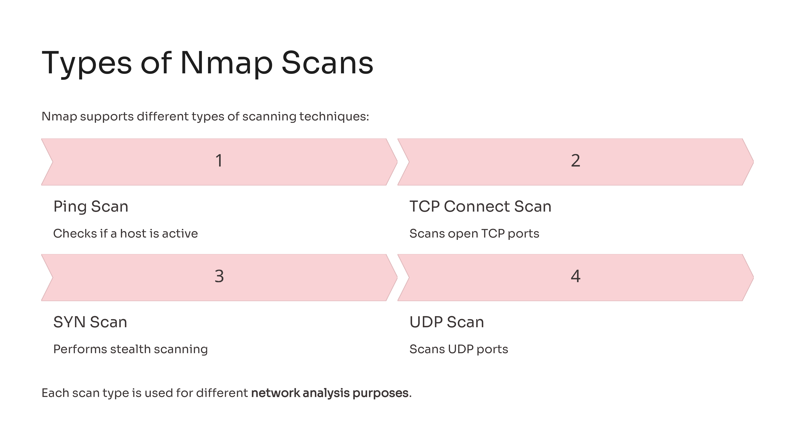
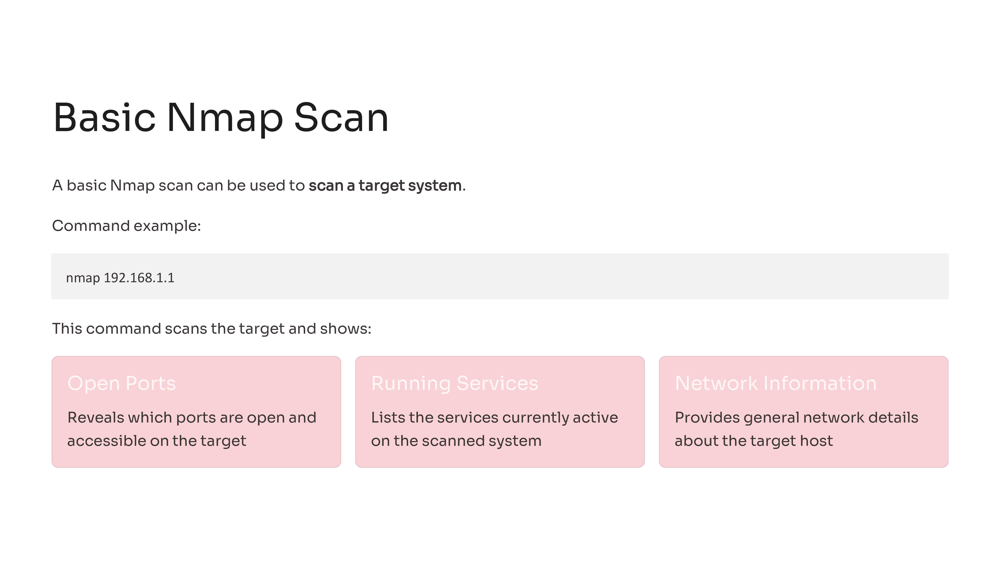
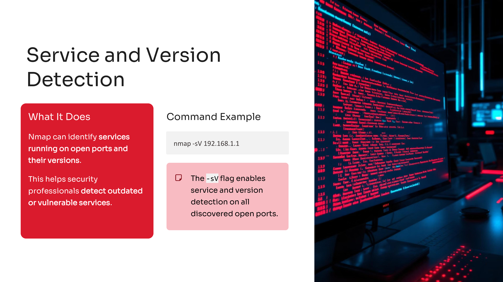
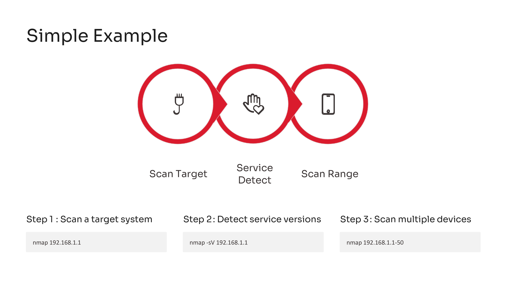

Day 82 – 100 Days Ethical Hacking Challenge

Today I learned about Nmap, a widely used tool for network scanning and security auditing.

Nmap helps security professionals discover devices connected to a network, identify open ports, and detect services running on those ports. It is commonly used during network reconnaissance and penetration testing to understand the structure of a network and identify potential vulnerabilities.

Learning Nmap is an important step in understanding how attackers and security professionals analyze networks.

Learning via Skills Uprise Mentored by Manoj Kumar                         

LinkedIn: https://www.linkedin.com/company/skills-uprise

CEO: https://www.linkedin.com/in/manoj-kumar

